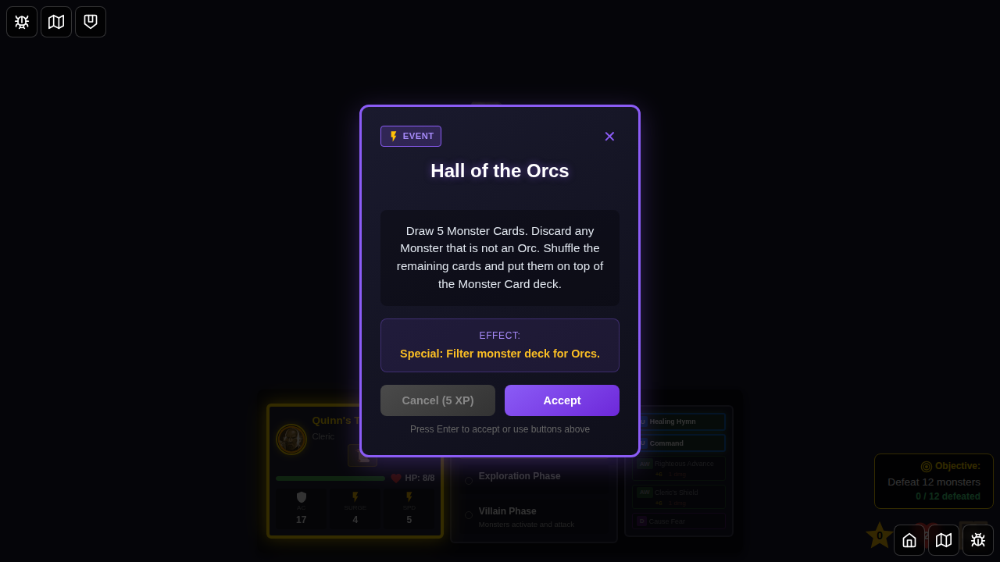
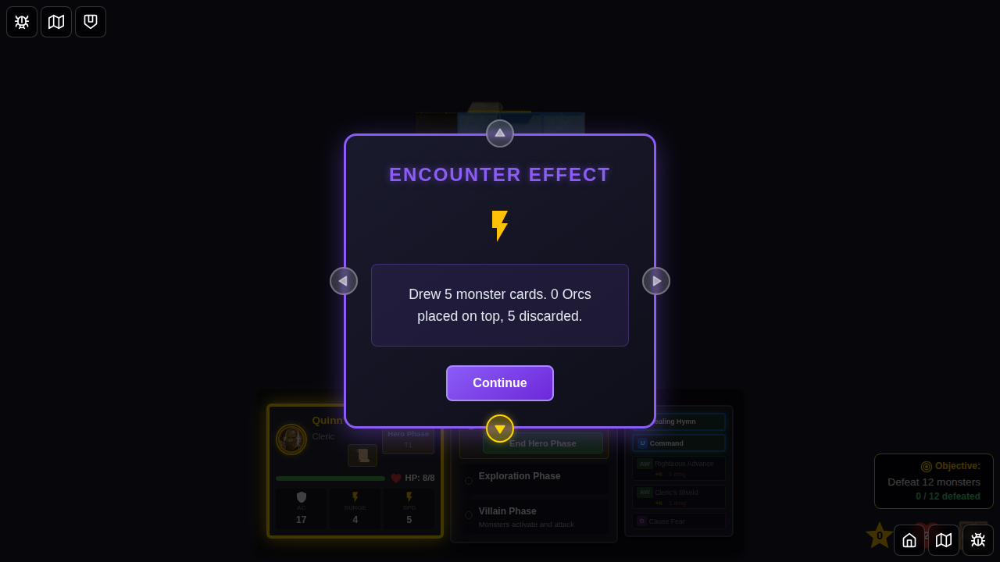
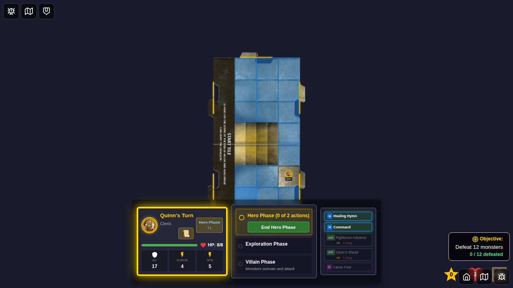

# 094 - Hall of the Orcs Encounter Card

## User Story

As a player, when I draw the "Hall of the Orcs" encounter card, the game should filter the monster deck for Orc monsters, place the matching cards on top, and discard the rest so that the card's mechanics resolve correctly.

## Test Flow

1. **Character Selection** - Player selects Quinn from the bottom edge
2. **Game Starts** - Game board loads with deterministic seed for reproducibility
3. **Initial State** - Verify hero phase and initial monster deck state
4. **Draw Encounter** - Force draw the "Hall of the Orcs" encounter card
5. **Display Card** - Verify card is displayed with correct name and description
6. **Dismiss Card** - Apply the deck filtering effect
7. **Effect Applied** - Monster deck is filtered for Orcs and effect message recorded
8. **Effect Notification** - Encounter effect notification displays the result
9. **Effect Complete** - Game continues in hero phase

## Screenshots

### 000 - Character Select Screen

The character selection screen with Quinn available for selection.

### 001 - Game Started

Game board loaded with Quinn as the active hero.

### 002 - Hall of the Orcs Encounter Drawn

The "Hall of the Orcs" encounter card is displayed, showing the Orc filtering instructions.

### 003 - Hall of the Orcs Effect Applied

After accepting the encounter, the deck is filtered and the effect message updates. Since Orc monsters are now in the deck (Orc Archer and Orc Smasher), some of the 5 drawn cards will be kept on top.

### 004 - Encounter Effect Notification

The encounter effect notification shows the filtering summary with the number of Orcs placed on top and non-Orcs discarded.

### 005 - Effect Complete

The encounter effect notification is dismissed and the game continues.

## Programmatic Verification

Each screenshot includes programmatic checks:

1. **Character Select**: Verifies the character select screen is visible
2. **Game Started**: Verifies hero phase is active and the monster deck is initialized
3. **Encounter Drawn**: Verifies the drawn encounter card and description
4. **Effect Applied**: Verifies encounter effect message and filtered deck state (orcs found and placed on top)
5. **Effect Notification**: Verifies encounter effect notification content
6. **Effect Complete**: Verifies encounter card is dismissed and hero phase continues

## Implementation Details

The "Hall of the Orcs" card uses the following mechanics:

- **Card ID**: `hall-of-orcs`
- **Category Mapping**: Maps to the `orc` monster category
- **Filter Function**: `filterMonsterDeckByCategory(deck, 'orc', 5)`
- **Effect**: Draws 5 monster cards, keeps Orcs on top, discards non-Orcs

Implementation lives in:
- Card definition: `src/store/types.ts` (Hall of the Orcs definition)
- Category mapping: `src/store/encounters.ts` (`getMonsterCategoryForEncounter`)
- Effect application: `src/store/gameSlice.ts` (`dismissEncounterCard` special handling)

## Current Game State Note

The monster deck now contains kobolds (reptile/sentry), snakes (reptile), cultists (humanoid), Orc Archers (orc), and Orc Smashers (orc). When Hall of the Orcs is triggered, it draws 5 monster cards and filters for orcs. The Orc Archer and Orc Smasher cards that are drawn will be placed on top of the deck, while non-orc monsters are discarded.
