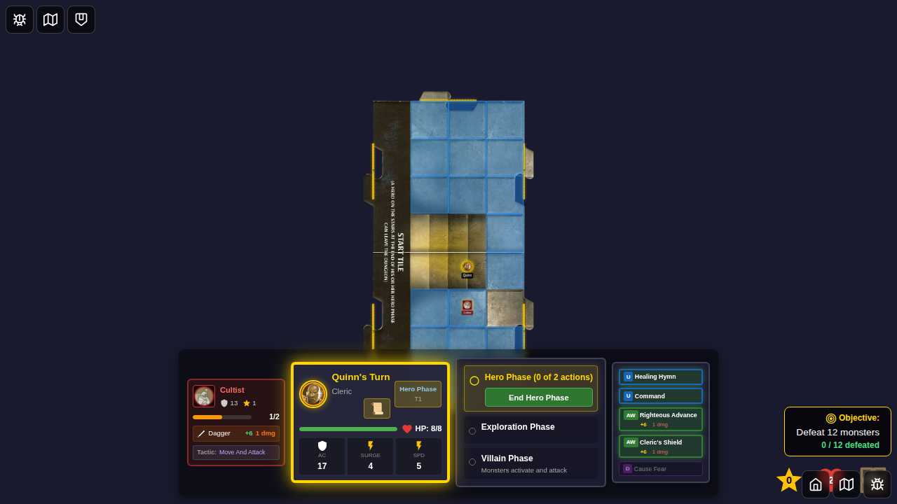
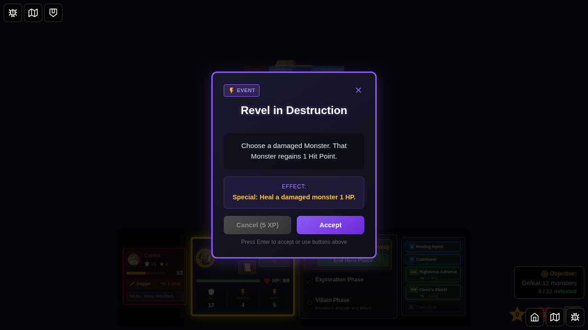
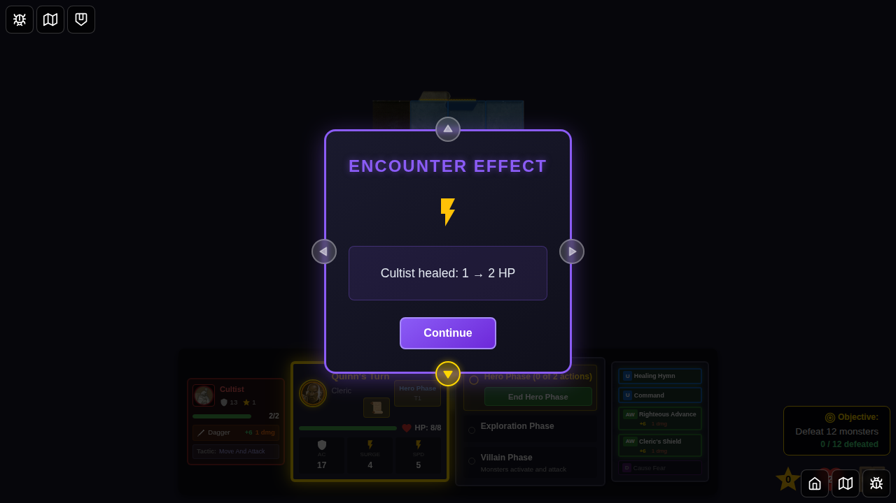
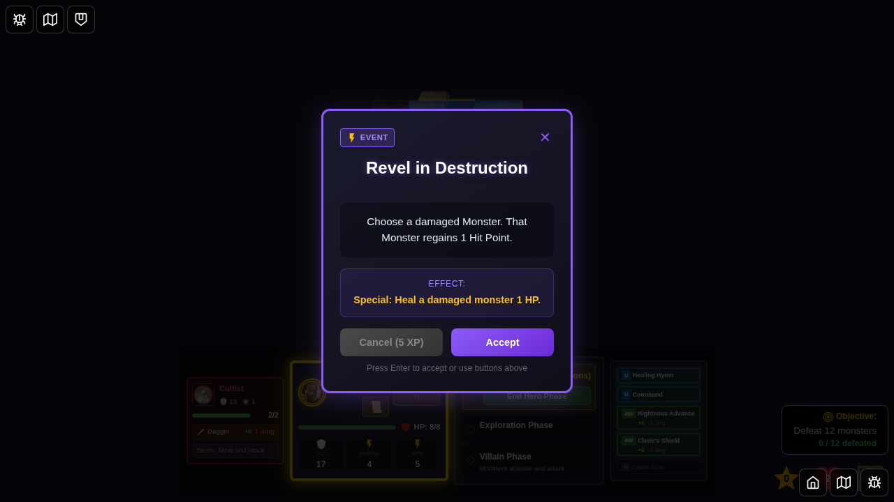
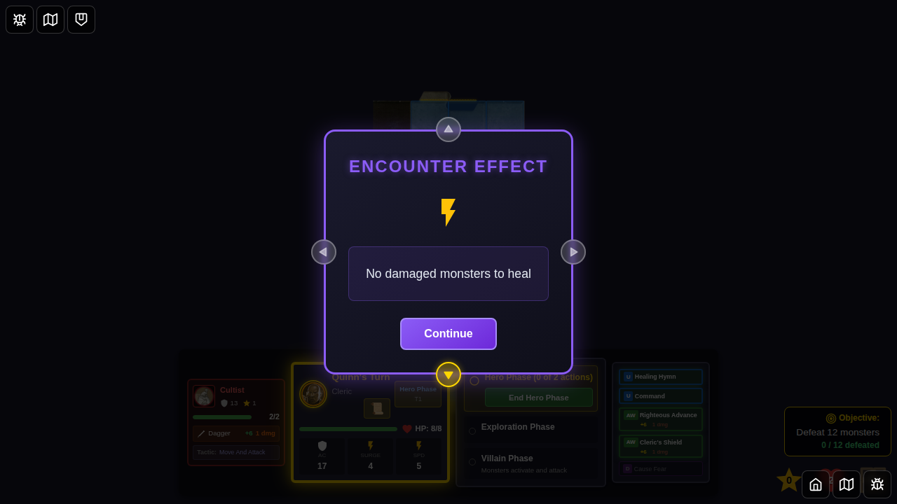
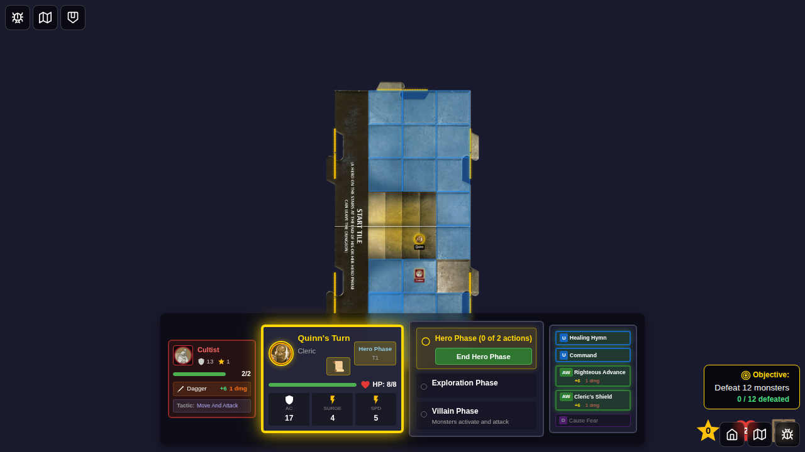

# Test 095 - Revel in Destruction Encounter Card

## User Story

As a player, when I draw the "Revel in Destruction" encounter card, the game should:
1. Display the encounter card with its description
2. Allow me to accept the card effect
3. Automatically heal a damaged monster by 1 HP
4. Display a notification showing the healing (e.g., "Cultist healed: 1 → 2 HP")
5. Discard the encounter card after applying the effect
6. Display "No damaged monsters to heal" if no monster is damaged

## Test Scenario

This test verifies the complete lifecycle of the "Revel in Destruction" encounter card from draw to heal application to discard.

### Part 1: Healing a Damaged Monster

1. **Initial Setup**: Player (Quinn) starts the game and a damaged Cultist monster is present (1/2 HP)
2. **Draw Card**: The "Revel in Destruction" encounter card is drawn
3. **Display Card**: The card is displayed with its description "Choose a damaged Monster. That Monster regains 1 Hit Point."
4. **Accept Card**: Player clicks "Continue" to accept the card
5. **Apply Effect**: The game automatically finds the damaged Cultist and heals it by 1 HP
6. **Show Notification**: An effect notification appears showing "Cultist healed: 1 → 2 HP"
7. **Dismiss**: Player dismisses the notification
8. **Verify State**: Monster HP is now 2/2 (full HP), card is discarded

### Part 2: No Damaged Monsters Case

9. **Draw Again**: The same encounter card is drawn again
10. **Display Card**: The card is displayed again
11. **Accept Card**: Player clicks "Continue"
12. **No Effect**: Since the Cultist is now at full HP, no healing occurs
13. **Show Message**: Effect notification shows "No damaged monsters to heal"
14. **Verify State**: Monster HP remains at 2/2, card is discarded

## Screenshots

### Screenshot 000: Character Selection Screen

- Initial character selection screen
- Quinn is available for selection

### Screenshot 001: Game State with Damaged Monster

- Game board is displayed
- Cultist monster is visible with 1/2 HP (damaged)
- Quinn is positioned on the board
- Ready to draw encounter card

### Screenshot 002: Revel in Destruction Encounter Displayed

- "Revel in Destruction" encounter card is displayed
- Card shows description: "Choose a damaged Monster. That Monster regains 1 Hit Point."
- Card effect type: Special
- "Continue" button is visible to accept the card

### Screenshot 003: Healing Effect Notification

- Effect notification popup appears
- Shows "Encounter Effect" title
- Displays healing message: "Cultist healed: 1 → 2 HP"
- Shows the HP change clearly
- "OK" button visible to dismiss

### Screenshot 004: Notification Dismissed - Monster Healed

- Effect notification is dismissed
- Game board visible again
- Cultist monster now shows 2/2 HP (full health)
- Encounter card has been discarded
- Game continues normally

### Screenshot 005: Second Encounter - Full HP Monster

- Same encounter card drawn again for testing
- Cultist monster visible at full HP (2/2)
- This tests the "no damaged monsters" scenario

### Screenshot 006: No Damaged Monsters Notification

- Effect notification appears
- Shows message: "No damaged monsters to heal"
- Indicates the card had no effect since all monsters are at full HP
- "OK" button visible to dismiss

### Screenshot 007: Test Complete

- Final state after dismissing notification
- Monster remains at 2/2 HP
- Both encounter cards have been discarded
- Game state is clean and ready to continue

## Manual Verification Checklist

When reviewing these screenshots, verify:

- [ ] Encounter card displays correctly with proper name and description
- [ ] Damaged monster (1/2 HP) is visible before healing
- [ ] Healing notification shows correct HP change (1 → 2 HP)
- [ ] Monster token/display updates to show full HP after healing
- [ ] "No damaged monsters" message appears when appropriate
- [ ] Encounter cards are properly discarded after use
- [ ] All UI elements (buttons, text) are clearly visible and aligned
- [ ] Game state remains consistent throughout the test

## Implementation Details

### Card Mechanics
- **Card ID**: `revel-in-destruction`
- **Type**: Special event card
- **Effect**: Heals the first damaged monster found by 1 HP
- **Healing Logic**: Uses `healMonster()` function from `monsters.ts`
- **Capping**: Healing is capped at monster's max HP

### Code References
- **Card Definition**: `src/store/types.ts` (line 1033)
- **Effect Implementation**: `src/store/gameSlice.ts` (lines 2163-2177)
- **Healing Function**: `src/store/monsters.ts` (`healMonster()` function)
- **Unit Tests**: `src/store/gameSlice.test.ts` (4 test cases added)

### Test Coverage
- ✅ Heals damaged monster by 1 HP
- ✅ Shows correct healing message with HP values
- ✅ Handles "no damaged monsters" case
- ✅ Handles "no monsters at all" case
- ✅ Caps healing at max HP
- ✅ Properly discards encounter card
- ✅ Updates Redux state correctly

## Related Issues
- Issue: Implement full mechanics & E2E for 'Revel in Destruction' event card
- Labels: encounters, enhancement
- Assignee: egirard
