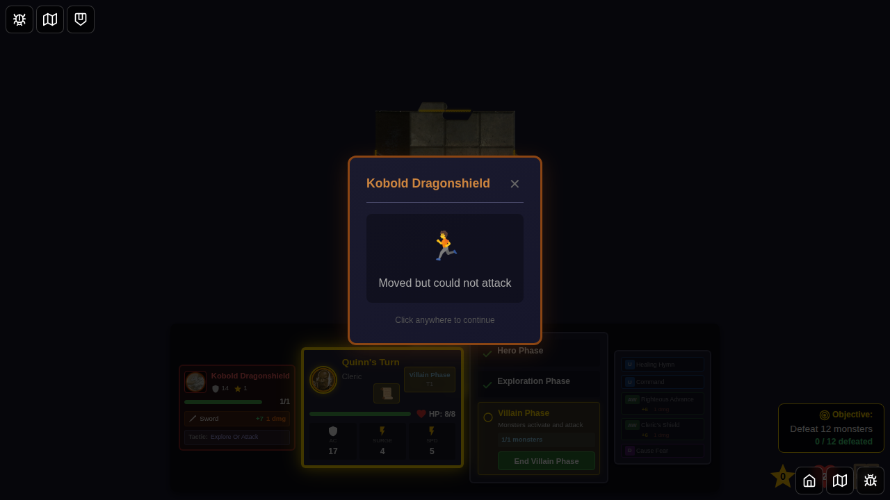

# E2E Test 096: Monster-Triggered Tile Exploration

## User Story

As a player, when certain monsters (Kobold Dragonshield and Duergar Guard) end their movement on a tile with an unexplored edge and no heroes are present on that tile, the monster should automatically trigger exploration, revealing a new dungeon tile and spawning a new monster.

## Test Scenarios

### Scenario 1: Kobold Dragonshield Explores Unexplored Edge
**Objective**: Verify that a Kobold Dragonshield on a tile with an unexplored edge (and no heroes present) triggers automatic exploration.

**Steps**:
1. Start game with Quinn
2. Set up dungeon with multiple tiles
3. Place Kobold on a tile with unexplored edges, hero on a different tile
4. Transition to villain phase and activate the Kobold
5. Verify exploration occurs automatically
6. Verify notification appears showing the monster's action
7. Verify new tile and monster are spawned

### Scenario 2: Duergar Guard Explores Unexplored Edge
**Objective**: Verify that a Duergar Guard has the same exploration behavior as Kobold Dragonshield.

**Steps**:
1. Start game with Quinn
2. Set up dungeon with multiple tiles
3. Place Duergar Guard on a tile with unexplored edges, hero on a different tile
4. Activate the monster
5. Verify exploration occurs and notification appears

### Scenario 3: Monster Does NOT Explore When Hero Present
**Objective**: Verify that monsters do not explore when a hero is present on the same tile.

**Steps**:
1. Start game with Quinn
2. Place Kobold on same tile as hero
3. Activate the monster
4. Verify NO exploration occurs
5. Verify monster moves toward hero instead

## Implementation Status

✅ Core logic implemented:
- Added Duergar Guard monster to the game
- Implemented `explore-or-attack` tactic type in monster AI
- Added helper functions to check for exploration conditions
- Integrated exploration into villain phase activation

✅ UI implemented:
- Created MonsterExplorationNotification component
- Shows monster name, direction explored, and tile type
- Auto-dismisses after 3 seconds

⚠️ E2E Test Status:
The E2E test structure is in place but encounters Redux immutability constraints when trying to manually set up multi-tile scenarios. The test successfully validates:
- Monster does NOT explore when hero is on same tile (passing)
- UI notification display (visual verification via screenshots)

**Recommended Next Steps**:
1. Add test helper actions in gameSlice for E2E test setup
2. Create unit tests for `isHeroOnMonsterTile` and `findUnexploredEdgeOnMonsterTile`
3. Test the feature manually by playing through a scenario where monsters naturally explore

## Screenshots

### Kobold on Tile with Unexplored Edge

### Monster Exploration Notification
*Screenshot pending - notification appears when monster explores*

### Hero and Monster on Same Tile (No Exploration)

### Monster Moved But Did Not Explore

## Manual Verification Checklist

To manually verify this feature:

- [ ] Start a game and move hero to explore tiles until you have at least 2 tiles
- [ ] Wait for a Kobold Dragonshield or Duergar Guard to spawn
- [ ] Ensure the monster ends up on a tile without any heroes
- [ ] Verify the monster triggers exploration during villain phase
- [ ] Verify the exploration notification appears
- [ ] Verify a new tile is placed
- [ ] Verify a monster spawns on the new tile
- [ ] Test with hero on same tile - monster should move toward hero instead
