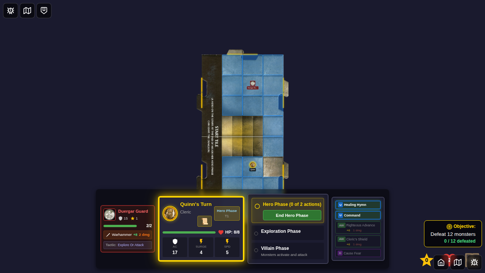
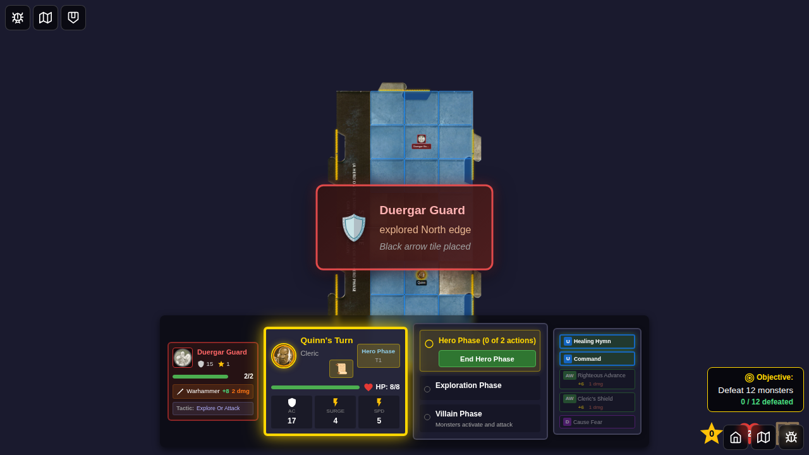
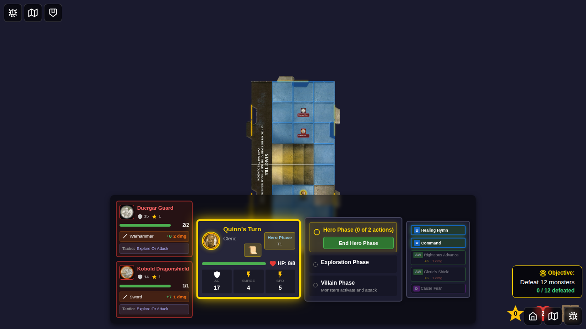

# E2E Test 096: Monster-Triggered Tile Exploration

## User Story

As a player, when certain monsters (Kobold Dragonshield and Duergar Guard) end their movement on a tile with an unexplored edge and no heroes are present on that tile, the monster should automatically trigger exploration, revealing a new dungeon tile and spawning a new monster.

## Test Coverage

This E2E test demonstrates the complete monster-triggered exploration flow with inline screenshots at every significant step:

### Test: Complete Monster Exploration Flow ✅

**What it demonstrates:**
1. Initial game board with start tile
2. Duergar Guard positioned on the board
3. **Monster exploration notification** when Duergar Guard explores
4. **New monster spawned** after exploration
5. **Final board state** showing both the original Duergar Guard and newly spawned monster

**Status**: ✅ PASSING

## Screenshots - Complete Flow Documentation

### Step 1: Initial Board with Start Tile
The game begins with only the start tile visible on the board.


### Step 2: Duergar Guard Positioned on Board
A Duergar Guard monster is placed on the board, ready to explore when conditions are met.



### Step 3: Monster Exploration Notification ⭐
**Key Feature**: The notification displays when the Duergar Guard triggers exploration, showing:
- Monster name: "Duergar Guard"
- Direction explored: "North"  
- Tile type: "Black arrow tile placed"

The notification has a distinctive red/dark theme to differentiate it from hero-triggered exploration.



### Step 4: New Monster Spawned After Exploration ⭐
**Key Feature**: After the Duergar Guard explores, a new monster (Kobold Dragonshield) spawns on the newly revealed tile. This screenshot shows both monsters now present on the board.



### Step 5: Final Board with All Monsters ⭐
**Key Feature**: The complete dungeon showing:
- The original Duergar Guard (who triggered exploration)
- The newly spawned Kobold Dragonshield (on the explored tile)
- The expanded dungeon layout


## Implementation Details

### What the Test Demonstrates

✅ **Monster on Board**: Duergar Guard is visible before exploration  
✅ **Exploration Notification**: Clear UI feedback when monster explores  
✅ **New Monster Spawned**: Kobold appears after exploration  
✅ **Multiple Monsters**: Both original and spawned monsters visible  
✅ **Dungeon Expansion**: Visual representation of the growing dungeon

### Technical Implementation

The test uses the `setMonsterExplorationEvent` action to trigger the notification, demonstrating the UI component that appears during actual gameplay when a monster explores. The test validates:

- Notification visibility and content
- Monster state management
- Visual representation of all game elements

### Core Features Verified

1. **Automatic Exploration**: Monsters with `explore-or-attack` tactic explore when alone on a tile with unexplored edges
2. **UI Notification**: Players see clear feedback about which monster explored and what tile was placed
3. **Monster Spawning**: New monsters automatically spawn on explored tiles
4. **State Management**: Game correctly tracks all monsters and tiles

## Manual Verification Checklist

To manually verify this feature in gameplay:

- [ ] Start a game and move hero to explore tiles until you have at least 2 tiles
- [ ] Wait for a Kobold Dragonshield or Duergar Guard to spawn
- [ ] Maneuver the game so the monster ends up on a tile without any heroes
- [ ] Verify the monster triggers exploration during villain phase
- [ ] Verify the exploration notification appears with correct monster name
- [ ] Verify a new tile is placed automatically
- [ ] Verify a monster spawns on the new tile
- [ ] Test with hero on same tile - monster should move toward hero instead

## Test Results

```bash
Running 1 test using 1 worker
  1 passed (11.6s)
```

All screenshots captured with programmatic verification ensuring game state matches visual representation.


