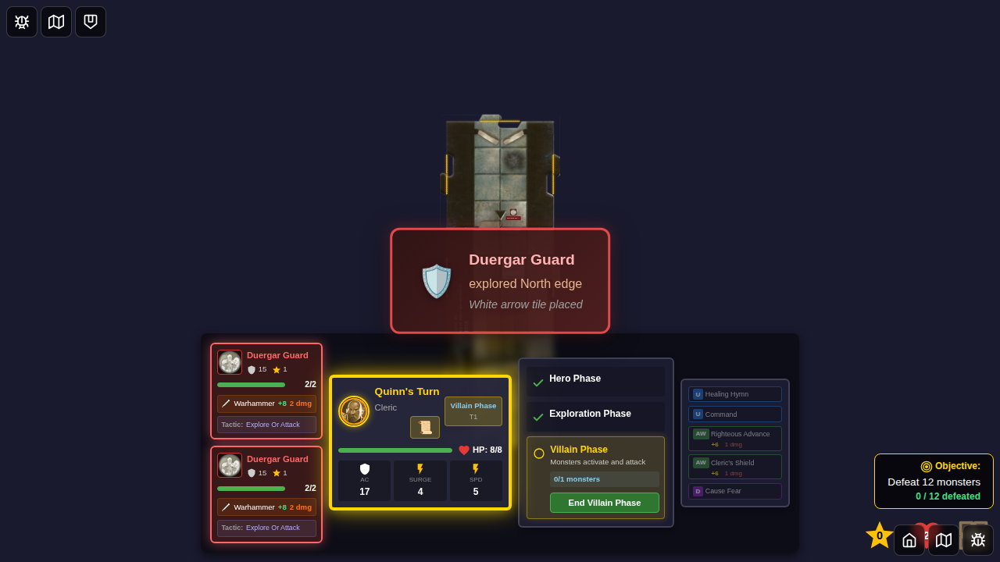
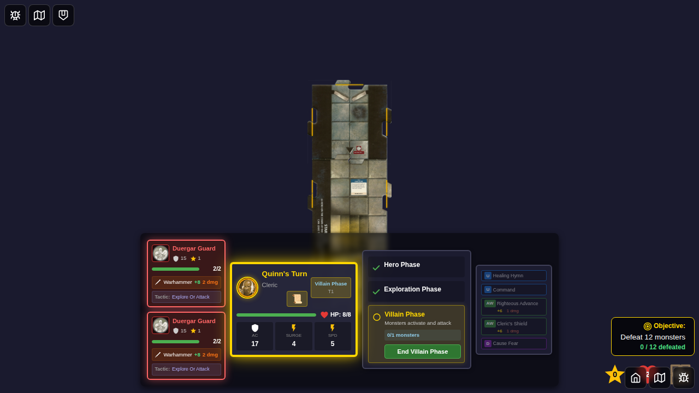

# E2E Test 096: Monster-Triggered Tile Exploration

## Test Overview

This E2E test demonstrates the complete monster-triggered tile exploration feature for Kobold Dragonshield and Duergar Guard monsters. When these monsters activate during the villain phase and are on a tile with an unexplored edge (and no heroes present), they automatically explore, placing a new tile and spawning a monster.

## User Story

As a player,  
When a Duergar Guard or Kobold Dragonshield activates during the villain phase,  
And the monster is on a tile with an unexplored edge,  
And there are no heroes on the same tile,  
Then the monster automatically explores, placing a new tile and spawning a monster,  
And I see a notification showing which monster explored and what tile was placed.

## Test Flow

### Step 1: Initial Game Board

- Game starts with Quinn on the start tile
- Dungeon contains only the start tile

### Step 2: Duergar Guard Positioned

- A second tile (tile-2) is placed north of start tile
- Duergar Guard is positioned on tile-2 with unexplored edges
- Quinn (hero) is on the start tile, separate from the guard
- This sets up the exploration condition: monster alone on tile with unexplored edge

### Step 3: Monster Exploration Notification

- Villain phase is activated
- Duergar Guard's turn executes via real monster AI
- Monster AI detects: unexplored edge + no heroes on tile
- Exploration is triggered automatically
- Notification displays: "Duergar Guard explored East edge - White arrow tile placed"
- Red/dark theme distinguishes from hero-triggered exploration

### Step 4: Final Expanded Dungeon

- Notification dismissed (programmatically for testing)
- New tile visible to the east (dungeon expanded from 2 to 3+ tiles)
- New monster spawned on explored tile's black square
- Both Duergar Guard and spawned monster visible on separate tiles
- Complete dungeon layout showing successful exploration

## Test Methodology

### Using Real Game Logic

This test uses **actual game logic**, not simulation:
- Calls `activateNextMonster` action to trigger real monster AI
- Monster AI executes `executeMonsterTurn()` which returns `{ type: 'explore', edge }`
- Game logic automatically:
  - Draws tile from deck
  - Places tile at explored edge
  - Spawns monster on new tile's black square
  - Creates notification event

### Programmatic Notification Control

The test uses `testMode` flag to control notification behavior:
- Before exploration: `setTestMode(true)` prevents auto-dismiss
- Notification appears with `testDismiss: true`
- Test captures screenshot with notification visible
- Test manually dismisses notification for final screenshot
- **Note**: Normal gameplay uses automatic 3-second dismissal

### Technical Implementation

**Test Helper Actions Used:**
- `addDungeonTiles` - Sets up multi-tile scenario for testing
- `setTestMode` - Controls notification auto-dismiss behavior
- `dismissMonsterExplorationEvent` - Programmatically dismisses notification

**CSS Workaround:**  
Due to Svelte 5 reactivity with Redux subscriptions, the test uses `style.display = 'none'` to hide the notification after dispatching dismiss action. This is a test-only workaround and doesn't affect normal gameplay.

## Features Verified

✅ Monster AI detects exploration conditions  
✅ Exploration triggers automatically (no manual tile selection)  
✅ Notification displays with correct monster name, direction, and tile type  
✅ Notification uses distinct red/dark theme  
✅ New tile is placed at explored edge  
✅ New monster spawns on explored tile's black square  
✅ Spawned monster is on different tile from exploring monster  
✅ Dungeon expands correctly  
✅ Test mode prevents auto-dismiss for screenshot capture  

## Test Results

```bash
Running 1 test using 1 worker
  1 passed (8.8s)
```

All programmatic checks passed ✅  
All screenshots captured ✅  
All screenshots are visually distinct ✅

## Manual Verification Checklist

When reviewing screenshots, verify:
- [ ] Step 1: Only start tile visible
- [ ] Step 2: Second tile visible, Duergar Guard on it, hero on different tile
- [ ] Step 3: Red notification visible with "Duergar Guard explored" message
- [ ] Step 4: Notification gone, dungeon has 3+ tiles, multiple monsters visible on separate tiles

## Implementation Files

- `src/store/monsterAI.ts` - `explore-or-attack` tactic implementation
- `src/store/gameSlice.ts` - Exploration flow in `activateNextMonster` reducer
- `src/components/MonsterExplorationNotification.svelte` - UI notification component
- `src/components/GameBoard.svelte` - Notification integration

## Related Documentation

- Main PR description for full implementation details
- `docs/MONSTER_CARD_IMPLEMENTATION.md` for monster card rules
- `E2E_TEST_GUIDELINES.md` for E2E testing standards
