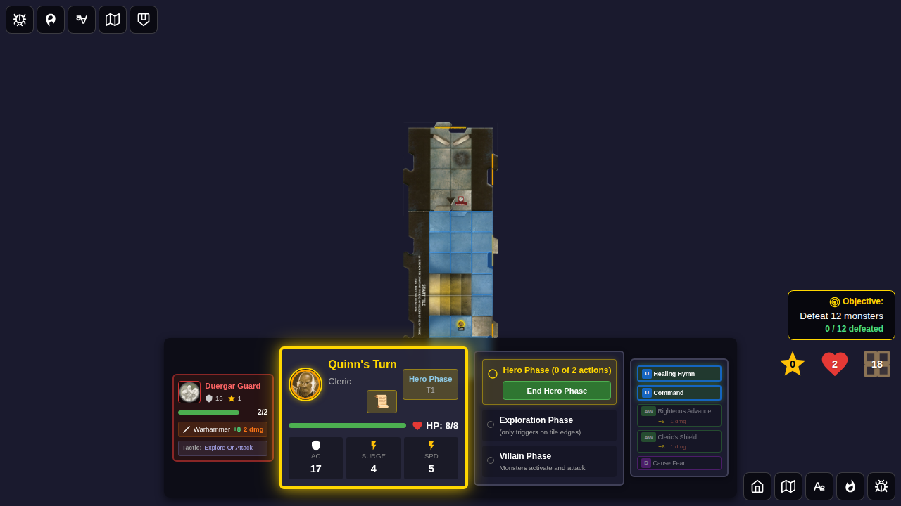
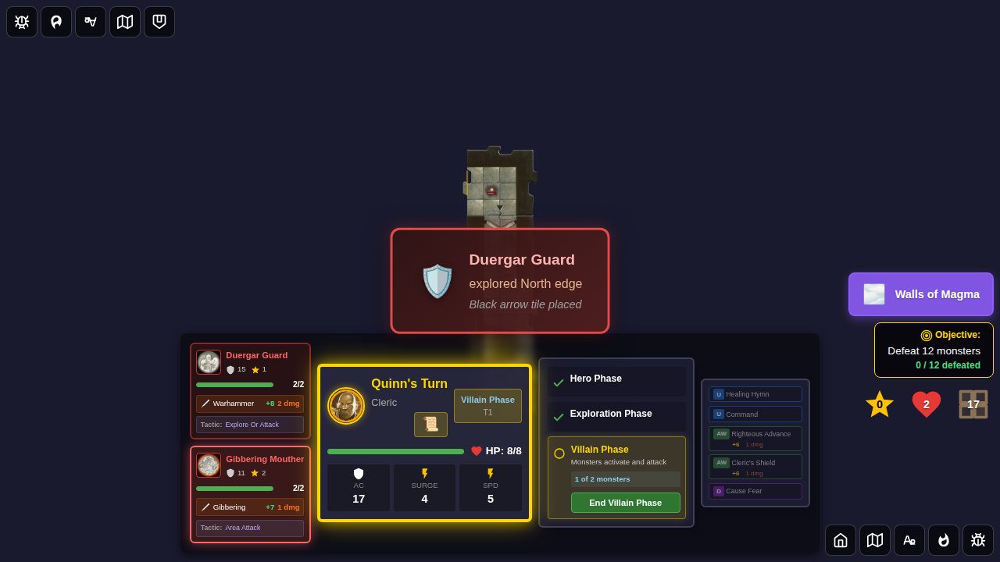
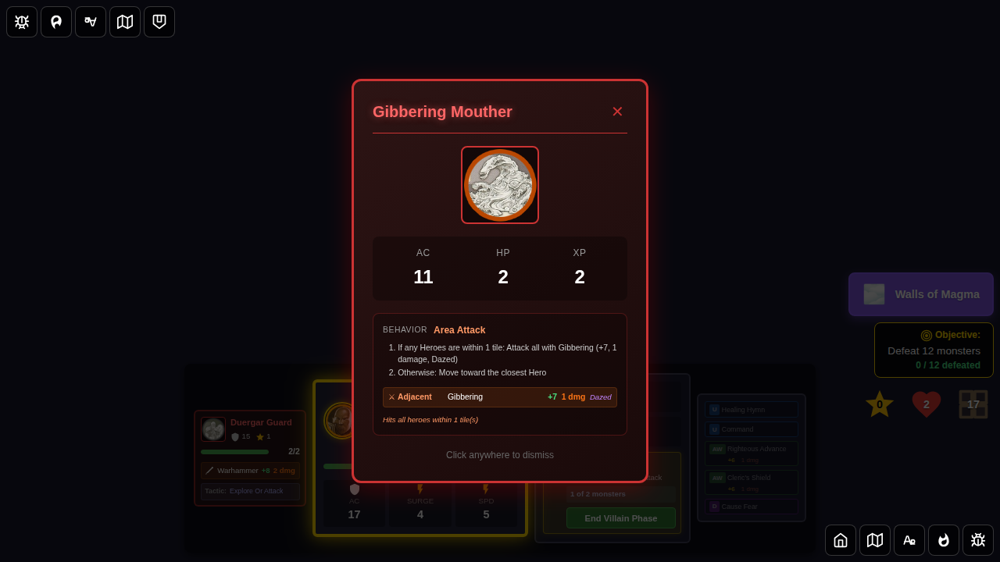
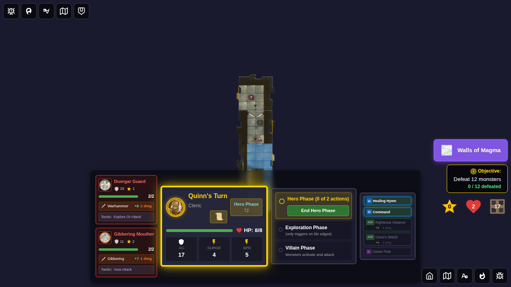

# E2E Test 096: Monster-Triggered Tile Exploration with New Monster Activation

## Test Overview

This E2E test demonstrates the complete monster-triggered tile exploration flow, including the **new monster activation bug fix**: when a monster explores and spawns a new monster, the newly spawned monster must:
1. Have its monster card shown to the player first
2. Then activate (take its turn) during the same villain phase

## User Story

As a player,  
When a Duergar Guard activates during the villain phase and explores an unexplored edge,  
A Gibbering Mouther spawns on the new tile.  
I must dismiss the Mouther's monster card,  
Then the Mouther takes its turn during the same villain phase before it ends.

## Test Flow

### Step 1: Initial Game Board

- Game starts with Quinn on the start tile
- Dungeon contains only the start tile

### Step 2: Duergar Guard Positioned

- A second tile (`guard-tile`) is placed north of the start tile
- Duergar Guard is positioned on `guard-tile` with unexplored edges
- Quinn (hero) is on the start tile, far from the guard
- This sets up the exploration condition: monster alone on tile with unexplored edge

### Step 3: Monster Exploration Notification

- Villain phase is activated; auto-activation triggers the Duergar Guard
- Monster AI detects: unexplored edge + no heroes on tile
- Exploration triggers automatically; a new tile and Gibbering Mouther are placed
- Notification shows: "Duergar Guard explored North/East edge — tile placed"

### Step 4: Gibbering Mouther Card Appears

- After the exploration notification is dismissed, the Gibbering Mouther's card appears
- The villain phase shows **"1 of 2 monsters"** — the guard activated first, the mouther is pending
- **Key fix verification**: `recentlySpawnedMonsterId` is set, blocking the auto-activation
  effect until the player dismisses the card
- Player reads the Mouther's stats before it takes its turn

### Step 5: Spawned Monster Activates — Villain Phase Completes

- After dismissing the monster card, the Mouther auto-activates
- Both monsters are now in the player's panel (Duergar Guard + Gibbering Mouther)
- The dungeon has expanded to 3 tiles
- The villain phase completed normally; game advanced to Hero Phase T2

## Bug Fix Verified

The test confirms the fix for: *"New monsters should activate"*.

**Before fix**: After the guard explored and the player dismissed the exploration notification,
the newly spawned Mouther's card would appear but the auto-activation effect would
simultaneously fire (since `monsterExplorationEvent` was cleared), activating or skipping
the Mouther silently behind the modal.

**After fix**: `recentlySpawnedMonsterId !== null` is now a blocking condition in the
villain phase auto-activation `$effect`. The Mouther only activates after the player
dismisses its card.

## Multiple Monster Behavior

If a monster spawns a **group** of monsters (e.g., 3 Legion Devils), the fix handles this
correctly:
- All N monsters are added to `state.monsters` immediately
- Only the first monster's card is shown (`recentlySpawnedMonsterId`)
- After dismissing the card, activation proceeds through all N monsters in order
- Every spawned monster gets its turn in the same villain phase

## Test Methodology

### Using Real Game Logic

This test uses **actual game logic**, not simulation:
- Relies on the auto-activation `$effect` in `GameBoard.svelte` to activate the guard
- Guard AI executes `executeMonsterTurn()` → returns `{ type: 'explore', edge }`
- Game logic automatically places a tile, spawns a monster, and shows the notification

### Important: Guard Tile ID

The manually placed tile uses `id: 'guard-tile'` (not `'tile-2'`). The `placeTile()` helper
generates auto-IDs as `tile-${dungeon.tiles.length}`, so with 2 tiles in the dungeon,
the next auto-generated ID would be `'tile-2'`. Using `'guard-tile'` avoids a collision
that would cause the new tile's count check to fail.

## Implementation Files

- `src/store/gameSlice.ts` — Exploration flow in `activateNextMonster` reducer
- `src/components/GameBoard.svelte` — Auto-activation `$effect` with `recentlySpawnedMonsterId` guard
- `src/components/MonsterExplorationNotification.svelte` — UI notification component
- `src/components/MonsterCard.svelte` — Monster card modal
