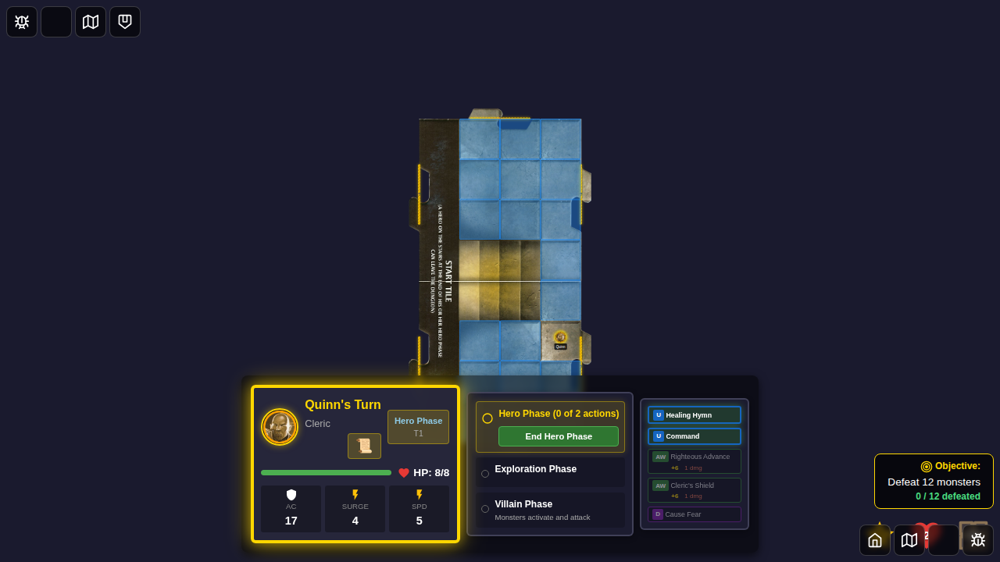
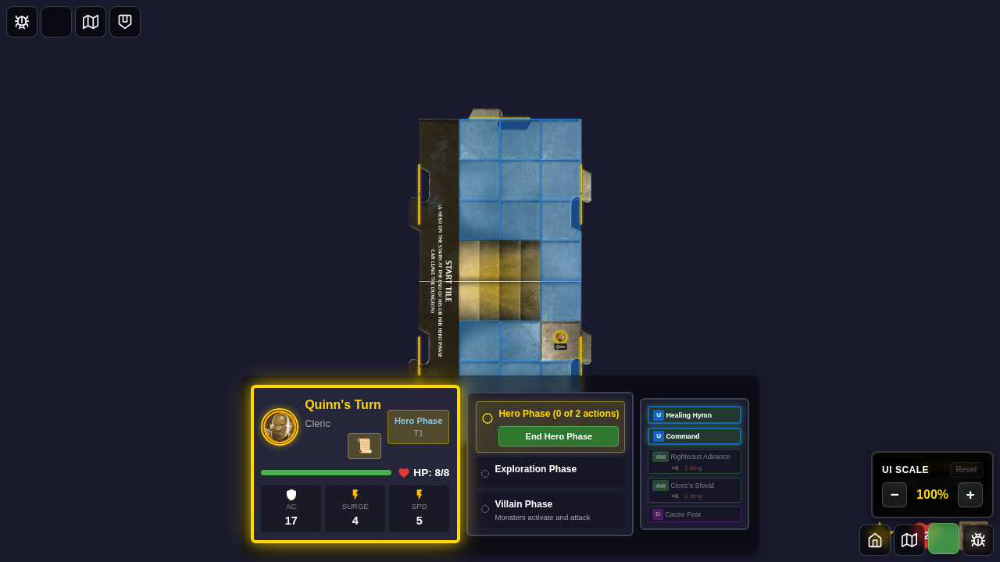
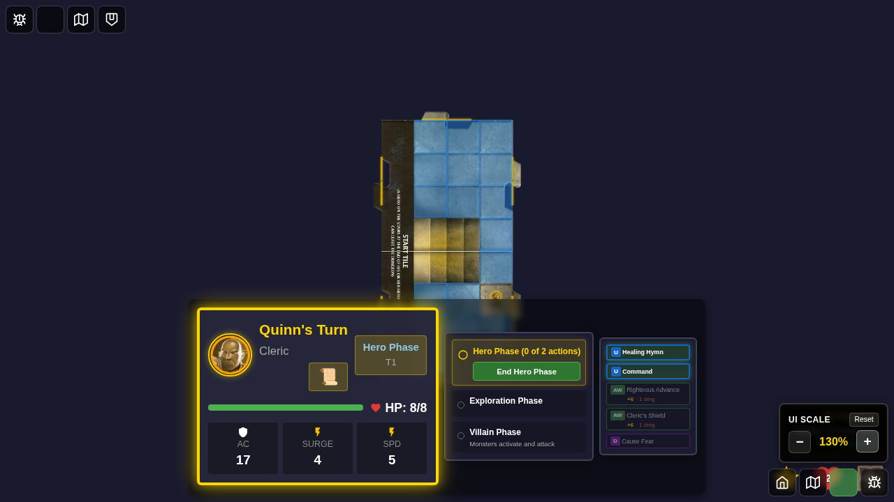
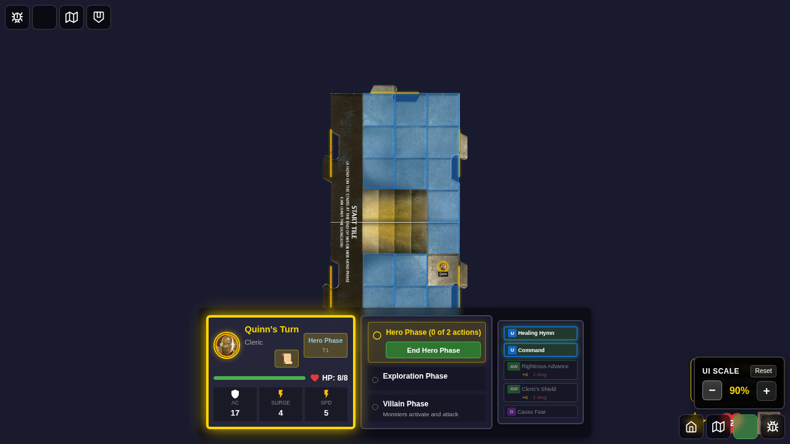
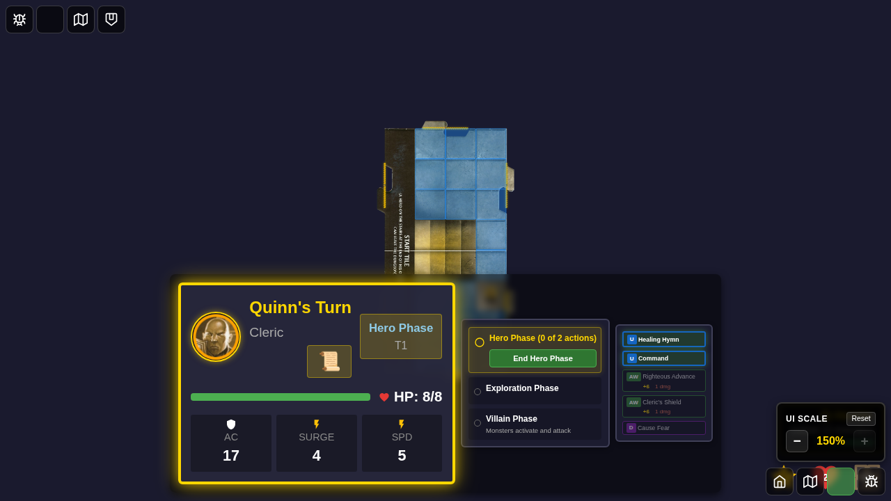
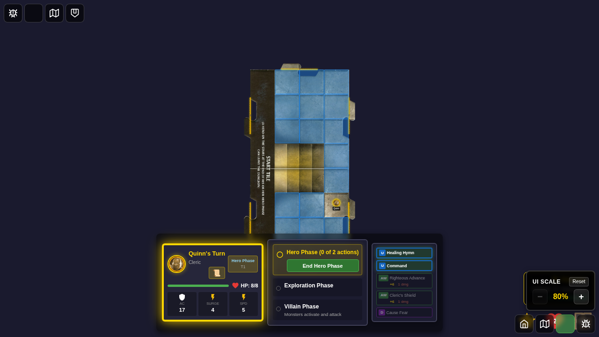

# 097 - Player Panel Font Scaling

## User Story

As a player, I want to adjust the UI scale of player panels to make them larger or smaller, so that I can optimize readability and screen space usage based on my display size and personal preferences.

## Test Scenario

This test demonstrates the font scaling feature for player panels:

1. **Default Scale (100%)**: Player starts the game with default UI scale
2. **Font Scale Controls**: Player opens the font scale controls from the corner button
3. **Increased Scale (130%)**: Player increases UI scale to make panels larger
4. **Decreased Scale (90%)**: Player decreases UI scale to make panels smaller
5. **Maximum Scale (150%)**: Player tests the maximum allowed scale
6. **Minimum Scale (80%)**: Player tests the minimum allowed scale
7. **Reset to Default**: Player resets scale back to 100%
8. **Controls Closed**: Player closes the font scale controls

## Screenshots

### 000 - Default Scale (100%)

Initial game state with player panel at default 100% scale. The player card shows:
- Hero name and portrait
- HP bar with current/max values
- Core stats (AC, Surge, Speed)
- Turn indicator showing it's Quinn's turn

### 001 - Font Scale Controls Visible

Font scale controls panel is opened after clicking the font scale button in the corner. The panel displays:
- Current scale percentage (100%)
- Increase/decrease buttons
- Reset button
- Clear visual indicators

### 002 - Increased Scale (130%)

UI scale increased to 130%, making the player panel noticeably larger. All text and UI elements scale proportionally while maintaining layout integrity.

### 003 - Decreased Scale (90%)

UI scale decreased to 90%, making the player panel smaller and more compact. Useful for players with large displays who want more screen space for the game board.

### 004 - Maximum Scale (150%)

Maximum UI scale at 150%, providing excellent readability for accessibility needs. The increase button becomes disabled at this limit.

### 005 - Minimum Scale (80%)

Minimum UI scale at 80%, offering maximum screen space while maintaining legibility. The decrease button becomes disabled at this limit.

### 006 - Reset to Default

Scale reset to 100% using the reset button. The reset button becomes disabled when at default scale.

### 007 - Controls Closed

Font scale controls panel closed, returning to the normal game view. The scale setting persists even after closing the controls.

## Verification Checklist

### Visual Verification
- [ ] Player panel scales uniformly at all scale levels (80% to 150%)
- [ ] Text remains readable at all scale levels
- [ ] Layout doesn't break or overlap at extreme scales
- [ ] Font scale controls are clearly visible and functional
- [ ] Button states (enabled/disabled) are visually apparent

### Functional Verification
- [ ] Increase button works and updates scale correctly
- [ ] Decrease button works and updates scale correctly
- [ ] Reset button restores 100% scale
- [ ] Buttons disable at min/max limits
- [ ] Scale setting persists when controls are closed
- [ ] CSS custom property updates correctly
- [ ] All UI elements scale proportionally

### Accessibility Verification
- [ ] Minimum scale (80%) maintains readability
- [ ] Maximum scale (150%) improves readability significantly
- [ ] Default scale (100%) meets baseline accessibility standards
- [ ] Controls are keyboard accessible
- [ ] ARIA labels are present and correct

## Technical Details

### Implementation
- **CSS Custom Property**: `--ui-font-scale` controls scaling
- **Redux Store**: UI preferences stored in `uiSlice`
- **Component**: `FontScaleControls.svelte` provides UI
- **Range**: 0.8 (80%) to 1.5 (150%)
- **Increment**: 0.1 (10%) per button click

### Acceptance Criteria Met
- ✅ Default player panel is readable and visually balanced
- ✅ Player can scale font sizes without breaking layout
- ✅ Scale range from 80% to 150% accommodates various needs
- ✅ Controls are intuitive and accessible
- ✅ Settings persist during gameplay
