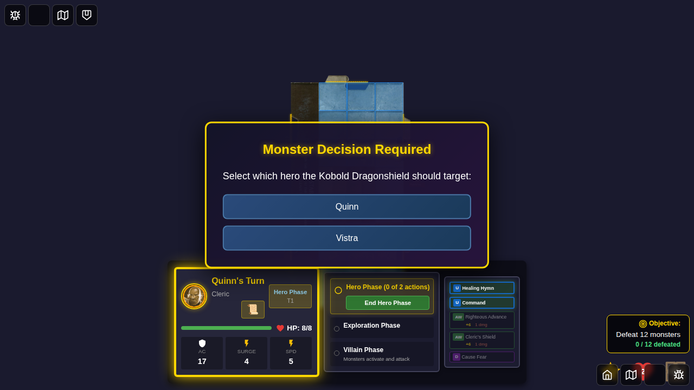

# E2E Test 100 - Monster Target Choice

## User Story

As a player, when a monster has multiple valid hero targets at the same distance during the villain phase, I want to be prompted to choose which hero the monster should target, so that I can make strategic decisions about how monsters behave.

## Test Coverage

This test validates that:

1. **Monster Decision Prompt Appears**: When a monster needs to choose between multiple equidistant heroes, a decision prompt is shown
2. **Hero Options Display**: Both hero options are clearly presented with buttons
3. **Selection Works**: Clicking on a hero button selects that target and dismisses the prompt
4. **State Management**: The pending decision is properly stored and cleared in Redux
5. **Villain Phase Pausing**: The villain phase correctly pauses and resumes

## Test Steps

1. Start game with Quinn
2. Add Vistra as a second hero
3. Position both heroes equidistant from a monster
4. Manually trigger a monster decision prompt (simulating AI detecting tie)
5. **Screenshot 001**: Monster decision prompt appears with two hero options
6. Click on Quinn to select that hero as the target
7. Verify prompt dismisses and state is cleared

## Screenshots

### 001 - Monster Decision Prompt

**What to look for:**
- Golden bordered modal appears in center of screen
- Title: "Monster Decision Required"
- Prompt text: "Select which hero the Kobold should target:"
- Two hero buttons: "Quinn" and "Vistra"
- Both heroes are equidistant from the monster on the map
- Monster token is visible at position (4, 3)
- Quinn at position (2, 2)
- Vistra at position (2, 4)

**Programmatic Verification:**
- `pendingMonsterDecision` is not null in Redux store
- `pendingMonsterDecision.type` is 'choose-hero-target'
- `pendingMonsterDecision.options.heroIds` contains ['quinn', 'vistra']
- `villainPhasePaused` is true
- Monster decision prompt is visible
- Both hero buttons are visible

## Implementation Notes

- This test demonstrates the UI/UX for monster target selection
- Currently uses manual triggering of the prompt (via Redux dispatch)
- Future tests will integrate with actual monster AI that detects ties
- The prompt blocks all other game interactions until a selection is made
- Animations are disabled for stable screenshots

## Visual Features Validated

1. **Modal Appearance**:
   - Fixed position, centered on screen
   - Dark gradient background with golden border
   - Box shadow for depth
   - Z-index 2000 (above all other UI elements)

2. **Hero Buttons**:
   - Blue gradient background
   - Clear hover effects (scale and glow)
   - Test IDs for E2E selection
   - Capitalized hero names for display

3. **Typography**:
   - Golden title with text shadow
   - White prompt text
   - Clear, readable font sizes

## Future Enhancements

Once monster AI is updated to detect ties:
- Test will show actual gameplay scenario
- Monster will naturally encounter tie situation
- AI will trigger prompt automatically
- Selection will influence monster's next action

## Related Files

- `src/components/MonsterDecisionPrompt.svelte` - UI component
- `src/store/types.ts` - `PendingMonsterDecision` type definition
- `src/store/gameSlice.ts` - State management actions
- `docs/MONSTER_TARGET_SELECTION_DESIGN.md` - Full design document
