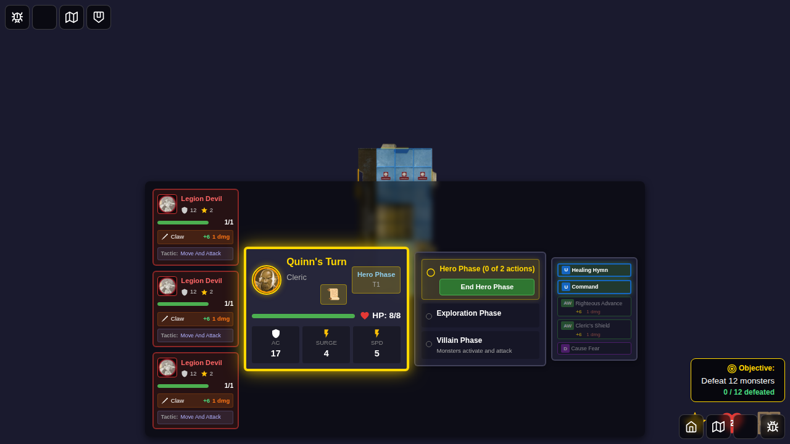
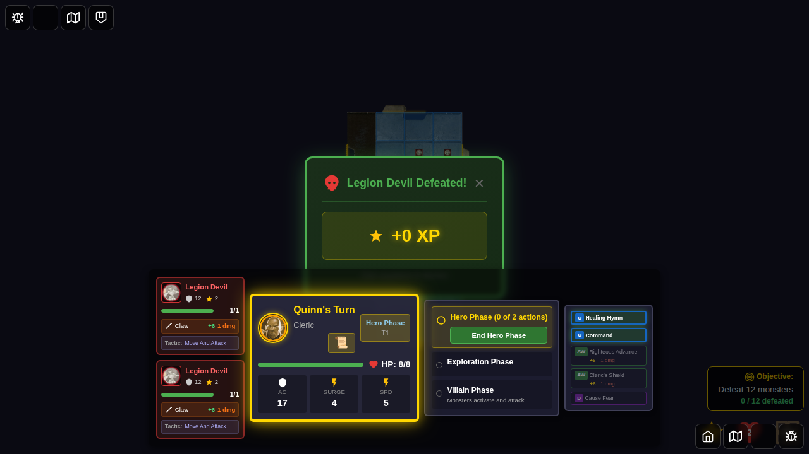
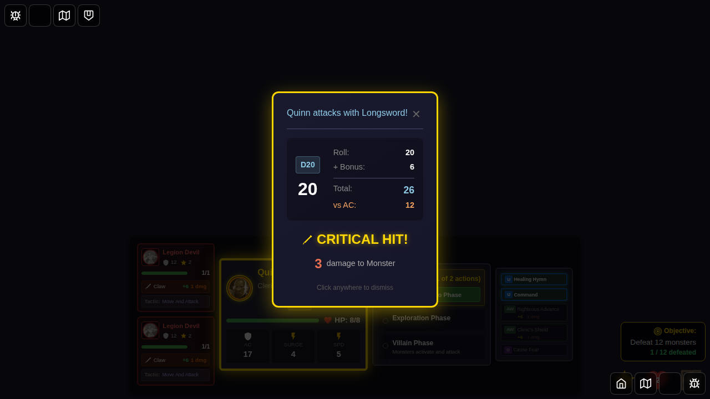
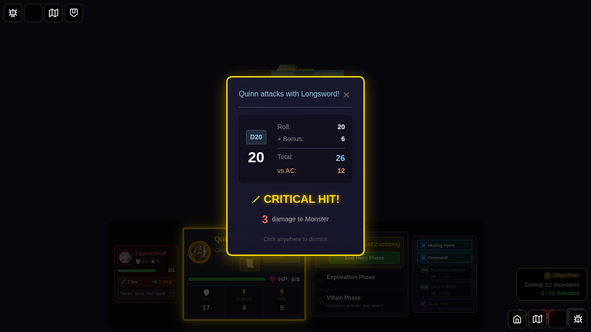
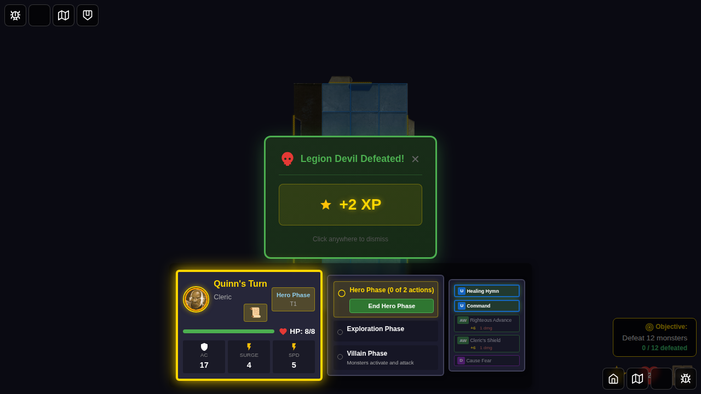
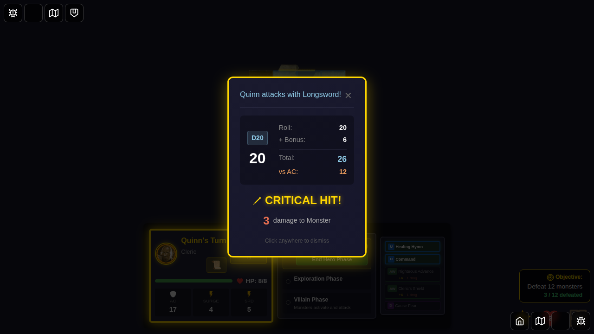

# E2E Test 101 - Legion Devil Multi-Monster Spawn

## User Story

As a player, when I encounter a Legion Devil monster card:
1. The Legion Devil spawns 3 total monsters (1 initial + 2 additional)
2. All 3 Legion Devils are tracked as a group
3. Defeating individual Legion Devils shows a notification with "+0 XP" (group incomplete)
4. Defeating all 3 Legion Devils shows a notification with "+2 XP" (group complete)

## Test Flow

### Screenshot 000 - Character Selection

**Verification:**
- Character selection screen is displayed
- Hero selection is available

### Screenshot 001 - Game Started

**Verification:**
- Game board is displayed
- Initial XP is 0
- No monsters on the board yet

### Screenshot 002 - Three Legion Devils Spawned

**Verification:**
- 3 Legion Devil monsters are visible on the board
- All 3 have the same `groupId`
- One monster group exists with 3 members
- Group XP is 2 points
- Party XP is still 0 (not awarded yet)

### Screenshot 003 - First Devil Defeated - Notification Shows "+0 XP"

**Verification:**
- Defeat notification is visible
- **XP amount shows "+0 XP"** (group not fully defeated)
- 2 Legion Devils remaining on the board
- Party XP is still 0

### Screenshot 004 - One Devil Defeated, Notification Dismissed

**Verification:**
- Defeat notification dismissed
- 2 Legion Devils remaining on the board
- Party XP is still 0 (group not fully defeated)
- Monster group still exists with 2 members

### Screenshot 005 - Two Devils Defeated

**Verification:**
- 1 Legion Devil remaining on the board
- Party XP is STILL 0 (group not fully defeated)
- Monster group still exists with 1 member

### Screenshot 006 - All Devils Defeated - Notification Shows "+2 XP"

**Verification:**
- Defeat notification is visible
- **XP amount shows "+2 XP"** (group fully defeated, XP awarded!)
- 0 Legion Devils remaining on the board
- Party XP is NOW 2
- Monster group has been removed

### Screenshot 007 - All Devils Defeated, Final State

**Verification:**
- Defeat notification dismissed
- 0 Legion Devils remaining on the board
- Party XP is 2 (group fully defeated, XP awarded)
- Monster group has been removed (no longer exists)

## Manual Verification Checklist

- [ ] Character selection screen displays correctly
- [ ] Game board loads with no monsters initially
- [ ] Legion Devil spawns exactly 3 monsters
- [ ] All 3 monsters appear on the board at non-overlapping positions
- [ ] Defeating 1 monster shows notification with "+0 XP"
- [ ] Defeating 2 monsters does not award XP (XP still 0)
- [ ] Defeating all 3 monsters shows notification with "+2 XP"
- [ ] Final XP total is 2 after all defeats
- [ ] Monster group is properly cleaned up after all defeats
- [ ] UI accurately reflects the number of remaining monsters
- [ ] Defeat notifications properly inform player of XP status

## Implementation Details

**Multi-Monster Spawn:**
- Legion Devil has `spawnBehavior: { count: 2 }`
- Spawns 1 + 2 = 3 total monsters
- All spawned monsters assigned same `groupId`

**Group XP Tracking:**
- `MonsterGroup` tracks all member IDs and collective XP
- XP award logic checks `isGroupDefeated()` before awarding
- Group removed from `monsterGroups` array when complete

**Defeat Notifications:**
- When a group member is defeated but group is incomplete: "+0 XP"
- When the last group member is defeated: "+{group.xp} XP" (e.g., "+2 XP")
- This provides clear feedback to players about group XP mechanics

**Test Approach:**
- Uses Redux state manipulation for reliable, deterministic testing
- Directly spawns monsters with group tracking
- Simulates attacks using `setAttackResult` action
- Dismisses attack result and defeat notification overlays
- Verifies state changes and UI feedback after each defeat
