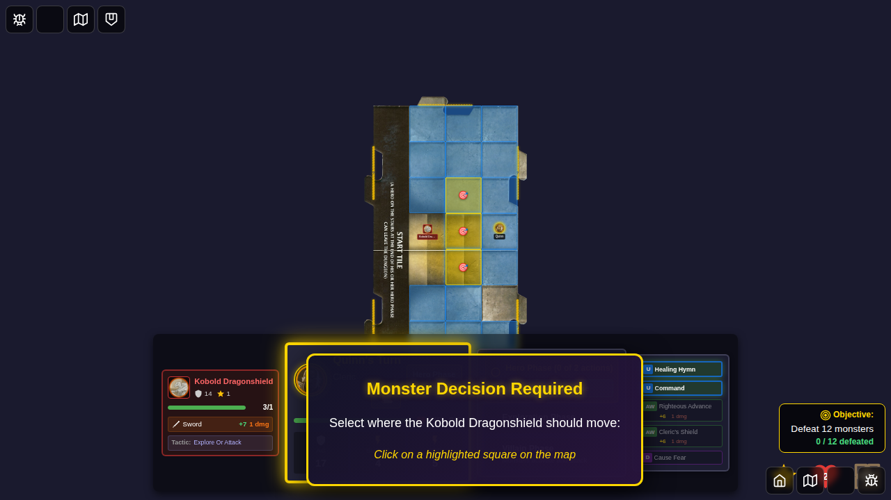
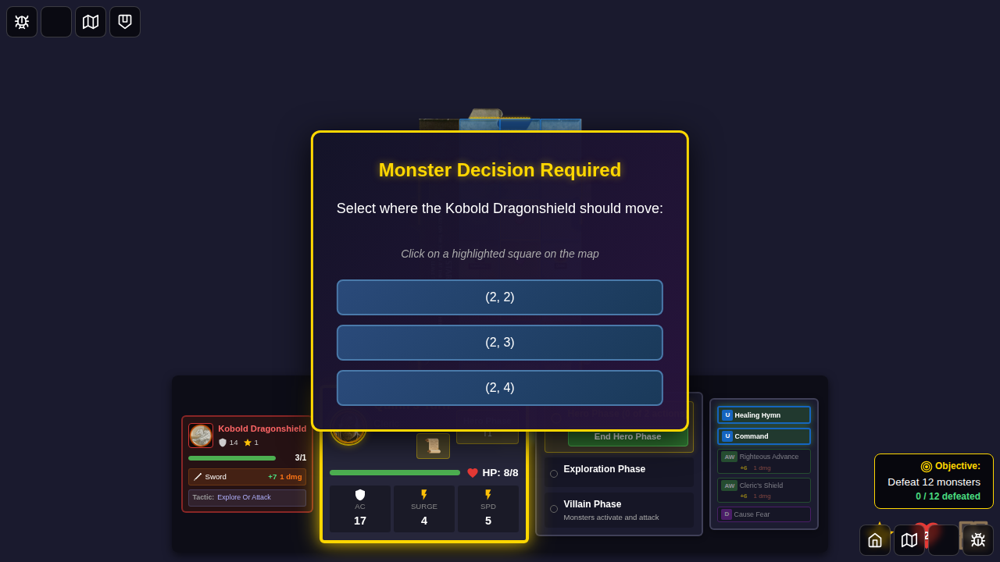
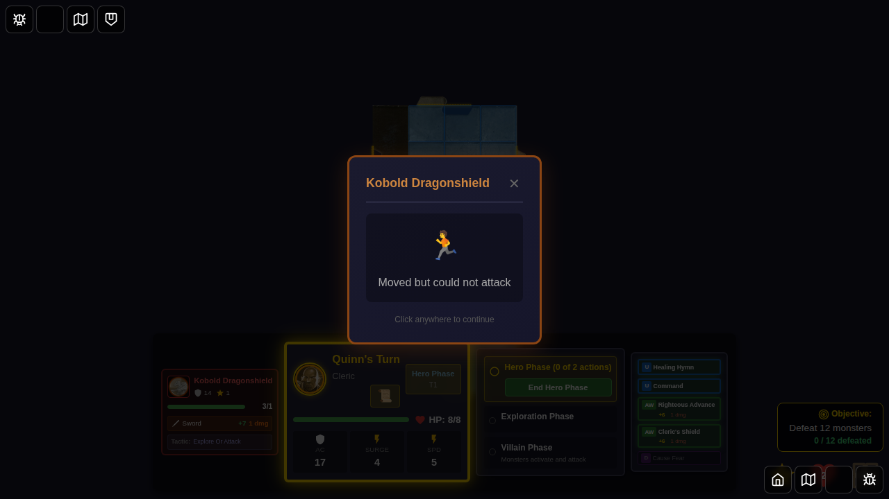

# E2E Test 101: Monster Move Destination Choice

## User Story
As a player, when a monster has multiple equally valid destinations to move toward its target, I want to select which square the monster should move to, so that I can control the tactical positioning of monsters during the villain phase.

## Test Description
This test verifies that the game prompts the player to choose a destination square when a monster has multiple equidistant movement options during its activation.

## Test Steps

### Screenshot 001: Monster Decision Prompt Displayed

**What to verify:**
- Monster decision prompt modal is visible
- Prompt text reads "Select where the Kobold Dragonshield should move:"
- "Monster Decision Required" header is shown
- Villain phase is paused

**Programmatic checks:**
- `pendingMonsterDecision` is not null
- `pendingMonsterDecision.type` is 'choose-move-destination'
- `villainPhasePaused` is true
- Multiple positions are available in `options.positions`

### Screenshot 002: Highlighted Destination Squares

**What to verify:**
- Multiple squares on the game board are highlighted with golden borders
- Each highlighted square shows a target indicator (🎯)
- The squares pulse with animation
- The prompt is still visible
- At least 2 selectable squares are visible

**Programmatic checks:**
- Count of `.selectable-square.monster-decision-square` elements is greater than 1

### Screenshot 003: Monster Moved to Selected Position

**What to verify:**
- The monster decision prompt has disappeared
- The monster has moved from its original position (1, 3)
- The monster is now at one of the selected destination squares
- The villain phase continues normally

**Programmatic checks:**
- `pendingMonsterDecision` is null
- `villainPhasePaused` is false
- Monster's position has changed from (1, 3)

## Implementation Details

**Scenario Setup:**
- Hero (Quinn) positioned at (3, 3)
- Monster (Kobold) at (1, 3)
- Three equidistant move options: (2, 2), (2, 3), (2, 4)

**Decision Type:** `choose-move-destination`

**Context:** `movement`

## Related Components
- `MonsterDecisionPrompt.svelte` - Decision prompt modal
- `GameBoard.svelte` - Visual highlighting and click handlers
- `monsterAI.ts` - Monster AI detection logic
- `gameSlice.ts` - State management for decisions

## Success Criteria
✅ Prompt appears when monster has multiple move options  
✅ Destination squares are highlighted on the game board  
✅ Player can click on a highlighted square to select it  
✅ Monster moves to selected position after selection  
✅ Villain phase continues after selection
