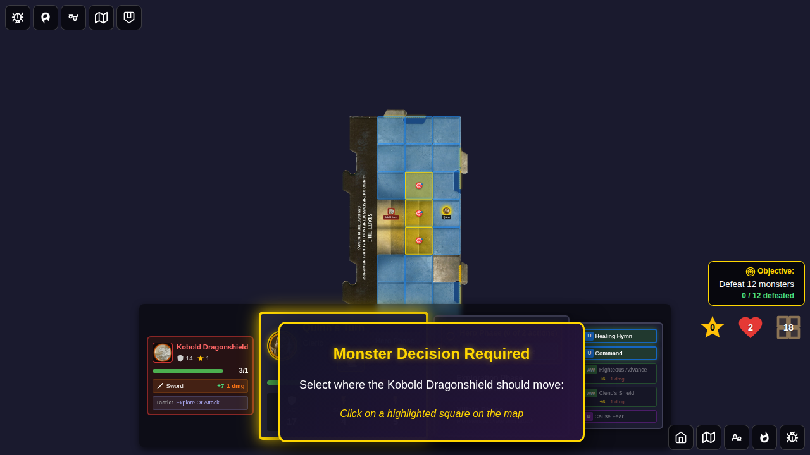
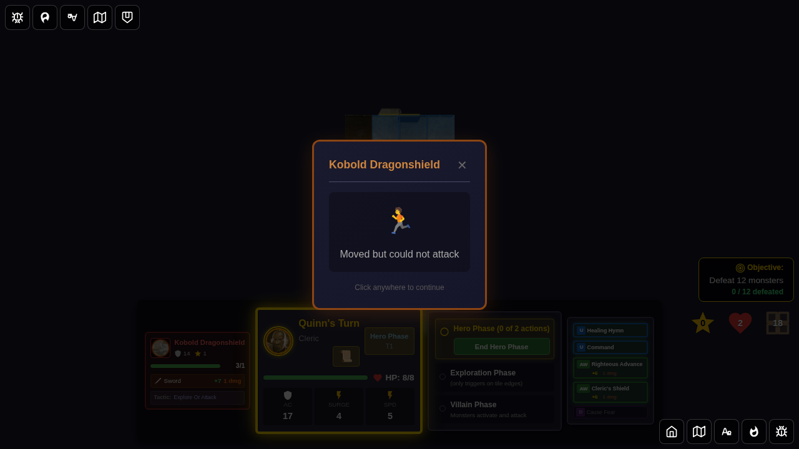

# E2E Test 101: Monster Move Destination Choice

## User Story
As a player, when a monster has multiple equally valid destinations to move toward its target, I want to select which square the monster should move to, so that I can control the tactical positioning of monsters during the villain phase.

## Test Description
This test verifies that the game prompts the player to choose a destination square when a monster has multiple equidistant movement options during its activation.

## Test Steps

### Screenshot 001: Monster Decision Prompt Displayed

**What to verify:**
- Monster decision prompt modal is visible
- Prompt text reads "Select where the Kobold Dragonshield should move:"
- "Monster Decision Required" header is shown
- Villain phase is paused

**Programmatic checks:**
- `pendingMonsterDecision` is not null
- `pendingMonsterDecision.type` is 'choose-move-destination'
- `villainPhasePaused` is true
- Multiple positions are available in `options.positions`

### Screenshot 002: Highlighted Destination Squares

**What to verify:**
- Multiple squares on the game board are highlighted with golden borders
- Each highlighted square shows a target indicator (🎯)
- The squares pulse with animation
- The prompt is still visible
- At least 2 selectable squares are visible

**Programmatic checks:**
- Count of `.selectable-square.monster-decision-square` elements is greater than 1

### Screenshot 003: Monster Moved to Selected Position

**What to verify:**
- The monster decision prompt has disappeared
- The monster has moved from its original position (1, 3)
- The monster is now at one of the selected destination squares
- The villain phase continues normally

**Programmatic checks:**
- `pendingMonsterDecision` is null
- `villainPhasePaused` is false
- Monster's position has changed from (1, 3)

## Implementation Details

**Scenario Setup:**
- Hero (Quinn) positioned at (3, 3)
- Monster (Kobold) at (1, 3)
- Three equidistant move options: (2, 2), (2, 3), (2, 4)

**Decision Type:** `choose-move-destination`

**Context:** `movement`

## Related Components
- `MonsterDecisionPrompt.svelte` - Decision prompt modal
- `GameBoard.svelte` - Visual highlighting and click handlers
- `monsterAI.ts` - Monster AI detection logic
- `gameSlice.ts` - State management for decisions

## Success Criteria
✅ Prompt appears when monster has multiple move options  
✅ Destination squares are highlighted on the game board  
✅ Player can click on a highlighted square to select it  
✅ Monster moves to selected position after selection  
✅ Villain phase continues after selection

## Test 2: Monster Scorch Mark Prioritization

### User Story
As a player, when a monster moves to a new dungeon tile, I expect it to prioritize moving to the scorch mark of that tile if available, following official game rules.

### Test Description
This test verifies that monsters prioritize scorch marks when crossing from one tile to another during movement.

### Test Steps

#### Screenshot 004: Initial State Before Monster Move

**What to verify:**
- Monster (Kobold) is on the start tile at position (3, 2)
- Hero (Quinn) is on the east tile at position (7, 2)
- A second tile (tile-east) exists adjacent to the start tile
- Monster is positioned near the edge between tiles

**Programmatic checks:**
- Monster `tileId` is 'start'
- Monster position is (3, 2)
- Hero position is (7, 2)

#### Screenshot 005: After Monster Moves to New Tile

**What to verify:**
- Monster has moved toward the hero
- If monster crossed to the east tile, it should be at or near the scorch mark
- The scorch mark for tile-black-2exit-a at 0° rotation is at local position (1, 2)
- Monster prioritizes this position when entering the tile

**Programmatic checks:**
- Monster has moved from original position
- If `tileId` is 'tile-east', verify scorch mark prioritization
- Distance to scorch mark position is minimal

### Implementation Details

**Scenario Setup:**
- Start tile with monster at (3, 2)
- Adjacent east tile (tile-black-2exit-a) with scorch mark at local (1, 2)
- Hero on east tile at (7, 2) to draw monster across tiles

**Expected Behavior:**
1. Monster detects hero on adjacent tile
2. Monster moves toward hero, crossing tile boundary
3. `findMoveTowardHero` in `monsterAI.ts` detects tile crossing
4. Function prioritizes scorch mark at (1, 2) of destination tile
5. Monster moves to scorch mark if unoccupied

### Related Components
- `monsterAI.ts` - Monster movement AI with scorch mark prioritization
- `monsters.ts` - Scorch mark position calculation functions
- `gameSlice.ts` - Movement execution during villain phase

### Success Criteria
✅ Monster moves toward hero across tiles  
✅ Monster prioritizes scorch mark when entering new tile  
✅ Scorch mark logic activates only for tile-crossing moves  
✅ Same-tile movement unaffected by scorch mark logic
