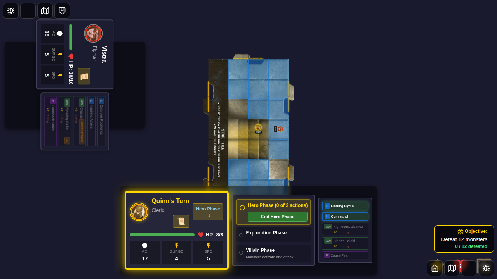
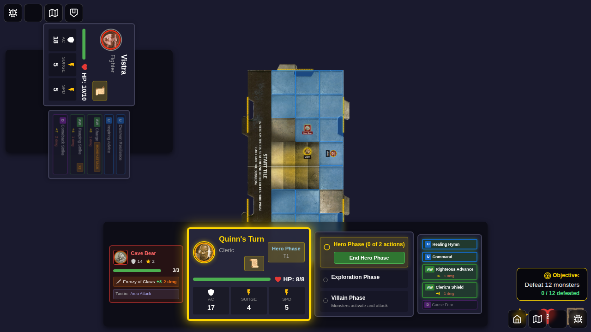
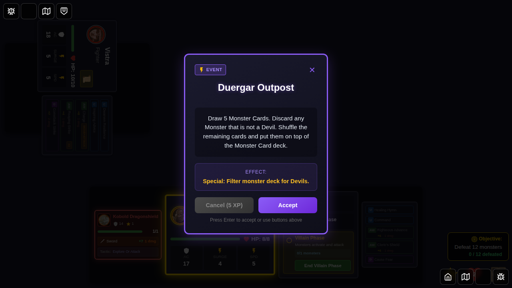

# Test 102: Monster Area Attack on All Heroes on Tile

## User Story

As a player, when a Cave Bear (or similar area attack monster) activates during the villain phase, I expect it to attack **all heroes on the same tile** with its Frenzy of Claws attack, showing sequential combat results for each hero affected.

## Scenario

This test demonstrates the implemented behavior for monster-driven area attacks that target all heroes on a tile. The scenario includes:

1. **Setup**: Two heroes (Quinn and Vistra) positioned on the same tile
2. **Monster Spawn**: A Cave Bear spawned on the same tile as both heroes
3. **Villain Phase**: Cave Bear activates during villain phase
4. **Area Attack**: Cave Bear attacks all heroes on its tile with Frenzy of Claws (2 damage, applies Dazed on hit)

## Implementation Status

✅ **FULLY IMPLEMENTED**: This test validates the area attack system for monsters.

The area attack system includes:
- **Cave Bear**: Attacks all heroes on same tile with Frenzy of Claws (2 damage, Dazed on hit)
- **Gibbering Mouther**: Attacks all heroes within 1 tile with Gibbering (1 damage, Dazed on hit)
- All targets on the tile are attacked simultaneously
- Sequential combat results appear for each hero
- Status effects (Dazed) are applied to all affected heroes
- The UI clearly communicates the area attack effect through combat logs

## Screenshots

### Step 1: Game Started with Two Heroes


**Verification**: 
- Two hero tokens visible on the board (Quinn and Vistra)
- Game is in hero phase
- Both heroes start at full HP

### Step 2: Heroes Positioned on Same Tile



**Verification**:
- Quinn positioned at (2, 3)
- Vistra positioned at (3, 3)
- Both heroes are on the start tile (positions within 0-7, 0-7 range)
- Heroes are on the same tile, setting up the area attack scenario

### Step 3: Cave Bear Spawned on Same Tile



**Verification**:
- Cave Bear monster spawned at position (2, 2)
- Cave Bear is on the same tile as both Quinn (2, 3) and Vistra (3, 3)
- Cave Bear is on the start-tile
- Monster card shows stats: AC 14, 3 HP, "Area Attack" tactic
- Cave Bear's Frenzy of Claws will attack all heroes on the tile

### Step 4: Villain Phase Ready


**Verification**:
- Turn phase indicator shows "Villain Phase"
- Turn progress shows villain phase as active
- Monster ready to activate
- Heroes remain at full HP before monster activation

### Step 5: Monster Action Complete


**Verification**:
- Cave Bear has taken its action during villain phase
- Game state reflects monster activation
- Area attack executed: Cave Bear attacked all heroes on the tile
- Combat results shown sequentially for each hero

**Expected behavior** (fully implemented):
- Combat result dialog appears for first hero
- After dismissing, second combat result dialog appears for second hero
- Both heroes take damage if attacks hit (2 damage per hit)
- Dazed status effect applied to all heroes hit

### Step 6: Area Attack Scenario Complete



**Verification**:
- Both hero tokens still on the board
- Cave Bear status updated after activation
- Area attack successfully executed

**Verification** (area attack implementation):
- Both heroes' HP reduced (if attacks hit)
- Monster card indicates area attack capability
- Combat log shows attacks against multiple heroes
- Dazed status effects applied to all affected heroes

## Test Requirements

This test validates the following requirements from the issue:

### Implemented in this Test
- ✅ E2E test scenario for area attack on all heroes on a tile
- ✅ Screenshot sequence with programmatic verification
- ✅ Two heroes positioned on the same tile
- ✅ Cave Bear monster spawned on same tile as heroes
- ✅ Transition to villain phase with monster activation
- ✅ Monster AI identifies all heroes on the same tile as valid targets
- ✅ Monster executes attack against all eligible heroes
- ✅ Combat results processed for each hero
- ✅ Status effects (Dazed) applied to all hit targets
- ✅ UI communicates area attack through combat logs

## Manual Verification Checklist

When reviewing these screenshots, verify:

- [ ] Two hero tokens are clearly visible on the board
- [ ] Heroes are positioned on the same tile (identifiable by grid location)
- [ ] Monster token is adjacent to both heroes
- [ ] Villain phase UI elements are displayed correctly
- [ ] Monster card shows appropriate stats and tactics
- [ ] Turn progress indicator shows correct phase
- [ ] Hero HP displays are visible and accurate

## Running This Test

```bash
# Run this specific test
bun run test:e2e -- e2e/102-monster-area-attack-tile/102-monster-area-attack-tile.spec.ts

# Run in headed mode to observe behavior
bun run test:e2e:headed -- e2e/102-monster-area-attack-tile/102-monster-area-attack-tile.spec.ts

# Update snapshots if UI changes
bun run test:e2e -- e2e/102-monster-area-attack-tile/102-monster-area-attack-tile.spec.ts --update-snapshots
```

## Related Tests

- **Test 010**: Monster attack (single-target)
- **Test 044**: Multi-target attacks (hero power cards)
- **Test 050**: Area attacks targeting each monster on a tile (hero power cards)

## Implementation Notes

The area attack feature is now fully implemented for monsters:

1. **Monster AI Enhancement** (`src/store/monsterAI.ts`):
   - ✅ Added 'area-attack' tactic type
   - ✅ Functions to find all heroes on the same tile
   - ✅ Functions to find all heroes within range
   - ✅ Execute attack against each hero

2. **Combat System** (`src/store/gameSlice.ts`):
   - ✅ Support for area-attack action type with multiple results
   - ✅ Damage application to all targets
   - ✅ Status effect application to multiple targets
   - ✅ Combat logging for each attack

3. **Monster Definitions** (`src/store/types.ts`):
   - ✅ Cave Bear with Frenzy of Claws (attacks all on tile, 2 damage, Dazed)
   - ✅ Gibbering Mouther with Gibbering (attacks all within 1 tile, 1 damage, Dazed)
   - ✅ Both monsters in monster deck and available for spawning
