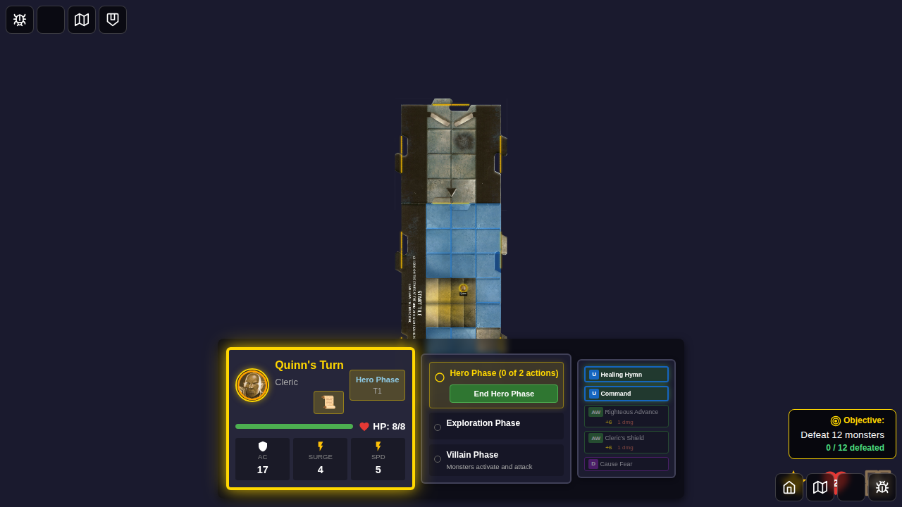
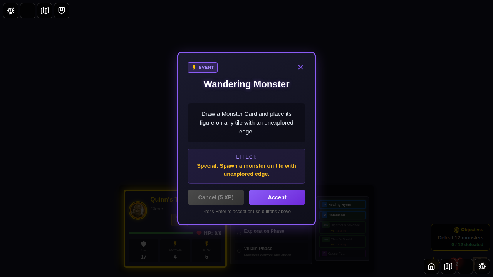
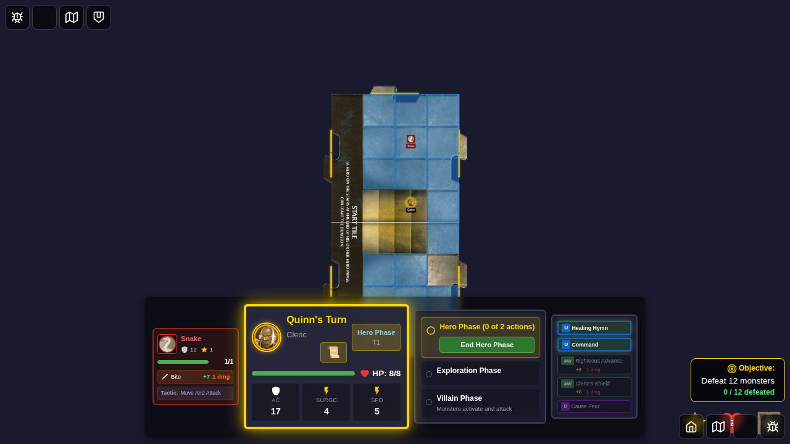

# E2E Test 103: Wandering Monsters Event Card

## User Story

As a player, when I draw the "Wandering Monster" encounter card, the game should:
1. Display the encounter card with its description
2. Upon accepting the card, draw a monster from the monster deck
3. Spawn that monster on a tile that has an unexplored edge
4. Update the monster deck to reflect the drawn monster
5. Discard the encounter card to the discard pile
6. Display appropriate messages about the spawned monster

## Test Sequence

This test demonstrates the complete lifecycle of the Wandering Monster encounter card, verifying that the card properly spawns a monster on the game board.

### Screenshot 000: Character Select Screen

**What to verify:**
- Character selection screen is displayed
- Hero cards are available for selection
- Quinn can be selected from bottom edge

### Screenshot 001: Game Started

**What to verify:**
- Game board is visible
- Quinn is positioned on the start tile
- Start tile has unexplored edges (needed for monster spawning)
- No monsters are present yet

**Programmatic checks:**
- Hero token exists for Quinn
- Dungeon has unexplored edges available
- Game is in playable state

### Screenshot 002: Game Ready for Encounter

**What to verify:**
- Quinn is positioned at coordinates (2, 3)
- Game state is stable and ready for encounter
- Unexplored edges still present on tiles

**Programmatic checks:**
- Quinn's position is set correctly
- Unexplored edges count is greater than 0

### Screenshot 003: Wandering Monster Card Displayed

**What to verify:**
- Encounter card modal is visible
- Card name displays "Wandering Monster"
- Card description mentions "unexplored edge"
- Card type is "Event"
- Accept/Continue button is available

**Programmatic checks:**
- `drawnEncounter.id` is 'wandering-monster'
- `drawnEncounter.type` is 'event'
- `drawnEncounter.effect.type` is 'special'

### Screenshot 004: Monster Spawned

**What to verify:**
- Encounter card has been dismissed
- A monster has been spawned on the board
- The spawned monster is visible on a tile
- Effect message displays "[Monster Name] spawned"

**Programmatic checks:**
- Monster count increased from initial count
- Monster deck was updated (card drawn)
- `encounterEffectMessage` contains "spawned"
- `recentlySpawnedMonsterId` is set
- Spawned monster has valid position coordinates

### Screenshot 005: Message Dismissed

**What to verify:**
- Encounter effect message has been cleared
- Monster remains on the board
- Game state is clean and ready for next action

**Programmatic checks:**
- `encounterEffectMessage` is null
- Monster count is greater than initial count

### Screenshot 006: Monster on Board

**What to verify:**
- Monster token is visible on the game board
- Monster is positioned on a tile with unexplored edge
- Game continues normally after monster spawn
- Encounter card is no longer displayed

**Programmatic checks:**
- `drawnEncounter` is null (card dismissed)
- At least one monster exists in game state
- Monster has valid position on the board

### Screenshot 007: Complete Lifecycle

**What to verify:**
- Encounter card lifecycle completed successfully
- Card was discarded to discard pile
- Game state is clean with no pending encounters
- Monster remains on the board

**Programmatic checks:**
- `drawnEncounter` is null
- Encounter discard pile contains 'wandering-monster'
- Monster count is greater than initial count (spawn persisted)

## Manual Verification Checklist

When reviewing this test, verify:

- [ ] Character selection works correctly with bottom-edge hero selection
- [ ] Game starts with deterministic state (consistent screenshots)
- [ ] Encounter card displays with correct name and description
- [ ] Encounter card shows appropriate icon for event type
- [ ] Monster spawns on a tile when card is accepted
- [ ] Monster appears at a valid position on the board
- [ ] Monster deck is updated (card drawn from deck)
- [ ] Encounter card is properly discarded after use
- [ ] Effect message communicates the monster spawn
- [ ] Game continues normally after monster spawn
- [ ] No errors or warnings in console

## Implementation Details

The Wandering Monster encounter card is fully implemented in:
- **Card definition**: `src/store/types.ts` (ENCOUNTER_CARDS array)
- **Effect handler**: `src/store/gameSlice.ts` (dismissEncounterCard reducer)
- **Monster spawning**: `src/store/monsters.ts` (spawnMonstersWithBehavior)
- **Deck manipulation**: `src/store/monsters.ts` (drawMonster)

## Edge Cases Handled

The implementation handles several edge cases:
- **No monsters in deck**: Displays "No monsters available in deck"
- **No unexplored edges**: Displays "No tiles with unexplored edges"
- **Spawn failure**: Displays "Failed to create monster"
- **Multi-monster spawns**: Handles monsters that spawn in groups (e.g., Kobold Skirmisher)

## Related Tests

- Test 037: Curse and Special Event Encounter Cards
- Test 038: Encounter Cards Comprehensive
- Unit tests: `src/store/gameSlice.test.ts` - "should spawn monster when dismissing wandering monster encounter"
