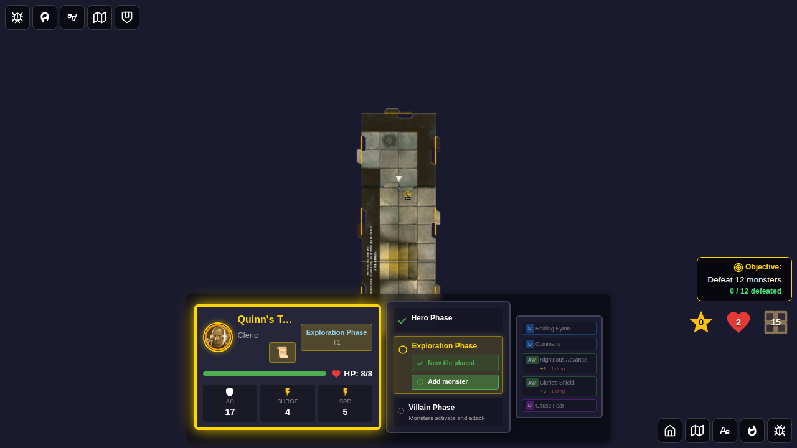
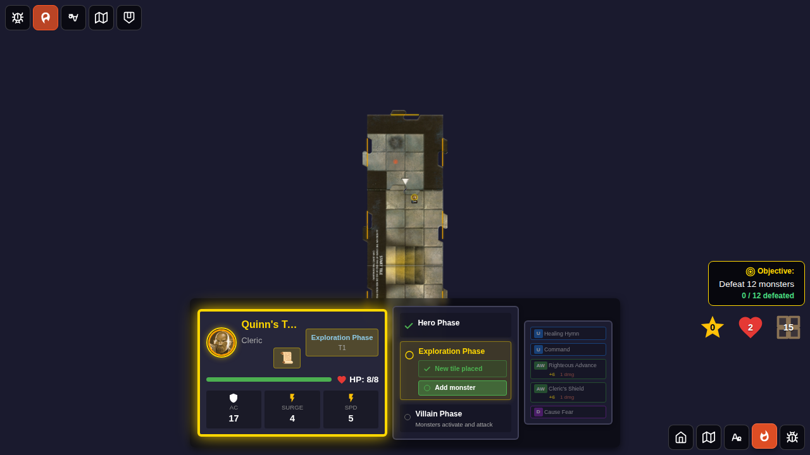

# E2E Test 104 - Scorch Mark Diagnostics Toggle

## User Story

As a developer or tester, I want to toggle a diagnostic overlay that highlights scorch marks on dungeon tiles so that I can verify spawn marker placement during gameplay.

## Test Scenario

1. Start a deterministic game with Quinn.
2. Move Quinn to the north edge to enable exploration.
3. End the hero phase and place a new tile.
4. Capture the board with diagnostics disabled.
5. Toggle the scorch mark diagnostic control.
6. Capture the board with scorch mark overlays visible.

## Screenshots

### Screenshot 000 - Tile placed without diagnostics

**What to verify:**
- A second tile is placed on the board.
- The scorch mark overlay is not visible.
- The diagnostics toggle button is available.

**Programmatic checks:**
- `scorch-mark-overlay` count is 0.
- `ui.showScorchMarks` is false.

### Screenshot 001 - Diagnostics enabled

**What to verify:**
- The scorch mark diagnostic toggle is active.
- A scorch mark overlay appears on the placed tile.

**Programmatic checks:**
- `scorch-mark-overlay` count is 1.
- `ui.showScorchMarks` is true.
