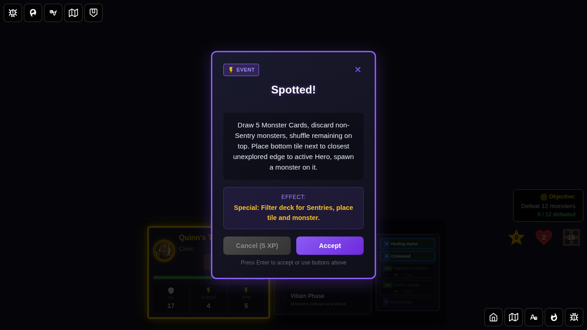
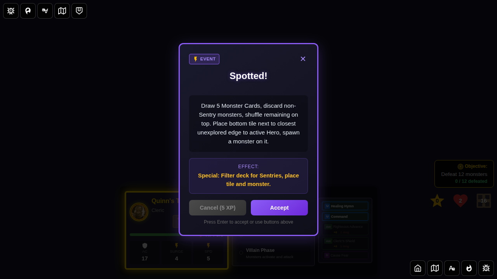

# E2E Test 105: Spotted! Encounter Card

## User Story

As a player, when I draw the "Spotted!" event card during the Villain Phase, the game should:
1. Draw 5 monster cards from the deck
2. Discard all non-Sentry monsters
3. Shuffle the remaining Sentry monsters and place them on top of the monster deck
4. Place a tile from the bottom of the tile deck next to the closest unexplored edge to the active hero
5. Draw a monster from the deck and spawn it on the newly placed tile

## Test Coverage

This test verifies:
- ✅ Monster deck filtering (draw 5, keep Sentries, discard others)
- ✅ Tile placement from bottom of deck
- ✅ Closest unexplored edge calculation
- ✅ Monster spawning on new tile
- ✅ Proper state updates (deck sizes, tile count, monster count)
- ✅ Effect message formatting and content
- ✅ Game continues normally after card effect

## Screenshots

### Screenshot 000: Character Select Screen

Player is presented with the character selection screen.

### Screenshot 001: Game Started

Game has started with Quinn selected. The start tile is visible and the hero is positioned on it.

### Screenshot 002: Spotted! Encounter Drawn

The "Spotted!" encounter card is displayed, showing its description and effects.

### Screenshot 003: Effect Applied

After dismissing the encounter card, the effect has been applied. The monster deck has been filtered for Sentries, a tile has been placed, and a monster has been spawned.

### Screenshot 004: New Tile Visible

The newly placed tile is visible on the game board next to an unexplored edge, placed at the location closest to the active hero.

### Screenshot 005: Spawned Monster Visible

The spawned monster is visible on the newly placed tile. The game continues normally after the card effect has been fully executed.

## Manual Verification Checklist

- [ ] Monster deck draw pile decreased by 5 minus Sentries kept
- [ ] Monster deck discard pile increased by number of non-Sentries discarded
- [ ] Sentry monsters are on top of the draw pile
- [ ] Tile count increased by 1
- [ ] Tile deck size decreased by 1
- [ ] Unexplored edges updated correctly
- [ ] Monster count increased (by 1 or more for multi-spawn monsters)
- [ ] Monster is positioned on the new tile
- [ ] Effect message is accurate and complete
- [ ] Game remains in hero phase after effect

## Implementation Details

The "Spotted!" card implementation combines three major game mechanics:
1. **Monster Deck Filtering**: Uses `filterMonsterDeckByCategory()` to filter for 'sentry' category monsters
2. **Tile Placement**: Uses `findTileAtPosition()` and Manhattan distance calculation to find closest unexplored edge, then `drawTileFromBottom()` and `placeTile()` to place the tile
3. **Monster Spawning**: Uses `drawMonster()` and `spawnMonstersWithBehavior()` to spawn a monster on the new tile

See `src/store/gameSlice.ts` for the complete implementation in the `dismissEncounterCard` reducer.
