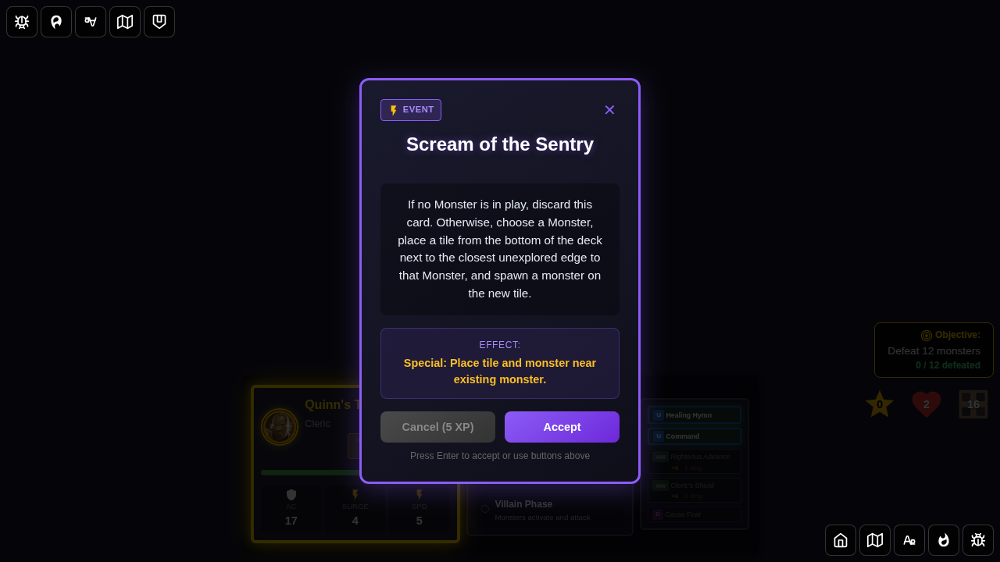
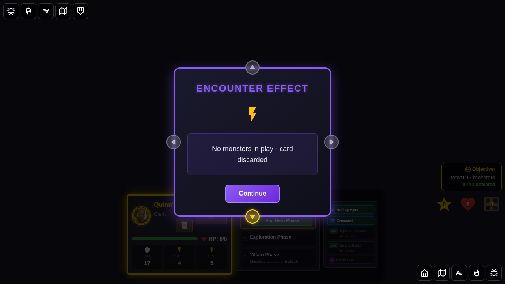
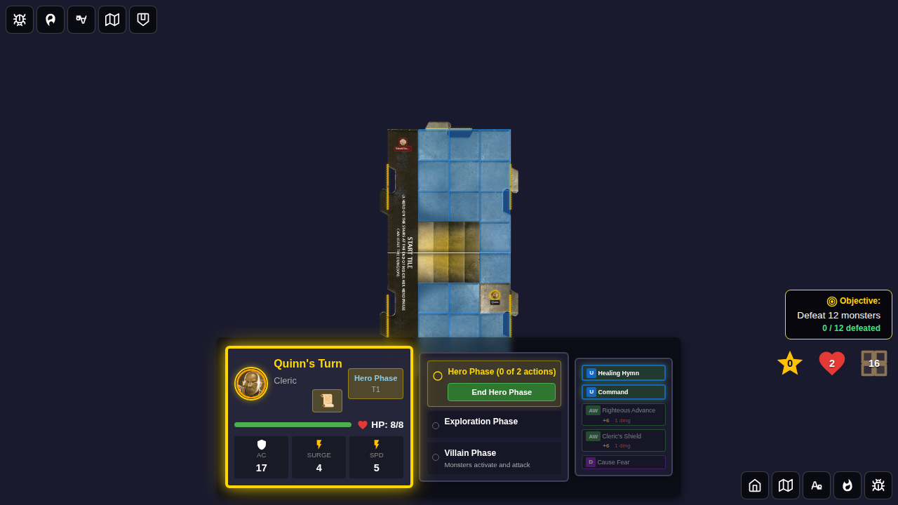
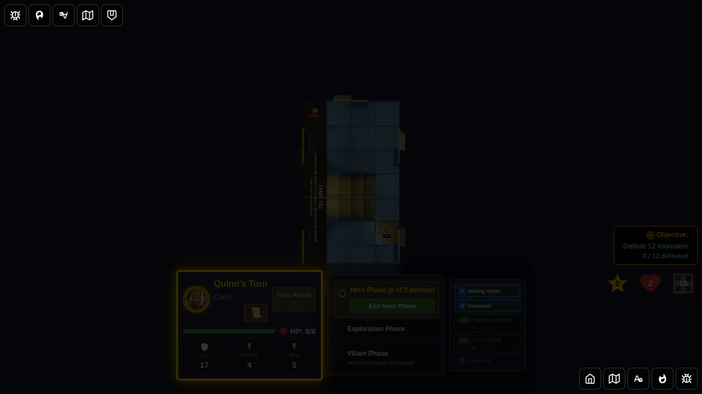
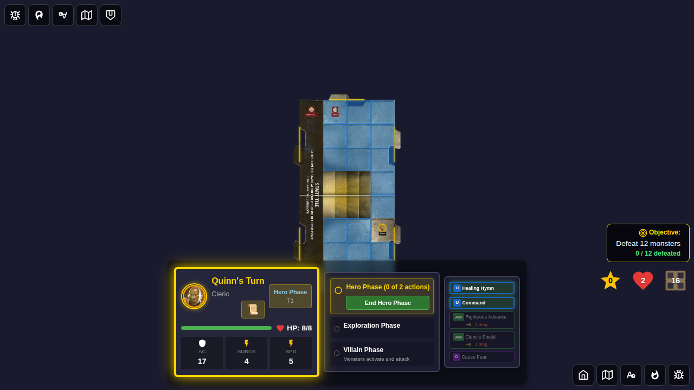
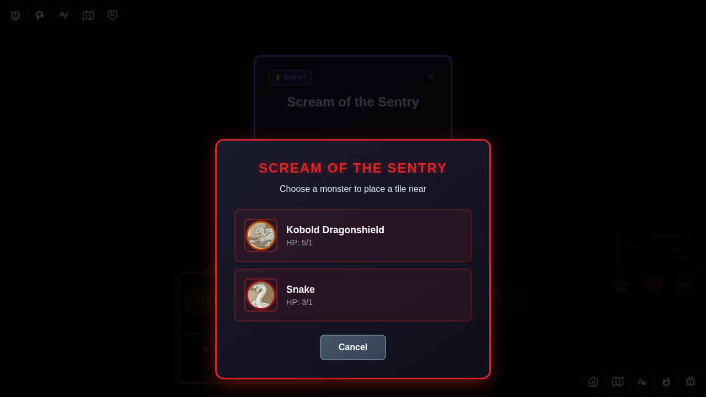

# E2E Test 107: Scream of the Sentry Encounter Card

## User Story

As a player, when I draw the "Scream of the Sentry" event card during the Villain Phase:
1. **If no monsters are in play**, the card is automatically discarded with no effect
2. **If only one monster is in play**, the card automatically selects that monster and:
   - Places a tile from the bottom of the deck at the closest unexplored edge to that monster
   - Spawns a new monster on the newly placed tile
3. **If multiple monsters are in play**, the card prompts me to choose which monster to use as the reference point, then:
   - Places a tile from the bottom of the deck at the closest unexplored edge to the chosen monster
   - Spawns a new monster on the newly placed tile

## Test Scenarios

This E2E test covers all three scenarios in separate test cases to ensure the card mechanics work correctly in each situation.

### Scenario 1: No Monsters in Play

The card should be discarded without any effect when no monsters are present on the board.

### Scenario 2: Single Monster Auto-Selection

When only one monster is in play, the card should automatically use that monster as the reference point without showing a selection modal.

### Scenario 3: Multiple Monsters - Player Choice

When multiple monsters are in play, the card should display a modal allowing the player to select which monster to use as the reference point for tile placement.

## Screenshot Gallery

### Scenario 1: No Monsters in Play

#### Screenshot 000: Character Selection Screen

**Verification:**
- Character selection screen is displayed
- Five hero cards are visible

#### Screenshot 001: Initial State - No Monsters

**Verification:**
- Game has started
- Hero is on the game board
- No monsters are present (verified via Redux state: `monsters.length === 0`)

#### Screenshot 002: Scream of the Sentry Card Drawn (No Monsters)

**Verification:**
- Encounter card is displayed showing "Scream of the Sentry"
- Card description explains the effect

#### Screenshot 003: Card Discarded (No Effect)

**Verification:**
- Encounter card is dismissed
- Effect message shows "No monsters in play - card discarded"
- No tiles were added to the dungeon
- No monsters were spawned

---

### Scenario 2: Single Monster Auto-Selection

#### Screenshot 000: Single Monster Present

**Verification:**
- One Kobold monster is present on the board (verified via Redux state)
- Monster is visible on the start tile

#### Screenshot 001: Scream of the Sentry Card Drawn (Single Monster)

**Verification:**
- Encounter card is displayed
- One monster is in play

#### Screenshot 002: Effect Applied - Tile and Monster Spawned

**Verification:**
- Encounter card was dismissed and effect applied
- Effect message shows tile was placed and monster was spawned
- Redux state confirms:
  - Tile count increased by 1
  - Monster count increased by 1
  - Tile deck decreased by 1
  - Monster deck decreased by 1
  - `recentlySpawnedMonsterId` is set

#### Screenshot 003: New Tile and Monster Visible

**Verification:**
- New dungeon tile is visible on the board
- New monster is visible on the newly placed tile
- Game state is consistent

---

### Scenario 3: Multiple Monsters - Player Choice

#### Screenshot 000: Multiple Monsters Present

**Verification:**
- Two monsters are present: Kobold and Snake (verified via Redux state)
- Both monsters are visible on the board

#### Screenshot 001: Scream of the Sentry Card Drawn (Multiple Monsters)

**Verification:**
- Encounter card is displayed
- Multiple monsters are in play

#### Screenshot 002: Monster Choice Modal Displayed

**Verification:**
- Monster choice modal is visible
- Modal title shows "Scream of the Sentry"
- Context message instructs player to "Choose a monster"
- Both monster options (Kobold and Snake) are displayed with:
  - Monster image
  - Monster name
  - Current HP / Max HP
- Cancel button is visible
- Redux state confirms `pendingMonsterChoice` is set with correct encounter details
- Encounter card is still drawn (not yet discarded, waiting for player choice)

#### Screenshot 003: Monster Selected - Effect Applied

**Verification:**
- Modal is dismissed
- Effect message shows tile was placed near "Kobold" and monster was spawned
- Redux state confirms:
  - `pendingMonsterChoice` is cleared
  - Encounter card is discarded
  - Tile count increased by 1
  - Monster count increased by 1 (now 3 total)
  - Tile deck and monster deck decreased appropriately
  - `recentlySpawnedMonsterId` is set

#### Screenshot 004: Final State - New Tile and Monster Visible

**Verification:**
- New dungeon tile is visible on the board
- Third monster is visible on the newly placed tile
- Game continues in Hero Phase
- All game state is consistent

## Programmatic Verification

All screenshots include comprehensive programmatic checks that verify:

### Redux State Verification
- Correct phase transitions
- Monster count changes
- Tile count changes
- Deck size changes (tile deck and monster deck)
- `pendingMonsterChoice` state (set when modal shown, cleared when choice made)
- `recentlySpawnedMonsterId` tracking
- Effect messages match expected outcomes

### DOM Verification
- Encounter card visibility
- Modal visibility and content
- Monster option buttons present in modal
- Effect notification messages

### Game Logic Verification
- No effect when no monsters present
- Auto-selection with single monster (no modal)
- Modal shown with multiple monsters
- Tile placed at correct location (closest unexplored edge to chosen monster)
- Monster spawned on new tile
- Proper cleanup after effect resolution

## Manual Verification Checklist

- [ ] **Scenario 1**: Card discarded with appropriate message when no monsters present
- [ ] **Scenario 2**: Single monster auto-selected without modal
- [ ] **Scenario 2**: Tile placed near the single monster
- [ ] **Scenario 2**: New monster spawned on new tile
- [ ] **Scenario 3**: Modal displayed when multiple monsters present
- [ ] **Scenario 3**: Modal shows all available monsters with images and HP
- [ ] **Scenario 3**: Selecting a monster applies the effect correctly
- [ ] **Scenario 3**: Tile placed near chosen monster
- [ ] **Scenario 3**: New monster spawned on new tile
- [ ] All screenshots are clear and properly captured
- [ ] No visual regressions from previous test runs
- [ ] Game remains playable after card effect

## Implementation Notes

This test validates the complete implementation of the "Scream of the Sentry" event card mechanics, including:

1. **Conditional Logic**: Different behavior based on monster count
2. **Player Interaction**: Monster selection modal for player choice
3. **Tile Placement**: Drawing from bottom of deck and placing at closest unexplored edge
4. **Monster Spawning**: Drawing and spawning monster on new tile
5. **State Management**: Proper Redux state updates and cleanup

The implementation uses:
- `handleScreamOfSentryEffect()` helper function for core effect logic
- `pendingMonsterChoice` state for modal display
- `selectMonsterForEncounter` action for player choice
- Manhattan distance calculation for finding closest unexplored edge
- `drawTileFromBottom()` to get tile from bottom of deck
- `spawnMonstersWithBehavior()` for proper monster spawning
