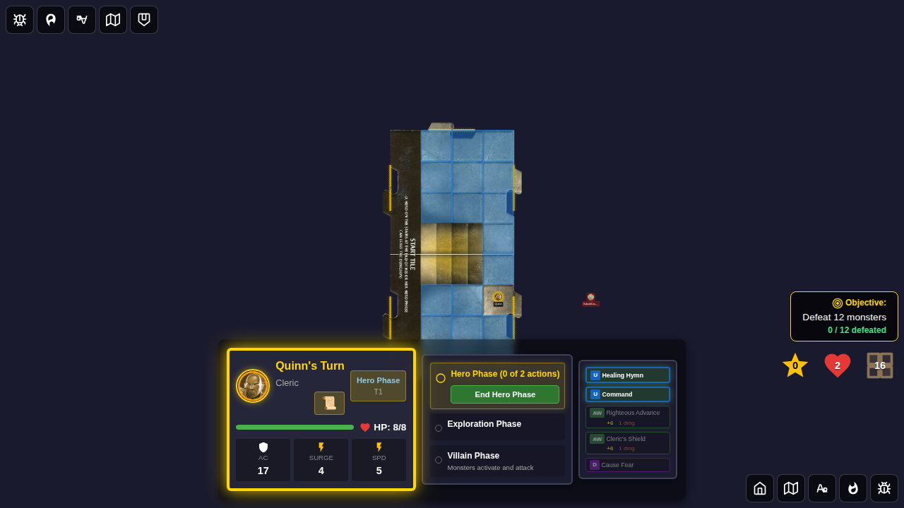
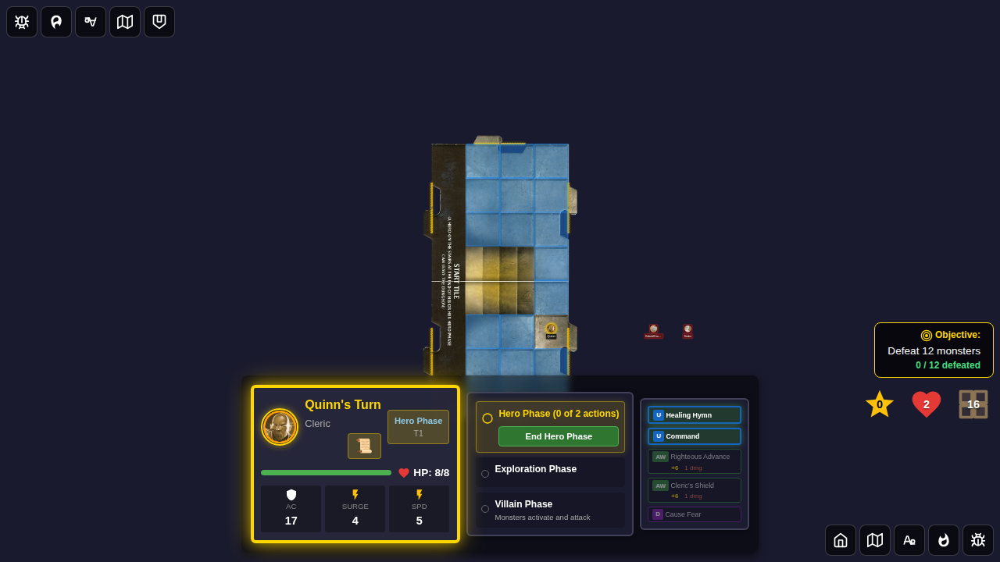
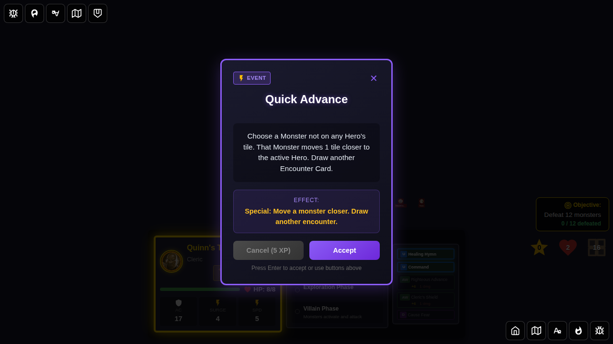
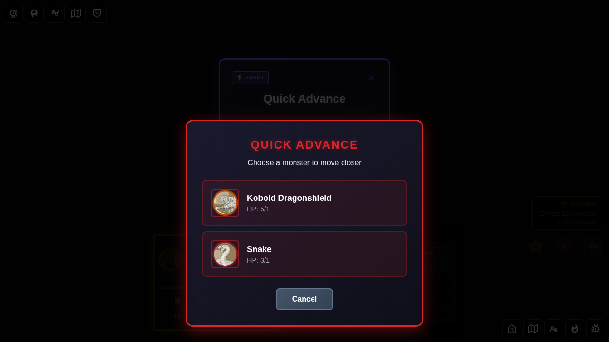
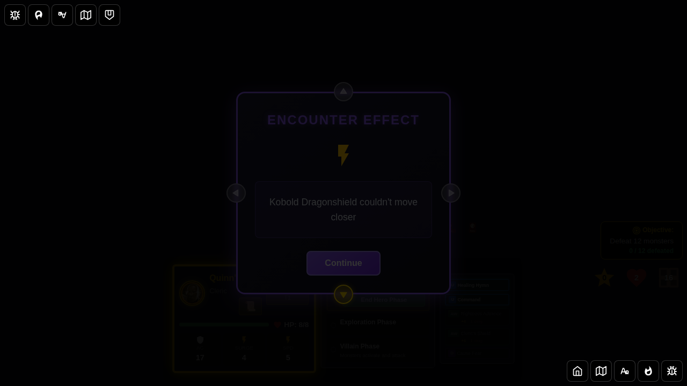

# 108 - Quick Advance Encounter Card

Tests the complete lifecycle of the **Quick Advance** event card:
- Drawing the card
- Monster movement toward the active hero
- Resolution with player choice (multiple monsters)
- Discard and follow-up encounter draw

## Scenarios

### Scenario 1: No Monsters in Play

When Quick Advance is drawn with no monsters in play, the card is discarded with a message and another encounter card is drawn immediately.

### Scenario 2: Single Monster Present

When Quick Advance is drawn with a single monster, it automatically moves that monster one step closer to the active hero.

### Scenario 3: Multiple Monsters Present

When Quick Advance is drawn with multiple monsters, the player must choose which monster to move. After the choice, the selected monster moves one step closer to the active hero.

