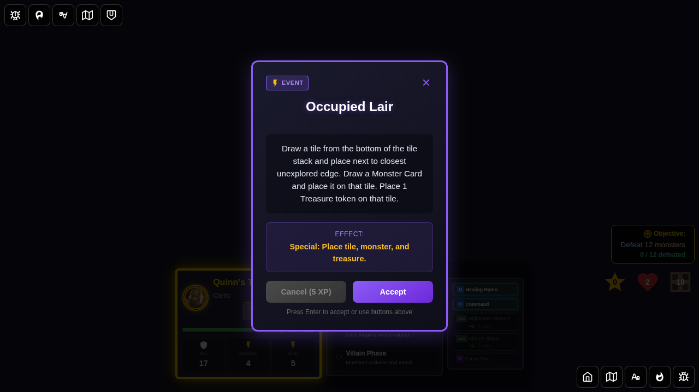

# E2E Test 109: Occupied Lair Encounter Card

## User Story

As a player, when I draw the "Occupied Lair" event card during the Villain Phase:
1. A tile is drawn from the bottom of the tile deck and placed next to the closest unexplored edge to the active hero
2. A Monster Card is drawn and the monster is spawned on the newly placed tile
3. A Treasure token is placed on the newly placed tile
4. The encounter card is discarded

## Test Scenarios

### Scenario 1: Full Effect — Tile, Monster, and Treasure Placement

The card is drawn, activated, and all three effects (tile placement, monster spawn, treasure token) are applied.

## Screenshot Gallery

#### Screenshot 000: Character Selection Screen

**Verification:**
- Character selection screen is displayed

#### Screenshot 001: Game Started

**Verification:**
- Game is in hero phase
- Dungeon has tiles and unexplored edges

#### Screenshot 002: Occupied Lair Card Drawn

**Verification:**
- Encounter card displays "Occupied Lair"
- Redux state confirms `drawnEncounter.id === 'occupied-lair'`

#### Screenshot 003: Effect Applied — Tile, Monster, and Treasure

**Verification:**
- Encounter card dismissed
- Effect message contains "treasure token placed"
- Tile count increased by 1
- Monster count increased by 1
- Treasure token count increased by 1
- **Bug Fix**: Treasure token position is verified to be on the new tile (not the start tile)

#### Screenshot 004: Card Discarded and State Verified

**Verification:**
- `drawnEncounter` is null
- `encounterDeck.discardPile` contains 'occupied-lair'
- Treasure token with `encounterId === 'occupied-lair'` exists on the board

## Programmatic Verification

All screenshots include comprehensive programmatic checks:

### Redux State Verification
- Tile count increases by 1 after card activation
- Tile deck length decreases by 1
- Monster count increases (monster spawned on new tile)
- Monster deck draw pile decreases
- Treasure token count increases by 1
- Treasure token has `encounterId === 'occupied-lair'`
- **Bug Fix**: Treasure token position equals `(newTile.minX + 1, newTile.minY + 1)` using correct `getTileBounds()` coordinates, not `(col * 4 + 1, row * 4 + 1)` which was wrong for south-column tiles
- Encounter card is in discard pile after resolution

## Manual Verification Checklist

- [ ] Occupied Lair card is shown with correct text describing tile, monster, and treasure placement
- [ ] After dismissal: a new tile appears on the board at the closest unexplored edge
- [ ] After dismissal: a new monster appears on the new tile
- [ ] After dismissal: a treasure token appears on the new tile
- [ ] Encounter card is discarded and no longer shown
- [ ] Effect message confirms all three placements occurred
- [ ] Game remains in a valid state after the effect

## Implementation Notes

The "Occupied Lair" mechanic:
1. Finds the closest unexplored edge to the active hero using Manhattan distance
2. Draws a tile from the bottom of the tile deck via `drawTileFromBottom()`
3. Places the tile at the closest unexplored edge via `placeTile()`
4. Updates dungeon edges via `updateDungeonAfterExploration()`
5. Draws a monster card via `drawMonster()`
6. Spawns the monster on the new tile via `spawnMonstersWithBehavior()`
7. Places a treasure token on the new tile via `createTreasureTokenInstance()`
