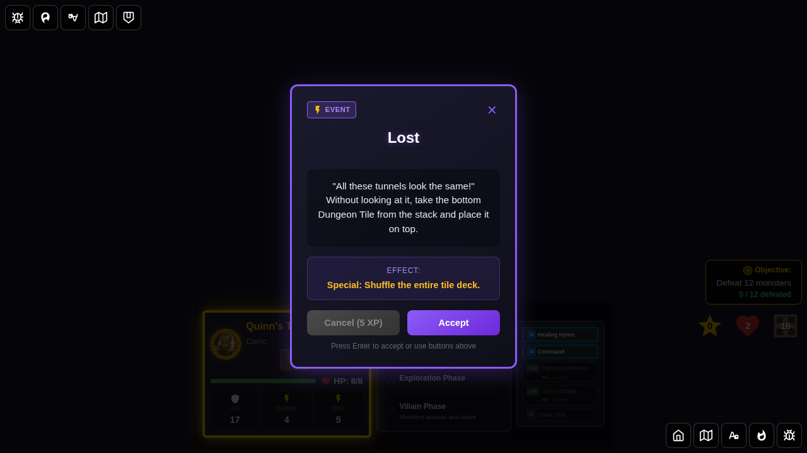
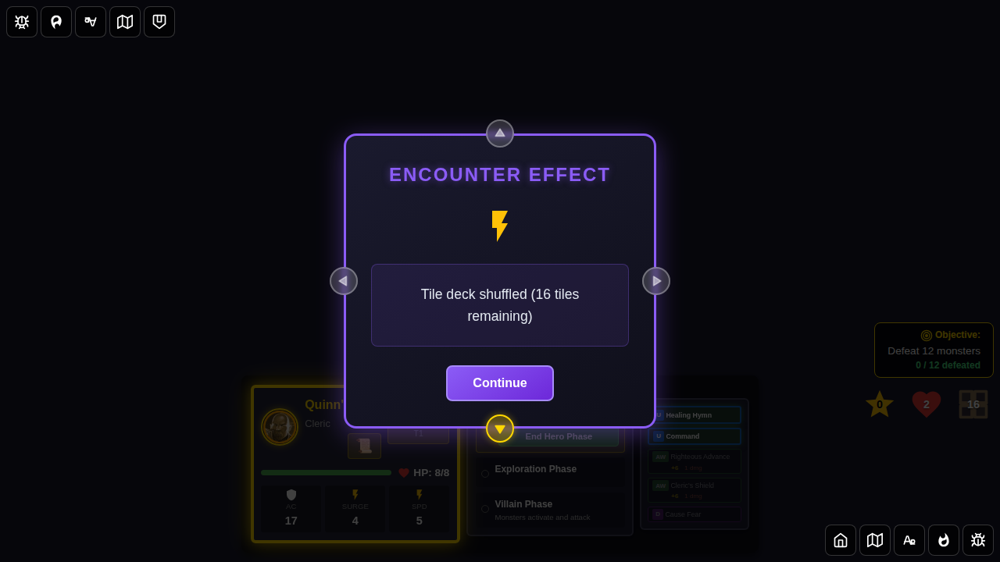

# E2E Test 110: Lost Encounter Card

## User Story

As a player, when I draw the "Lost" event card during the Villain Phase:
1. The encounter card is displayed with the 'Lost' card text
2. Upon dismissal, the entire tile deck is shuffled
3. The tile deck retains the same number of tiles (no tiles added or removed)
4. The encounter card is discarded to the discard pile

## Test Scenarios

### Scenario 1: Full Effect — Tile Deck Shuffle

The card is drawn, activated, and the tile deck is shuffled.

## Screenshot Gallery

#### Screenshot 000: Character Selection Screen

**Verification:**
- Character selection screen is displayed

#### Screenshot 001: Game Started

**Verification:**
- Game is in hero phase
- Dungeon has tiles and a non-empty tile deck

#### Screenshot 002: Lost Card Drawn

**Verification:**
- Encounter card displays "Lost"
- Redux state confirms `drawnEncounter.id === 'lost'`

#### Screenshot 003: Effect Applied — Tile Deck Shuffled

**Verification:**
- Encounter card dismissed
- Effect message contains "Tile deck shuffled"
- Tile deck length is unchanged (same number of tiles, just reordered)

#### Screenshot 004: Card Discarded and State Verified

**Verification:**
- `drawnEncounter` is null
- `encounterDeck.discardPile` contains 'lost'
- Tile deck size remains unchanged

## Programmatic Verification

All screenshots include comprehensive programmatic checks:

### Redux State Verification
- `drawnEncounter.id === 'lost'` after card is drawn
- Effect message contains "Tile deck shuffled" after dismissal
- Tile deck length is unchanged after shuffling
- Encounter card is in discard pile after resolution

## Manual Verification Checklist

- [ ] Lost card is shown with correct text about the tile deck
- [ ] After dismissal: effect notification appears confirming tile deck was shuffled
- [ ] After dismissal: tile count on the board remains the same
- [ ] Encounter card is discarded and no longer shown
- [ ] Game remains in a valid state after the effect

## Implementation Notes

The "Lost" mechanic:
1. Shuffles the entire tile deck using `shuffleTileDeck()` from exploration.ts
2. Does NOT add or remove any tiles from the deck
3. Sets the effect message to "Tile deck shuffled (N tiles remaining)"
4. The card is discarded to the encounter discard pile after the effect is applied
