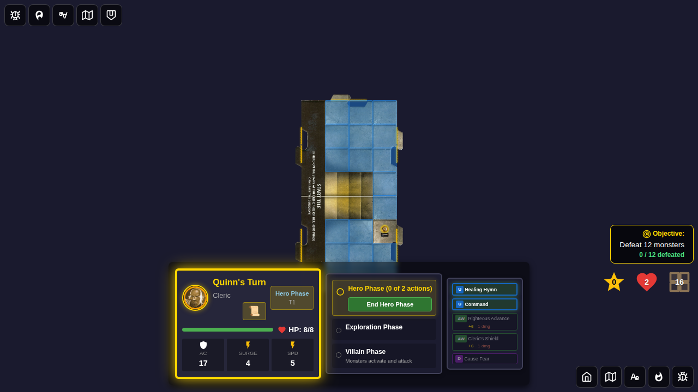
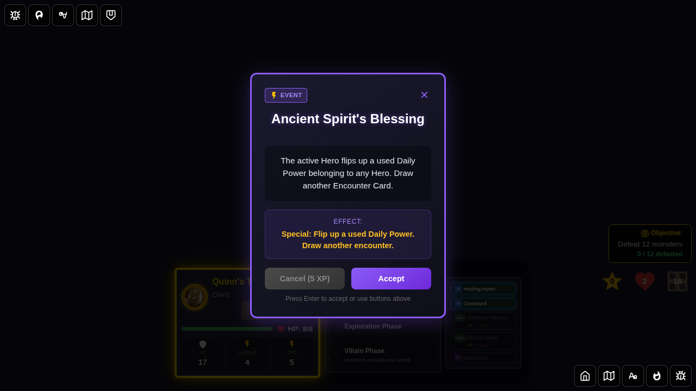
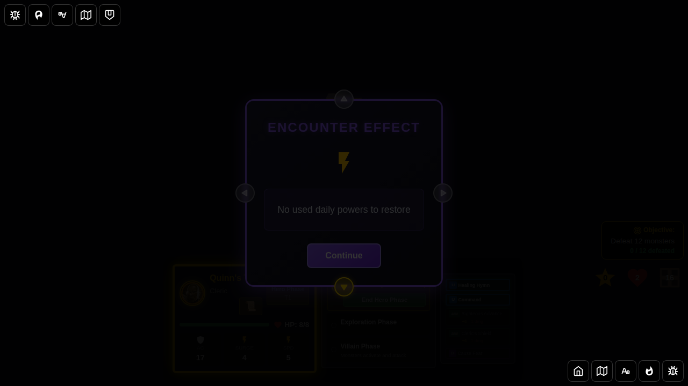
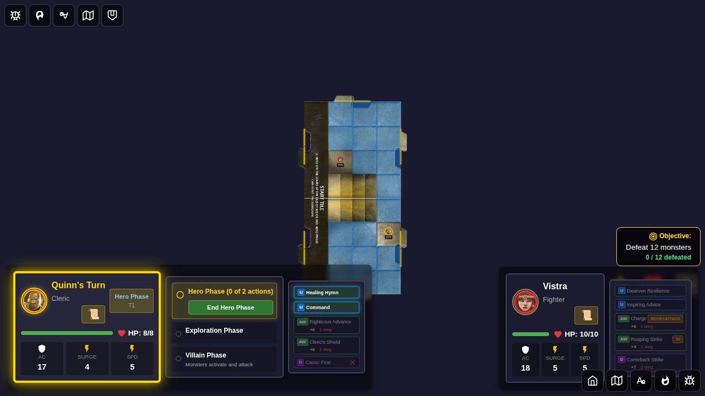
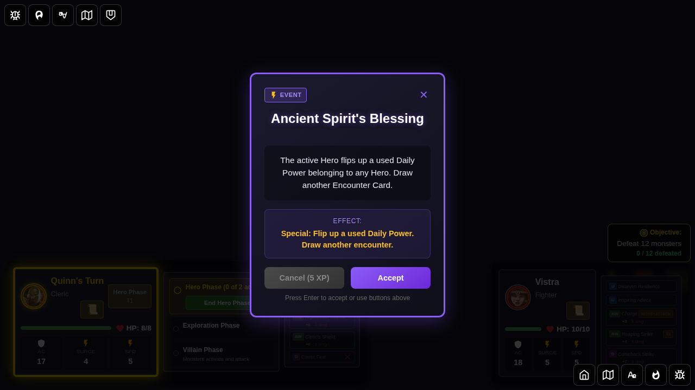
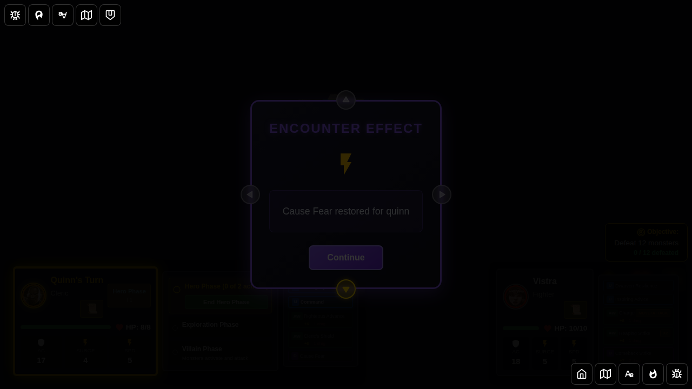

# 111 - Ancient Spirit's Blessing Encounter Card

This test suite verifies the full lifecycle of the "Ancient Spirit's Blessing" encounter card, which restores a used Daily Power for any hero.

## Card Description

> The active Hero flips up a used Daily Power belonging to any Hero. Draw another Encounter Card.

## Scenarios

### Scenario 1: No Used Daily Powers

When the card is drawn but no heroes have used their daily power, the card resolves with a message indicating nothing was restored, then draws another encounter card.

#### Screenshot 001 - Character Select

#### Screenshot 002 - Game Started (Daily Not Used)

#### Screenshot 003 - Ancient Spirit's Blessing Drawn

#### Screenshot 004 - No Daily Powers To Restore

---

### Scenario 2: Hero Has Used Daily Power

When a hero's daily power has been used (flipped), the card restores it (unflips it) and shows an effect message indicating which power was restored.

#### Screenshot 001 - Daily Power Used

#### Screenshot 002 - Ancient Spirit's Blessing Drawn (with Used Daily)

#### Screenshot 003 - Daily Power Restored

---

### Scenario 3: Multiple Heroes - First Used Daily Restored

With multiple heroes, the first encountered used daily power (across all heroes) gets restored when the blessing is applied.

#### Screenshot 001 - Active Hero Daily Used

#### Screenshot 002 - Ancient Spirit's Blessing Drawn (Multi-Hero)

#### Screenshot 003 - Daily Power Restored (Multi-Hero)

## Implementation Notes

- The card is identified as a `special` type encounter with effect type `special`
- Cross-slice coordination is done in `GameBoard.svelte`: before dispatching `dismissEncounterCard`, the handler reads `state.heroes.heroPowerCards`, finds the first used daily power, dispatches `restoreUsedDailyPower` to the heroes slice, then passes the restored power info as a payload to `dismissEncounterCard`
- The daily power is identified by `isFlipped: true` in the `cardStates` array of `HeroPowerCards`
- After applying the blessing, the card automatically draws another encounter card (as per `shouldDrawAnotherEncounter('ancient-spirits-blessing') === true`)
