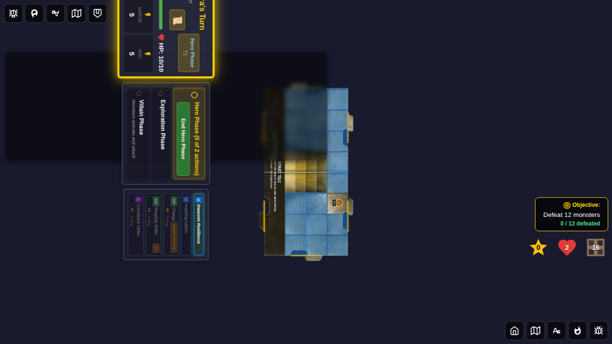
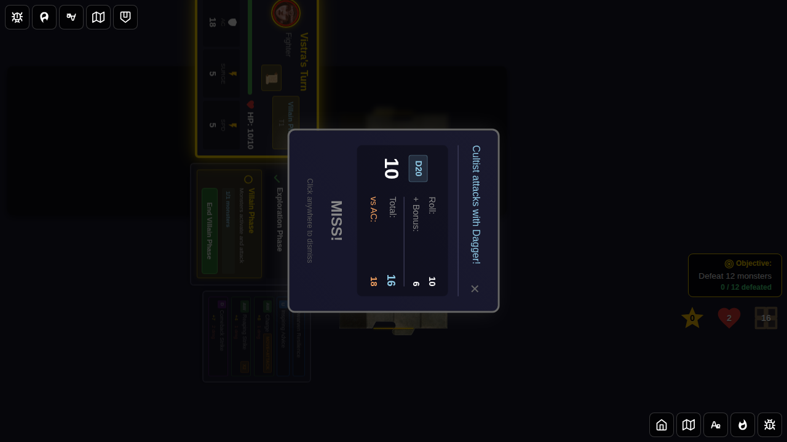

# 112 - Monster Attack Name Display

## User Story

> As a player, when a monster attacks during the Villain Phase, the combat result dialog shows the monster's specific attack name (e.g. "Cultist attacks with Dagger!") rather than the generic placeholder "Attack".

## Feature Description

This test validates the fix for the bug where every monster combat result showed "attacks with Attack!" regardless of which attack the monster actually used. Each monster now displays its real attack name from the monster card definition.

### Monster Attack Names

| Monster | Attack Name |
|---------|-------------|
| Human Cultist | Dagger |
| Snake | Bite |
| Kobold | Sword |
| Orc Smasher | Heavy Mace |
| Grell (adjacent) | Venomous Bite |
| Grell (ranged) | Tentacles |
| Orc Archer (adjacent) | Punch |
| Orc Archer (ranged) | Arrow |

## Test Flow with Screenshots

### Step 1: Game Started

The player starts the game with Vistra the Fighter. The game board shows the Start Tile ready to begin.

### Step 2: Cultist Adjacent — Villain Phase

A Cultist is placed immediately adjacent to Vistra. The turn transitions to the Villain Phase, ready for monster activation.

### Step 3: Cultist Attacks with Dagger!

When the Cultist activates, the combat result dialog shows **"Cultist attacks with Dagger!"** — the monster's real attack name drawn from its card definition, not the old hardcoded "Attack".

### Step 4: Combat Result Dismissed

After dismissing the combat result dialog, both `monsterAttackResult` and `monsterAttackName` are verified to be `null` in the Redux store, confirming clean state reset.

## Test Scenario

### Cultist attacks with Dagger (not generic "Attack")
- **Setup**: Vistra at (2, 3), Cultist adjacent at (2, 2) on start tile; encounter deck cleared
- **Action**: Activate monster during Villain Phase
- **Expected**: Combat result dialog shows "Cultist attacks with Dagger!"
- **Verification**:
  - `[data-testid="attacker-info"]` contains `"Cultist attacks with Dagger!"`
  - `[data-testid="attacker-info"]` does NOT contain `"attacks with Attack!"`
  - After dismiss: `monsterAttackResult === null` and `monsterAttackName === null`

## Acceptance Criteria

- [x] Combat result shows the monster's actual attack name from the card definition
- [x] The old generic "Attack" text is no longer shown
- [x] `monsterAttackName` state field is set on attack and cleared on dismiss
- [x] `DEFAULT_MONSTER_ATTACK` construct removed — no fallback generic attack exists
