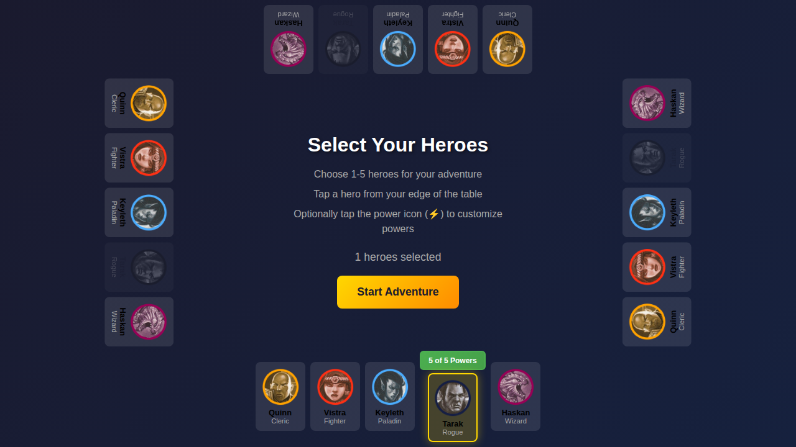
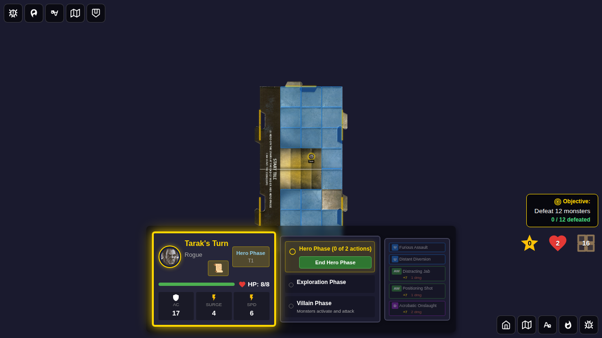
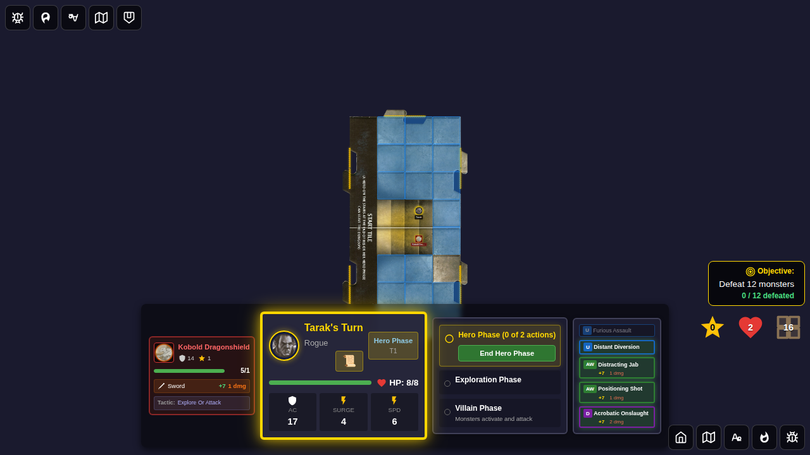
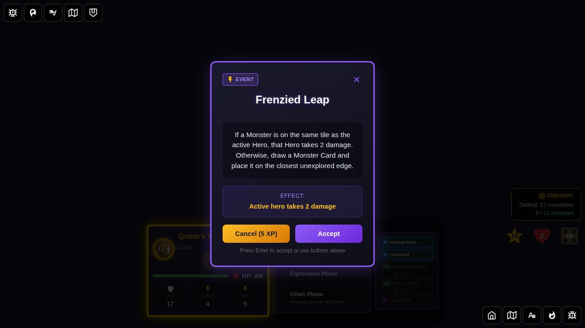
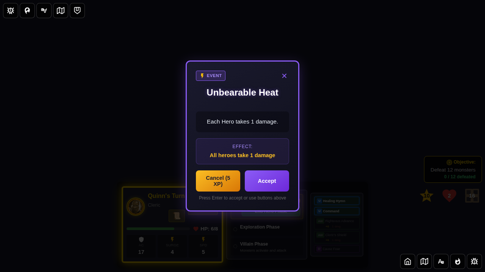

# 113 - Event Hook Power Cards

Demonstrates the integrated event hook system for power cards. Power cards with conditional effects register hooks in the Redux game state on game start. The EncounterCard UI reads the encounter cancel cost dynamically from Redux state.

## User Story

As a player, the event hook system automatically activates power card effects at the right moment without requiring manual intervention:
- **Furious Assault** (Tarak's custom ability, ID 31): Automatically adds +1 damage when Tarak hits a monster, by registering an `attack-hit-by-hero` event hook in Redux state
- **Perseverance** (Cleric utility, ID 10): Registers an `encounter-draw` hook that reduces the encounter cancel cost by the number of heroes on the active tile

## Test Coverage

### Test 1: Event Hooks Registered After Game Start
- Selects Tarak (Rogue with Furious Assault custom ability)
- Starts the game and verifies `state.game.eventHooks` has hooks registered
- Confirms there is at least one `attack-hit-by-hero` hook (from Furious Assault)
- Confirms `encounterCancelCost` is initialized to 5
- Confirms `pendingPowerCardFlips` starts empty
- Spawns a monster adjacent to Tarak and verifies hooks remain active

### Test 2: Encounter Cancel Cost is Dynamic
- Selects Quinn (Cleric)
- Draws an encounter card and verifies the Cancel button shows "Cancel (5 XP)" from Redux state
- Registers Perseverance (ID 10) hooks via `registerEventHooks` dispatch
- Draws another encounter and verifies `encounter-draw` hooks are in game state

## Screenshots

### Test 1

#### 000 - Tarak Selected With Powers

#### 001 - Game Board With Event Hooks Registered

#### 002 - Monster Spawned Adjacent to Tarak

### Test 2

#### 000 - Encounter Cancel Shows Dynamic Cost

#### 001 - Encounter With Perseverance Hooks Active

