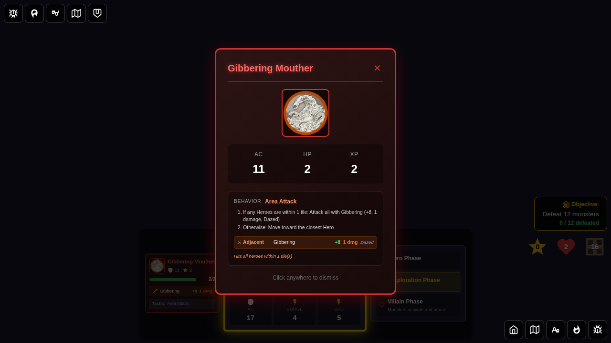
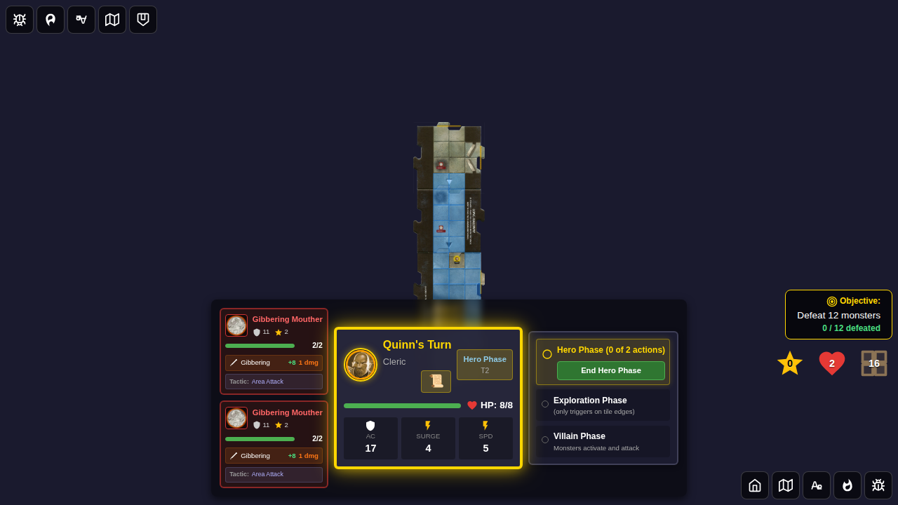
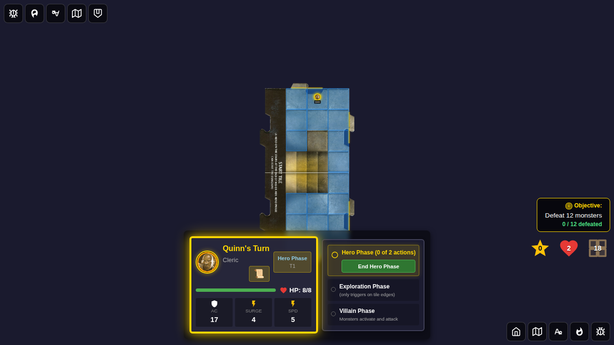
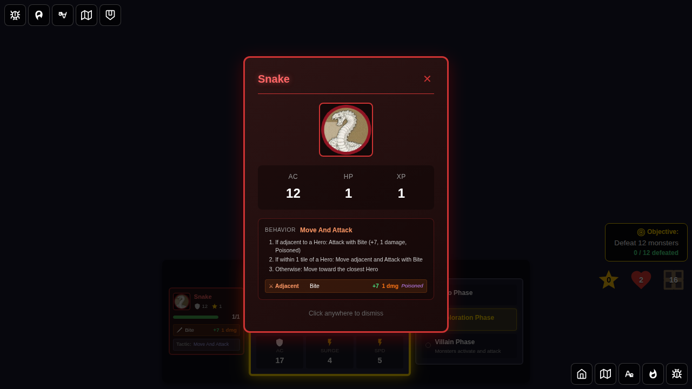
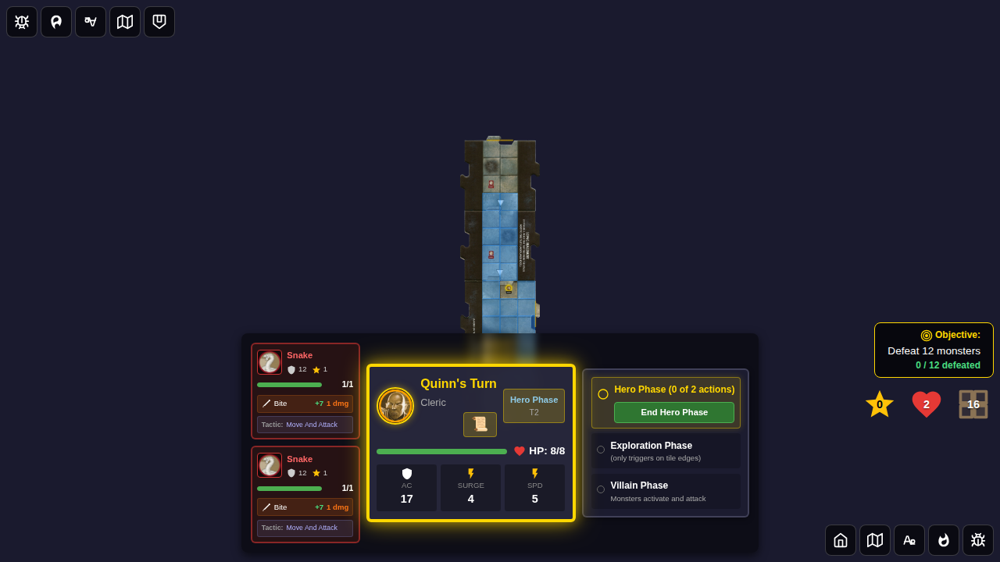

# Test 114 - Long Hallway Special Rule

## User Story

> As a player, when I explore and draw the Long Hallway tile, the game automatically draws and places a second tile on the hallway's open end. An encounter card is drawn during the Villain Phase unless both tiles have white arrows.

## Game Rules

When a Long Hallway tile is drawn during exploration:
1. Place the Long Hallway tile normally (with a monster)
2. Automatically draw an additional tile from the deck
3. Place the additional tile on the hallway's unexplored end
4. Ensure both tile arrows face back toward their connecting edge
5. Spawn a monster on each newly revealed tile
6. During the Villain Phase, draw an encounter card if **either** tile has a black arrow — skip if **both** tiles have white arrows

## Test Scenarios

### Scenario 1: Black Long Hallway → Encounter Drawn

```gherkin
Feature: Long Hallway draws second tile

  Scenario: Black Long Hallway triggers an encounter
    Given it is Quinn's turn
    And Quinn is on the north edge of the start tile
    And the tile deck has the black Long Hallway as the first tile
    When Quinn ends the hero phase
    Then the Long Hallway tile is placed to the north
    And a second tile is automatically placed on the hallway's far end
    And both tile arrows point back toward the connecting edge
    And each revealed tile has at least one spawned monster
    And the tile deck decreases by 2 (both tiles drawn)
    And during the Villain Phase an encounter card is drawn
```

### Scenario 2: White Long Hallway + White Second Tile → No Encounter

```gherkin
  Scenario: White Long Hallway with white second tile skips encounter
    Given it is Quinn's turn
    And Quinn is on the north edge of the start tile
    And the tile deck has the white Long Hallway first, then a white tile second
    When Quinn ends the hero phase
    Then the white Long Hallway tile is placed to the north
    And a white second tile is automatically placed on the hallway's far end
    And both tile arrows point back toward the connecting edge
    And each revealed tile has at least one spawned monster
    And the tile deck decreases by 2
    And during the Villain Phase NO encounter card is drawn
```

## Screenshot Gallery

### Test 1: Black Long Hallway

#### 000 - Hero at North Edge (Black Hallway in Deck)


Quinn is positioned at the north edge of the start tile. The black Long Hallway tile is at the front of the deck.

#### 001 - Long Hallway + Second Tile Placed


After exploration: 3 tiles are now on the board (start tile + black Long Hallway + automatically drawn second tile). The tile deck decreased by 2.

#### 002 - Hero Phase After Black Hallway (Encounter Was Drawn)


The next hero turn begins. The black Long Hallway triggered an encounter card during the Villain Phase.

---

### Test 2: White Long Hallway + White Second Tile

#### 000 - Hero at North Edge (White Hallway in Deck)


Quinn is positioned at the north edge. The white Long Hallway tile is first in the deck, followed by a white tile.

#### 001 - White Long Hallway + White Second Tile Placed


After exploration: 3 tiles on the board. Both tiles are white, so no encounter will be drawn.

#### 002 - Hero Phase After White Hallway (No Encounter)


The next hero turn begins. Since both tiles were white, no encounter card was drawn during the Villain Phase.
