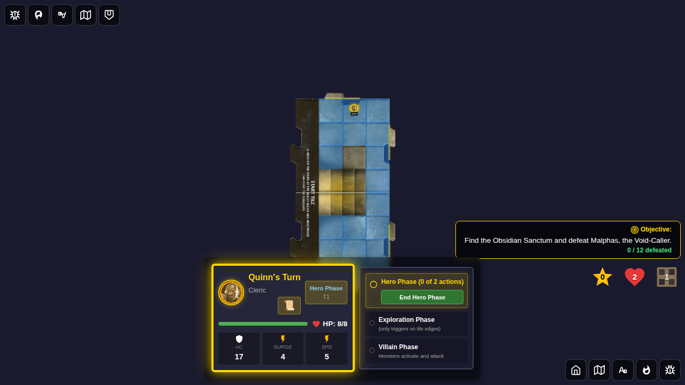
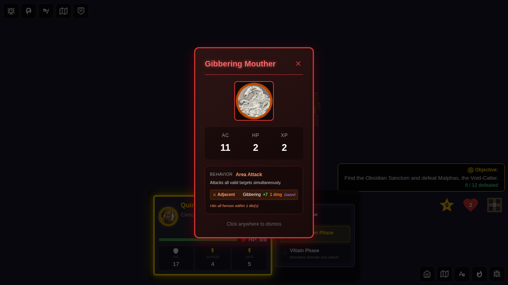
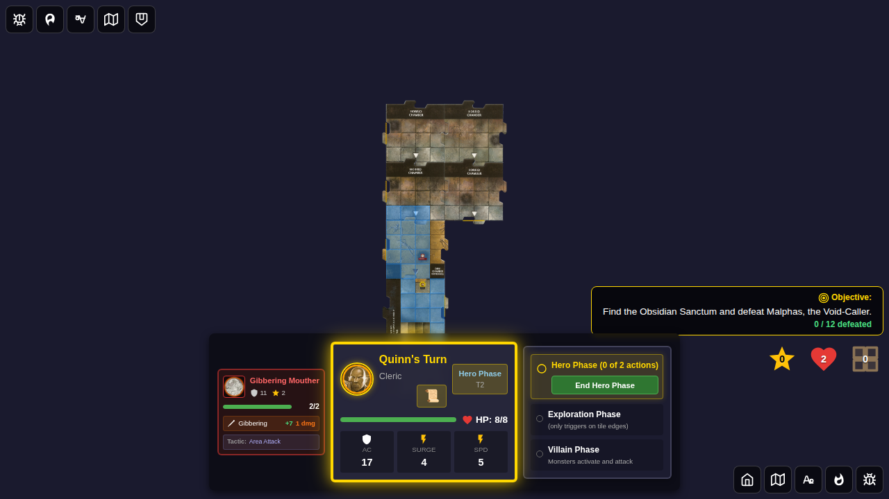

# 115 - Room Set Placement on Chamber Reveal

## User Story

As a player in a scenario with a room set (Adventure 14 or 15), when I explore and reveal the Chamber Entrance tile, the game automatically places the scenario's room set tiles around the entrance. Each tile fades in sequentially with staggered animation.

## Screenshots

### 000 - Hero at North Edge, Chamber Entrance Next

Quinn is positioned at the north edge of the start tile. The tile deck has been forced to contain only the Chamber Entrance tile.

### 001 - Chamber Entrance and Room Set Placed

After exploration, the Chamber Entrance tile is placed and the Obsidian Sanctum room set (4 Horrid Chamber tiles) is automatically laid out in a 2×2 grid beyond the entrance. A monster is spawned on the chamber entrance tile.

### 002 - Hero Phase After Chamber Reveal

The full chamber layout is visible: start tile (blue) → chamber entrance → 4 Horrid Chamber room tiles arranged in a 2×2 pattern above the entrance. The mini-monster card for the spawned monster is shown. Animation tracking IDs are cleared when moving to the next hero turn.

## Programmatic Verification

- ✅ 6 tiles total placed (start + entrance + 4 room set tiles)
- ✅ Chamber Entrance tile (`tile-chamber-entrance`) present
- ✅ All 4 Horrid Chamber tiles (`tile-horrid-chamber-01` through `tile-horrid-chamber-04`) present
- ✅ `scenario.chamberRevealed` is `true`
- ✅ `recentlyPlacedRoomSetTileIds` contains 4 tile IDs (for sequential animation)
- ✅ Log entry mentions "Chamber Entrance revealed"
- ✅ Log entry mentions "Obsidian Sanctum" room set placement
- ✅ Room set tiles positioned correctly relative to entrance (forward/right offsets)
- ✅ **No wall edges appear as unexplored** — tile connections validated against image-analysed edge configuration (`tools/validate_tiles.py`)
- ✅ Chamber entrance east wall side has no unexplored edge
- ✅ Animation IDs cleared after villain phase ends
