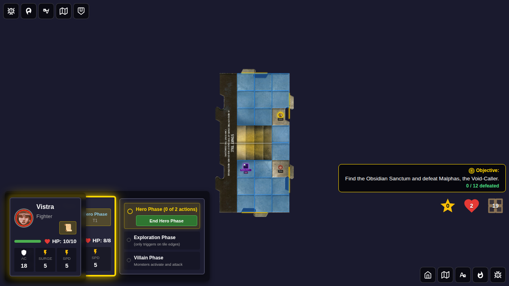
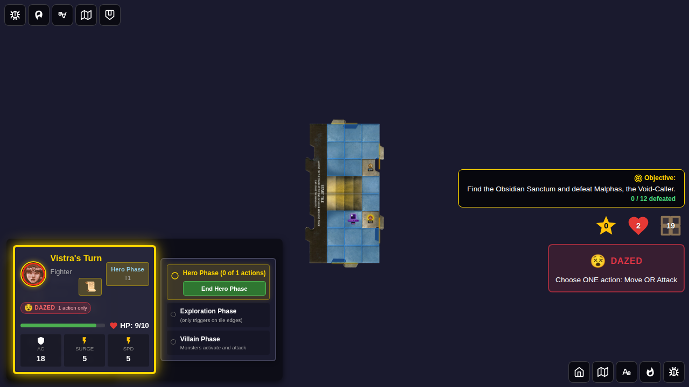
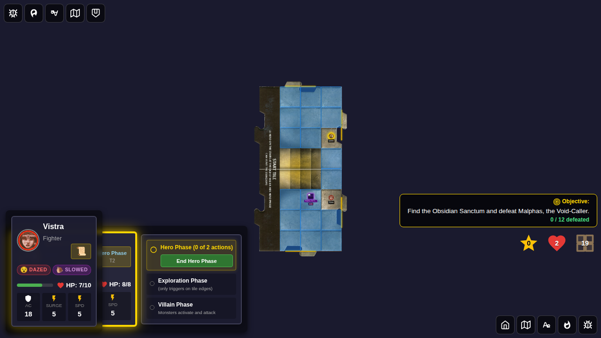

# Test 116 - Villain Display and Per-Turn Activation

## User Story

As a player in Adventure 14 (Malphas), once the villain is present on the board:

1. The villain token renders with an HP bar and status badges (e.g., 🛡️ shield when guards are adjacent for Malphas).
2. During **every** hero's villain phase, Malphas activates once — meaning in a 2-hero game he activates **twice** per round, once per hero.

## Test Coverage

### Test 1: Villain token appears and activates each player turn

Verifies that:
- The villain token is visible on the board when `villain != null` (any phase)
- HP bar shows correct `currentHp/maxHp` values
- The villain auto-activates during Quinn's villain phase (log entry appears)
- `villainActivatedThisTurn` resets to `false` after the phase ends
- The villain auto-activates again during Vistra's villain phase
- Total activation log count is ≥ 2 (one per hero's villain phase)

### Test 2: Villain token shows HP bar and shield badge when guards adjacent

Verifies that:
- HP bar is visible and shows correct values (`12/16`)
- Shield badge (🛡️) appears when a monster guard is adjacent to Malphas
- Shield badge disappears when no monsters are adjacent

## Screenshots

### Test 1

#### Screenshot 000 — Villain token visible in hero-phase

#### Screenshot 001 — After villain activates during Quinn's villain phase

#### Screenshot 002 — Villain activated in both villain phases

### Test 2

#### Screenshot 000 — Villain token with HP bar

#### Screenshot 001 — Shield badge when guard adjacent

#### Screenshot 002 — No shield when no guards

