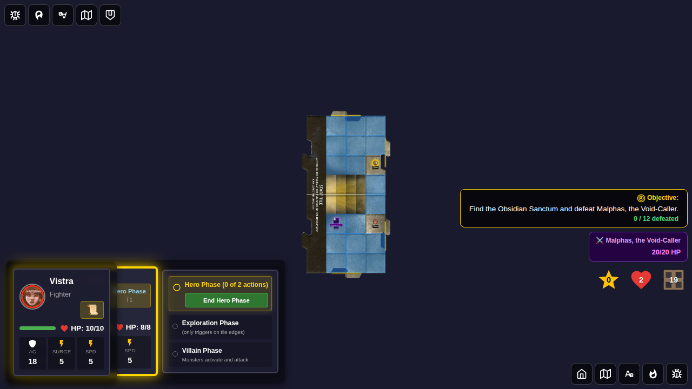
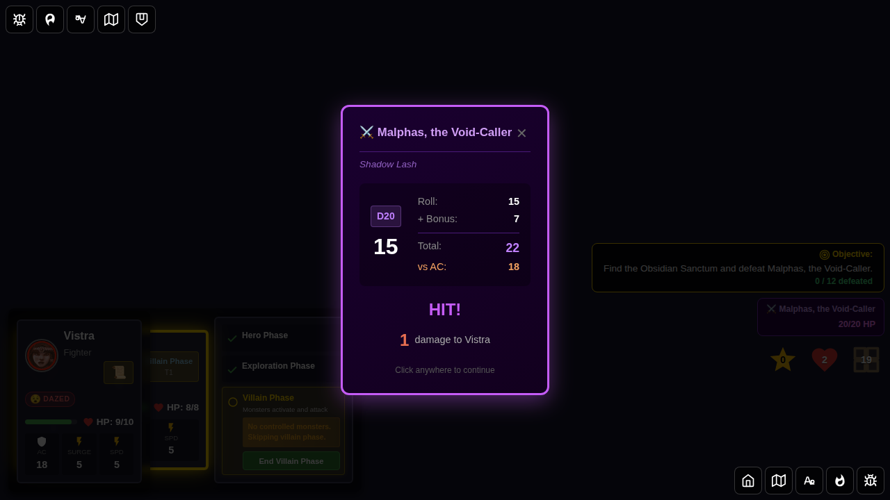
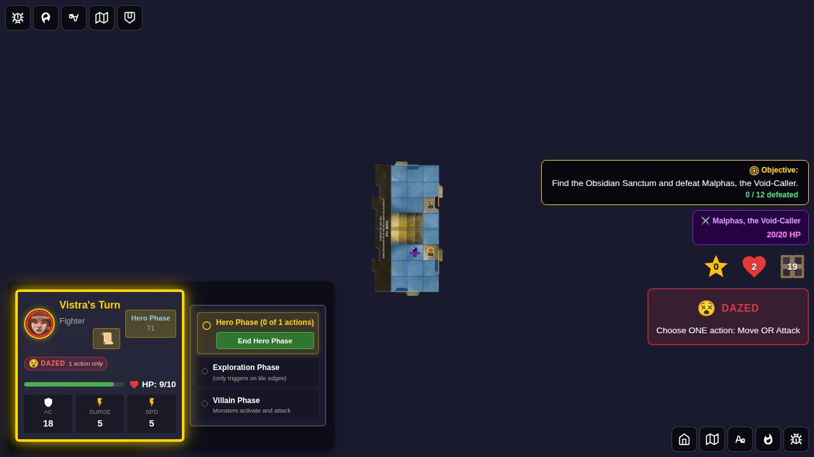
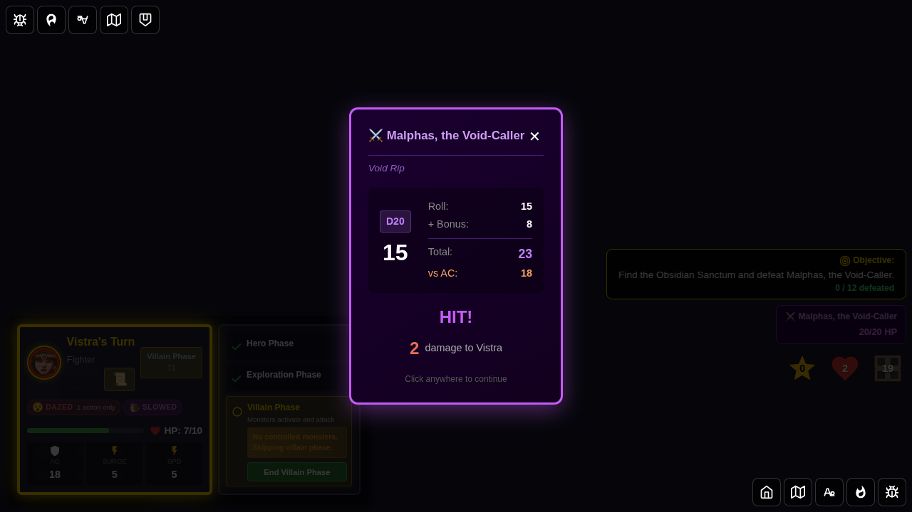
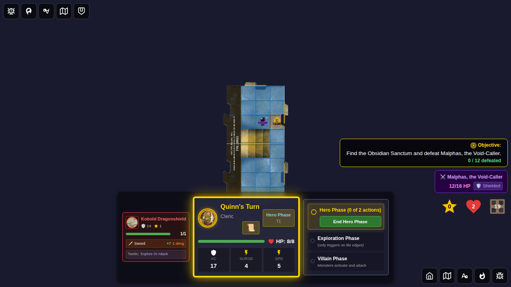
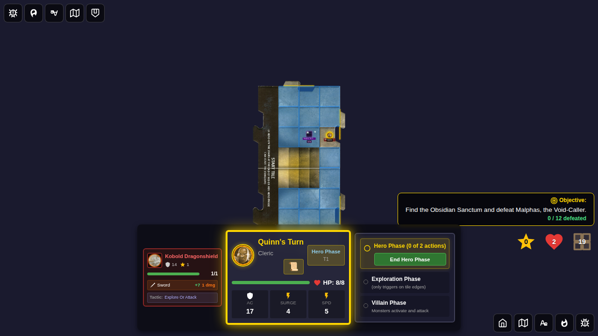
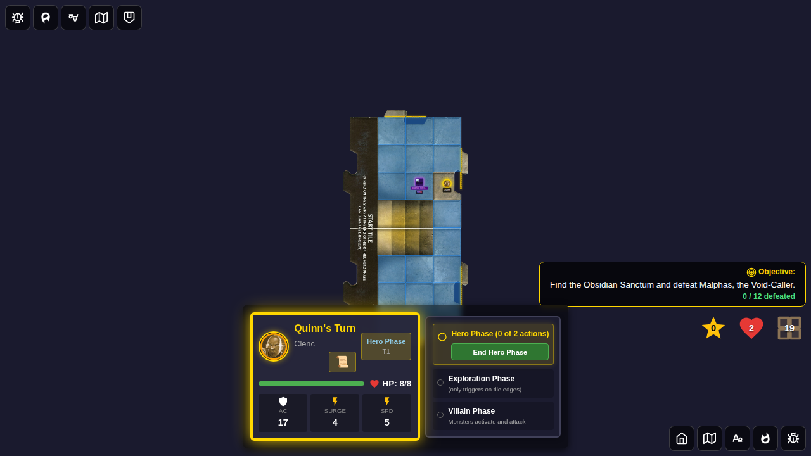

# Test 116 - Villain Display and Per-Turn Activation

## User Story

As a player in Adventure 14 (Malphas), once the villain is present on the board:

1. The villain token renders on the board with an HP bar.
2. A **villain status card** appears in the right-side objective panel showing the villain's HP and shield status.
3. During **every** hero's villain phase, Malphas activates once and a **purple activation notification panel** appears (like monster attack notifications) — the player must click to dismiss it.
4. In a 2-hero game (Quinn + Vistra), Malphas activates **twice per round** — once per hero's villain phase.

## Test Coverage

### Test 1: Villain token appears and activates with notification each player turn

Verifies that:
- The villain token is visible on the board when `villain != null` (during hero-phase)
- The villain status card is visible in the objective panel with correct HP (`20/20 HP`)
- During Quinn's villain phase, Malphas activates and a purple notification panel appears
- The notification shows the villain name, tactic used (e.g. "Shadow Lash"), and dice roll result
- The player must **click to dismiss** the notification (it blocks auto-advance)
- After dismissal, Quinn's villain phase ends and Vistra's hero-phase starts
- Vistra's villain phase also triggers a villain activation notification
- Total activation log count ≥ 2 confirms one activation per hero's villain phase

### Test 2: Villain status card and shield badge when guards adjacent

Verifies that:
- HP bar on the board token shows correct partial HP (`12/16`)
- Villain status card shows HP and **🛡️ Shielded** indicator when a guard is adjacent (Malphas's special mechanic)
- Both indicators disappear when no monsters are adjacent

## Screenshots

### Test 1

#### Screenshot 000 — Quinn's hero-phase with villain token and status card
Both heroes visible in left panel; villain token on board; status card top-right.

#### Screenshot 001 — Quinn's villain phase: Malphas activation notification
Purple notification panel shows villain name, tactic ("Shadow Lash"), dice roll, hit result and damage.
Both hero panels visible on left. Villain status card (top-right) shows HP.

#### Screenshot 002 — Vistra's hero-phase (after Quinn's villain phase ends)
After dismissing notification, Vistra becomes the active hero.

#### Screenshot 003 — Vistra's villain phase: Malphas activates again
Villain activates a second time proving per-hero-turn activation (twice per round).

### Test 2

#### Screenshot 000 — Villain token and status card with partial HP
Token HP bar shows `12/16`; villain status card in objective panel also shows `12/16 HP`.

#### Screenshot 001 — Shield badge when guard adjacent
🛡️ badge on token and "🛡️ Shielded" in status card when Kobold guard is adjacent.

#### Screenshot 002 — No shield when no guards
Shield badge and status card shield indicator disappear when guards are removed.

