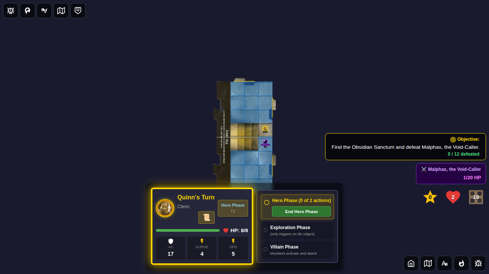
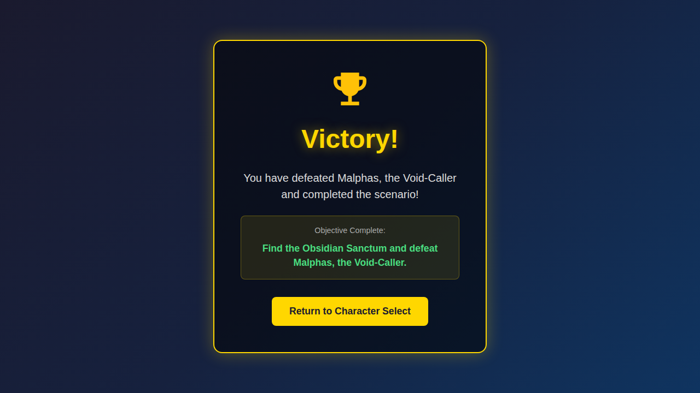
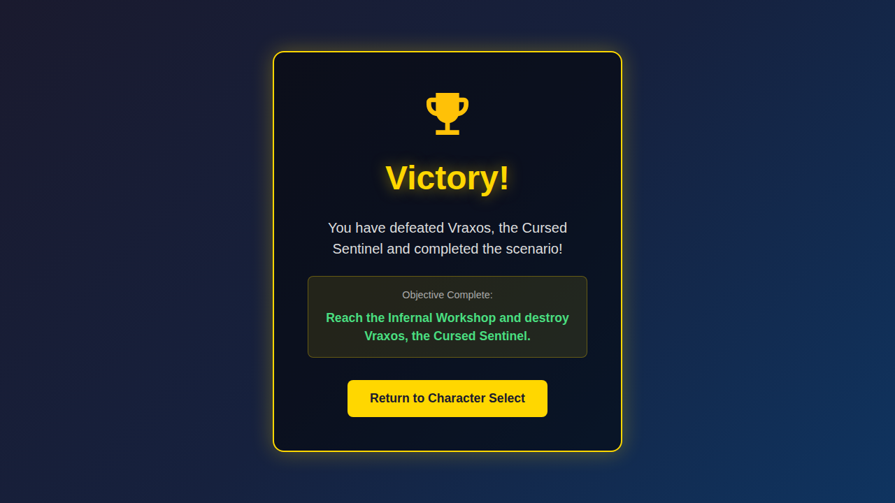
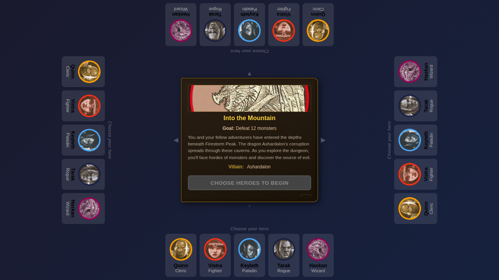

# E2E Test 117 - Villain Defeat Victory

## User Story

As a player in Adventure 14 (Malphas) or Adventure 15 (Vraxos), when I defeat the villain, I should see a Victory screen with a message specific to the villain I defeated.

## Test Scenarios

### Scenario 1: Victory screen appears when villain is defeated in Adventure 14

1. Start Adventure 14 with Quinn
2. Inject Malphas with 1 HP remaining adjacent to Quinn
3. Quinn attacks Malphas — dealing enough damage to defeat the villain
4. Verify the Victory screen appears with "You have defeated Malphas, the Void-Caller and completed the scenario!"
5. Verify the objective text shows the Adventure 14 goal
6. Click "Return to Character Select" and verify all villain/scenario state is fully reset

### Scenario 2: Victory screen shows correct villain name for Adventure 15 (Vraxos)

1. Start Adventure 15 with Vistra
2. Inject Vraxos with 1 HP remaining
3. Vistra attacks Vraxos — defeating the villain
4. Verify the Victory screen says "You have defeated Vraxos, the Cursed Sentinel and completed the scenario!"

## Screenshots

### Villain at Low HP Before Defeat (Adventure 14)

Game board showing Malphas at 1/20 HP, ready to be defeated.

### Victory Screen - Malphas Defeated (Adventure 14)

Victory screen showing villain-specific message: "You have defeated Malphas, the Void-Caller and completed the scenario!" with the scenario objective displayed.

### Victory Screen - Vraxos Defeated (Adventure 15)

Victory screen showing the Vraxos-specific message for Adventure 15.

### Character Select After Victory (Reset)

Character selection screen after returning from victory, confirming full scenario state reset (villain cleared, chamber unrevealed, victoryReason null).

## Automated Test Coverage

| Behavior | Test | Screenshot |
|---|---|---|
| Victory triggers when villain HP reaches 0 | `Victory screen appears when villain is defeated in Adventure 14` | `001-victory-screen-villain-defeated` |
| Victory message shows villain name (Adventure 14) | `Victory screen appears when villain is defeated in Adventure 14` | `001-victory-screen-villain-defeated` |
| Victory message shows villain name (Adventure 15) | `Victory screen shows villain-specific message for Adventure 15 (Vraxos)` | `000-victory-screen-vraxos-defeated` |
| Villain state is reset on returning to menu | `Victory screen appears when villain is defeated in Adventure 14` | `002-character-select-after-victory` |
| victoryReason is cleared on reset | `Victory screen appears when villain is defeated in Adventure 14` | `002-character-select-after-victory` |
