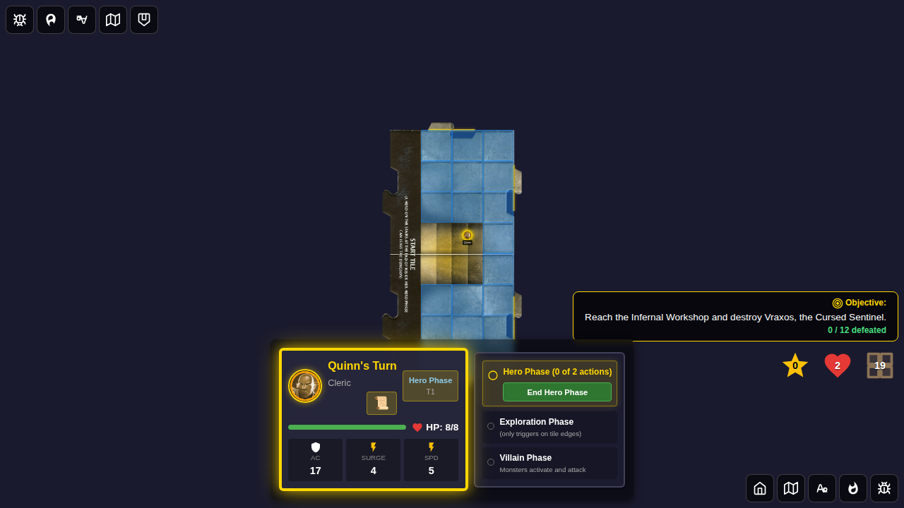
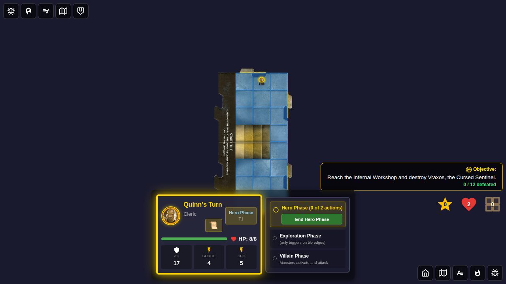
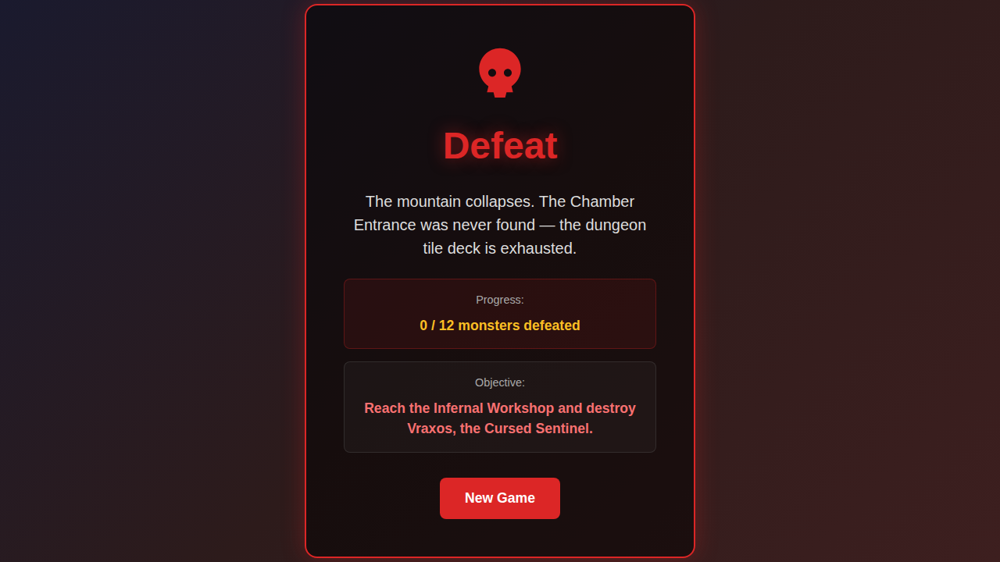
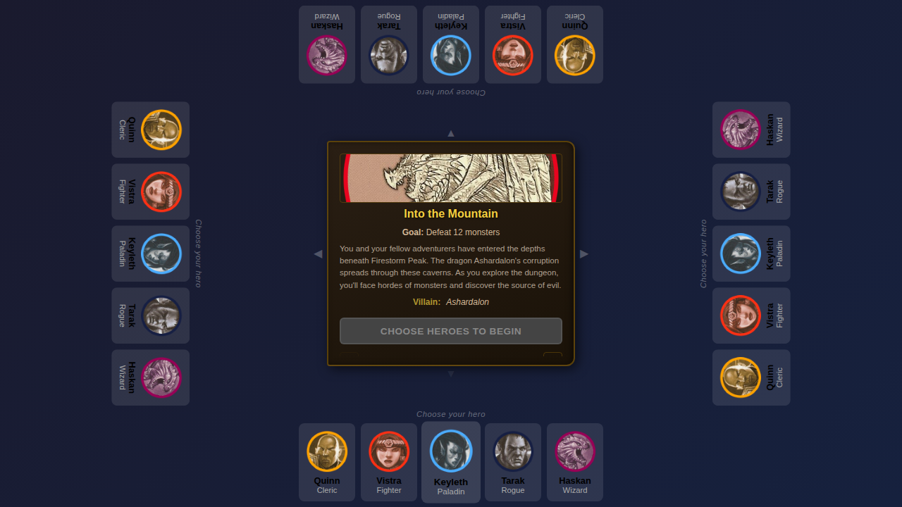
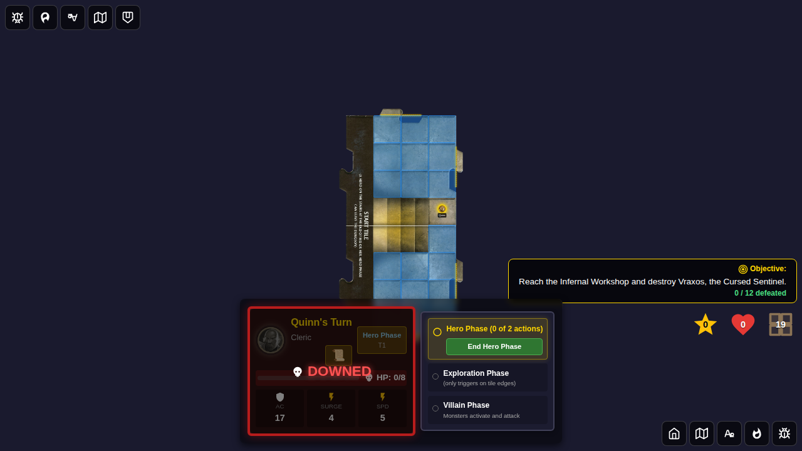
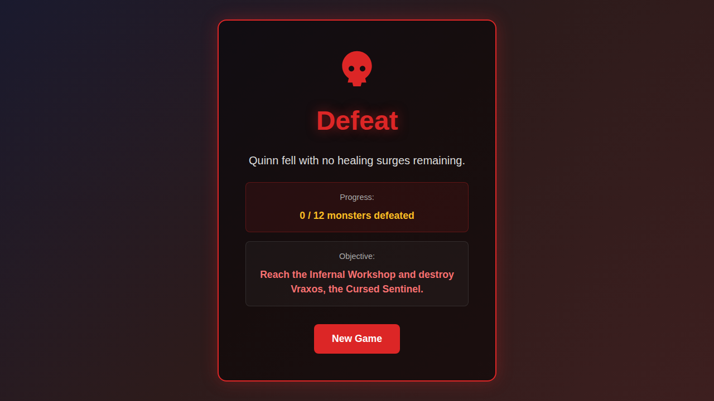

# E2E Test 118 - Tile Deck Exhaustion Defeat

## User Story

As a player in Adventure 15, the dungeon tile deck can run out before the Chamber Entrance (Infernal Workshop) is found. When the last tile is drawn without the chamber being revealed, the party is defeated. This test also covers the healing surge depletion defeat condition for Adventure 15.

## Test Scenarios

### Scenario 1: Defeat when tile deck runs out before chamber is found (Adventure 15)

1. Start Adventure 15 with Quinn
2. Verify the tile deck counter is visible in the UI
3. Exhaust the tile deck (set to empty), keeping the chamber unrevealed
4. Position Quinn on an unexplored tile edge
5. End hero phase — exploration is attempted with empty deck → defeat triggers
6. Verify the Defeat screen appears with message about tile deck exhaustion
7. Click "New Game" to return to character select, verify full scenario reset

### Scenario 2: Defeat when healing surges run out (Adventure 15)

1. Start Adventure 15 with Quinn
2. Set Quinn to 0 HP and 0 healing surges
3. End turns to cycle back to Quinn
4. Verify the Defeat screen appears with a hero-specific defeat message

## Screenshots

### Tile Deck Counter Visible

Game board showing the tile deck counter indicating tiles remain.

### Tile Deck Empty (Before Defeat Triggers)

Game board after the tile deck has been exhausted, still in the game. The chamber has not been revealed.

### Defeat Screen - Tile Deck Exhausted

Defeat screen showing the tile-deck-exhaustion message: "The mountain collapses. The Chamber Entrance was never found — the dungeon tile deck is exhausted." The Adventure 15 objective is also displayed.

### Character Select After Defeat (Reset)

Character selection screen after returning from defeat, confirming full scenario state reset.

### Hero at Zero HP, No Surges (Adventure 15 - Healing Surge Depletion)

Game board showing Quinn at 0 HP with 0 healing surges remaining in Adventure 15.

### Defeat Screen - Healing Surge Depletion

Defeat screen showing hero-specific defeat message when surges run out in Adventure 15.

## Automated Test Coverage

| Behavior | Test | Screenshot |
|---|---|---|
| Tile deck counter is visible during Adventure 15 | `Defeat screen appears when tile deck runs out before chamber is found` | `000-tile-deck-counter-visible` |
| Game continues while deck has tiles | `Defeat screen appears when tile deck runs out before chamber is found` | `001-tile-deck-empty` |
| Defeat triggers when deck is empty on exploration | `Defeat screen appears when tile deck runs out before chamber is found` | `002-defeat-screen-deck-exhausted` |
| Defeat message explains tile deck exhaustion | `Defeat screen appears when tile deck runs out before chamber is found` | `002-defeat-screen-deck-exhausted` |
| Scenario state fully resets on New Game | `Defeat screen appears when tile deck runs out before chamber is found` | `003-character-select-after-defeat` |
| Healing surge depletion also triggers defeat in Adventure 15 | `Defeat screen shows correct reason when healing surges run out (Adventure 15)` | `001-defeat-screen-no-healing-surges` |
