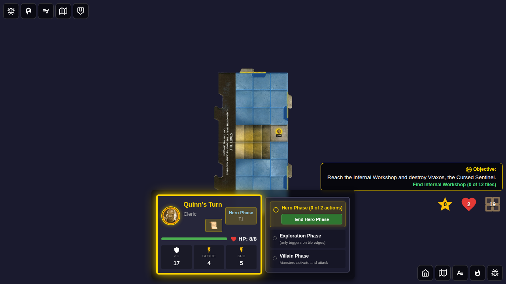
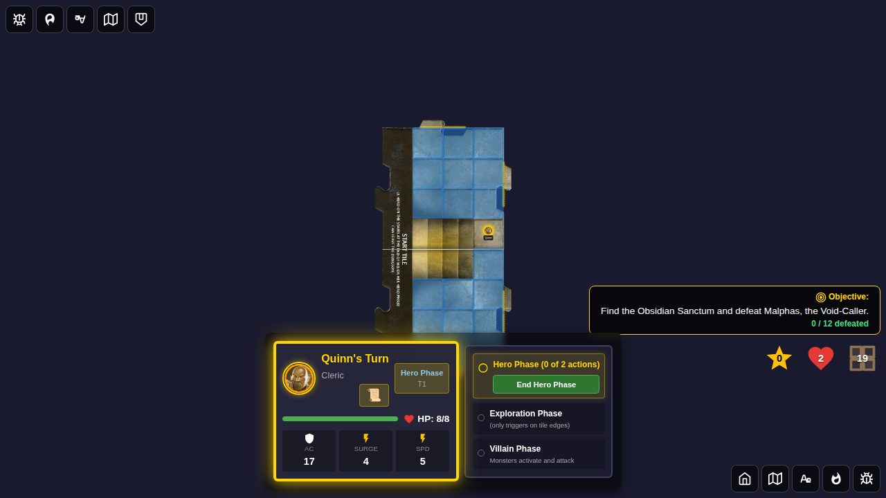

# Test 119 - Deck Recipe (Scenario-Specific Deck Setup)

## User Story

As a player selecting Adventure 14 or Adventure 15, the dungeon tile deck is arranged
according to that scenario's deck configuration:

- **Adventure 14**: 10 regular tiles (mini-stack) are placed at the top of the deck,
  and the Chamber Entrance tile appears immediately after them.
- **Adventure 15**: 12 regular tiles (mini-stack) are placed at the top of the deck,
  and the Chamber Entrance tile appears immediately after them.

This ensures the Chamber Entrance is guaranteed to appear after a predictable number
of explorations, giving the adventure its pacing.

## Test Coverage

### Test 1: Adventure 14 deck places Chamber Entrance after 10 regular tiles

Verifies that:
- After starting Adventure 14, the tile deck has the Chamber Entrance (`tile-chamber-entrance`) at index 10
- The first 10 tiles are all regular dungeon tiles (not the Chamber Entrance)
- The chamber starts unrevealed (`chamberRevealed: false`)

### Test 2: Adventure 15 deck places Chamber Entrance after 12 regular tiles

Verifies that:
- After starting Adventure 15, the tile deck has the Chamber Entrance at index 12
- The first 12 tiles are all regular dungeon tiles
- The chamber starts unrevealed

### Test 3: Deck contains all regular tiles plus one Chamber Entrance

Verifies completeness:
- Exactly one Chamber Entrance in the deck
- Room set tiles (horrid-chamber tiles for Adventure 14) are NOT pre-loaded in the deck (they're placed on chamber reveal)
- All tile IDs in the deck are valid non-empty strings

## Screenshots

### Test 1: Adventure 14 Deck

#### Screenshot 000 — Adventure 14 initial deck
Game board after starting Adventure 14 showing the tile deck counter with 11+ tiles remaining.

### Test 2: Adventure 15 Deck

#### Screenshot 000 — Adventure 15 initial deck
Game board after starting Adventure 15 showing the tile deck counter with 13+ tiles remaining.

### Test 3: Deck Completeness

#### Screenshot 000 — Adventure 14 deck completeness check
Game board after starting Adventure 14 verifying the deck has exactly one Chamber Entrance.

