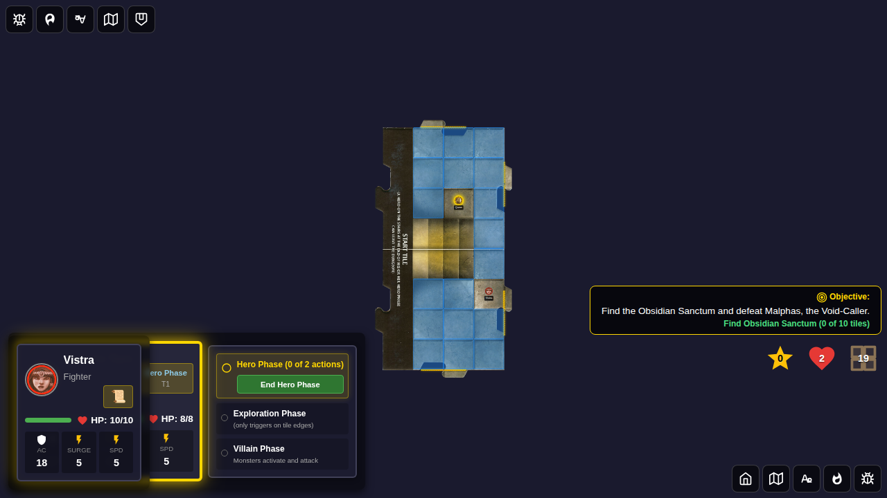
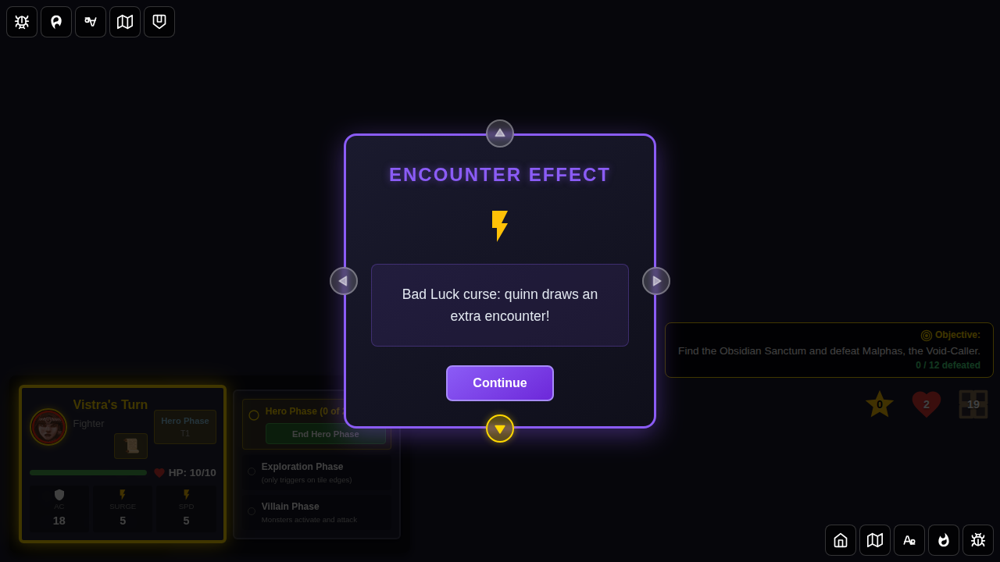
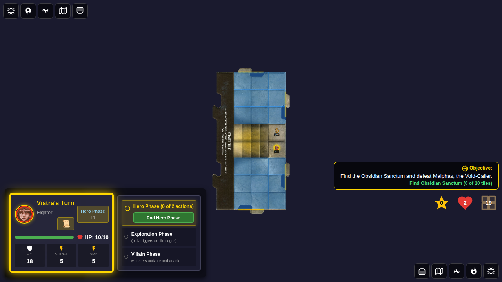
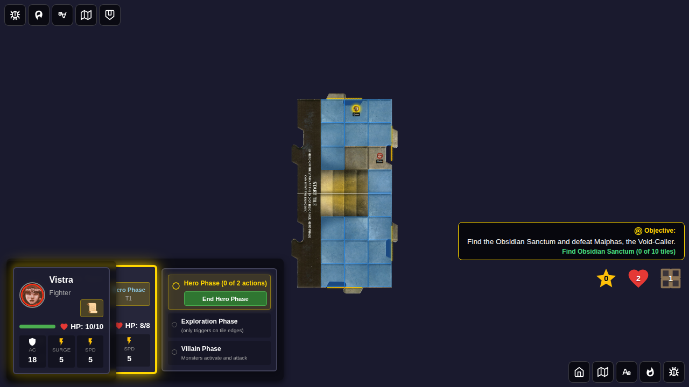
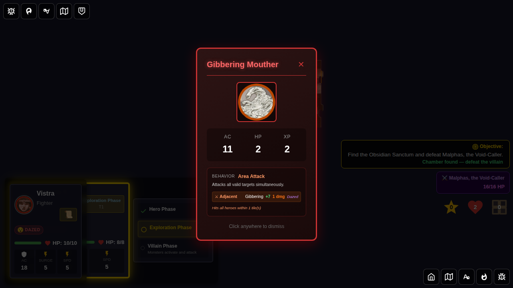
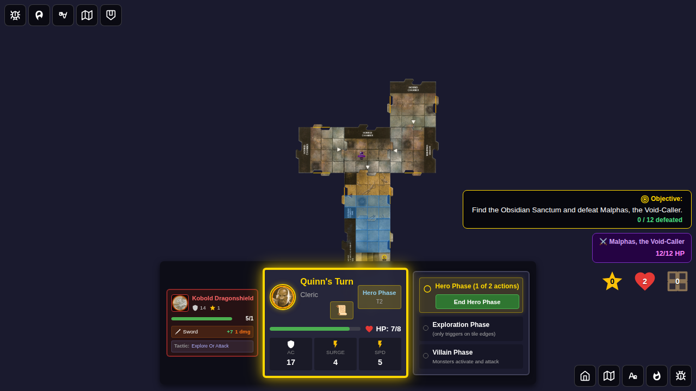

# Test 120 - Adventure 14 Trigger Rules

## User Story

Adventure 14 (The Shadow of the Void-Caller) has three special trigger rules that
activate during gameplay:

1. **The Creeping Void**: At the start of each Villain Phase, if no hero is adjacent
   to another hero, the active player draws an additional Encounter Card. The game log
   shows "🌑 The Creeping Void draws an additional Encounter Card".

2. **Daze All Heroes (Chamber Reveal)**: When the Obsidian Sanctum is revealed (Chamber
   Entrance tile placed), all heroes are immediately Dazed for 1 turn.

3. **Reflect Natural One**: After the Obsidian Sanctum chamber is revealed, if a hero
   rolls a natural 1 on an attack, the void reflects the strike dealing 1 damage to
   that hero. The log shows "💫 The void reflects your strike: 1 damage".

## Test Coverage

### Test 1: The Creeping Void draws extra encounter when heroes are isolated

Verifies that:
- When two heroes are on separate non-adjacent positions, entering the Villain Phase triggers the Creeping Void
- The game log contains "Creeping Void" message
- The `badLuckExtraEncounterPending` flag is set to `true`

### Test 2: The Creeping Void does NOT fire when heroes are adjacent

Verifies that:
- When two heroes are adjacent (next to each other), the Creeping Void does not trigger
- No "Creeping Void" message appears in the log after entering Villain Phase

### Test 3: Daze All Heroes when Chamber Entrance is revealed

Verifies that:
- Before chamber reveal, heroes are not dazed
- After the Chamber Entrance tile is placed, both heroes receive the "dazed" status effect
- The game log contains a daze entry

### Test 4: Reflect Natural One deals 1 damage after chamber reveal

Verifies that:
- Before chamber reveal, natural-1 misses do not deal self-damage
- After the chamber is revealed, a `setAttackResult` with `roll: 1` and `isHit: false` causes the attacking hero to lose 1 HP
- The log contains the void reflection message

## Screenshots

### Test 1: Heroes Isolated → Creeping Void Triggers

#### Screenshot 000 — Heroes separated before villain phase
Quinn at (2,2) and Vistra at (3,5) — clearly non-adjacent.

#### Screenshot 001 — Villain phase with Creeping Void log message
After entering villain phase, the game log shows the Creeping Void entry.

### Test 2: Heroes Adjacent → No Creeping Void

#### Screenshot 000 — No Creeping Void when heroes adjacent
After entering villain phase with heroes adjacent, no Creeping Void entry in log.

### Test 3: Daze All Heroes on Chamber Reveal

#### Screenshot 000 — Before chamber reveal (no daze)
Heroes are not dazed; chamber entrance is next in the tile deck.

#### Screenshot 001 — After chamber reveal (heroes dazed)
Both Quinn and Vistra are Dazed after the Obsidian Sanctum is revealed.

### Test 4: Reflect Natural One

#### Screenshot 000 — Natural-1 reflect damages hero
After chamber is revealed, a natural-1 miss causes Quinn to lose 1 HP with a void reflection log entry.

