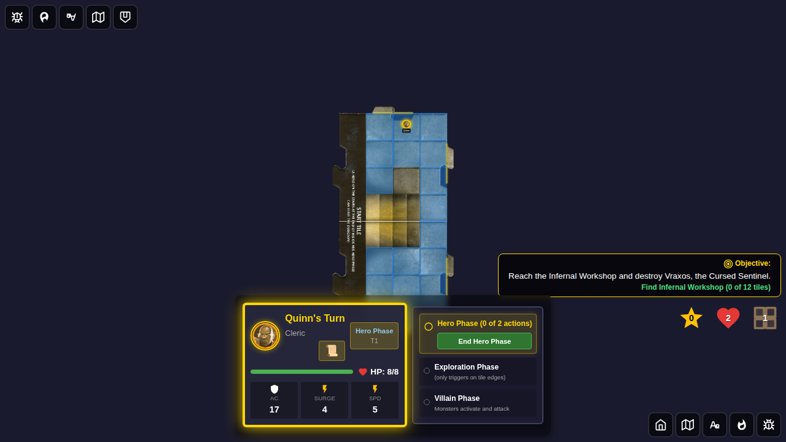
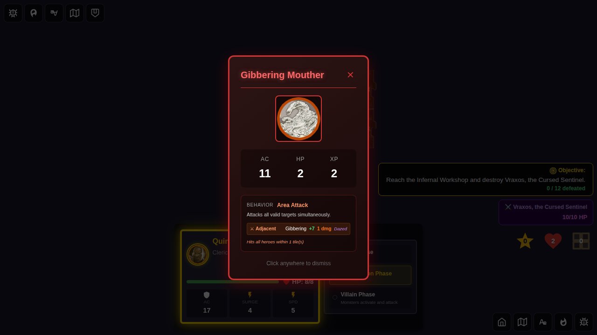
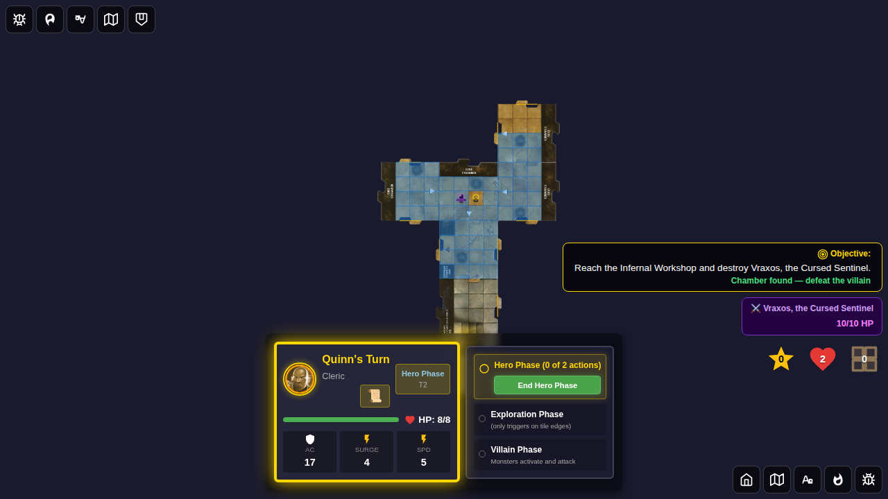
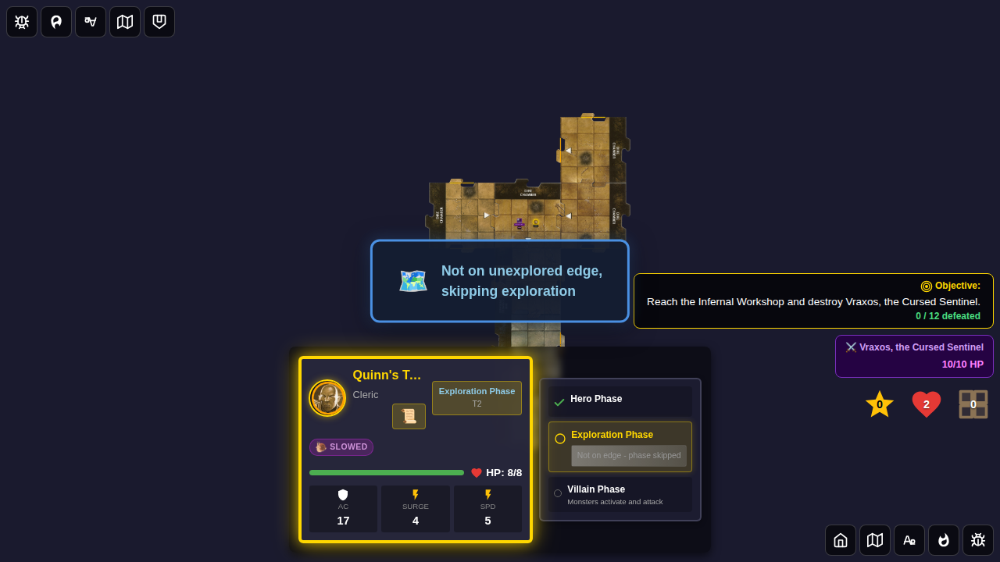
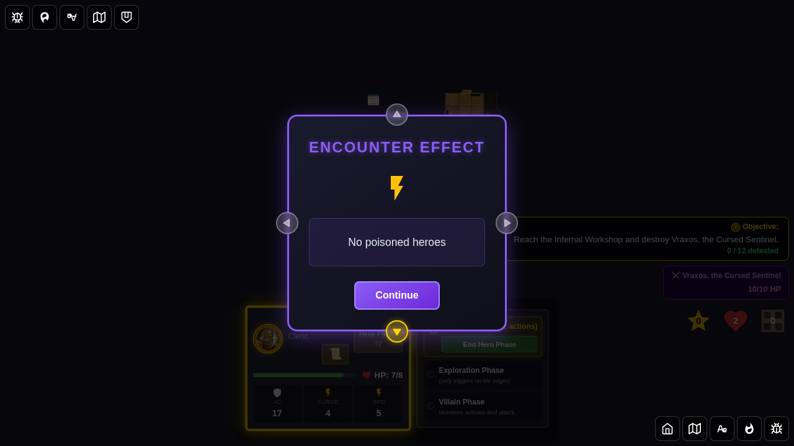
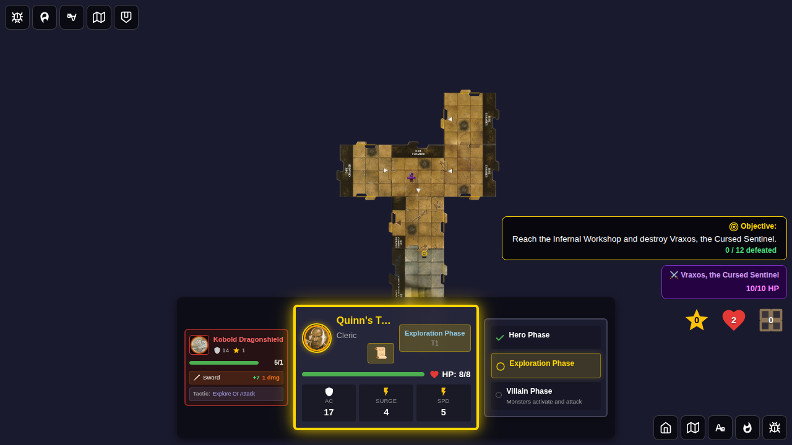

# Test 121 - Adventure 15 Trigger Rules and Modifiers

## User Story

Adventure 15 (The Echo of the Cursed Forge) has two special trigger rules and persistent
modifiers:

1. **Forge Awakens (Chamber Reveal)**: When the Infernal Workshop is revealed, the
   Forge Awakens activates persistent modifiers:
   - **+1 Daily Power damage bonus** for all hero daily power attacks
   - **+2 Monster AC bonus** (all monsters become harder to hit)
   The game log shows "🔥 Workshop Aura" entries for each modifier.

2. **Heat Exhaustion**: At the end of a hero's turn, if they are on a tile with the
   `volcanic-vent` terrain feature (the Infernal Workshop dire-chamber tiles), a d6
   is rolled. On a result of 5 or lower (5/6 chance), the hero gains the Slowed
   condition for 1 turn. The log shows "🌋 Heat Exhaustion: [hero] is slowed".

## Test Coverage

### Test 1: Forge Awakens activates persistent modifiers when chamber is revealed

Verifies that:
- Before chamber reveal, `activePersistentModifiers` is empty
- After revealing the Infernal Workshop, two modifiers are registered:
  - `{ type: 'hero-daily-damage-bonus', bonus: 1 }`
  - `{ type: 'monster-ac-bonus', bonus: 2 }`
- The game log contains "🔥 Workshop Aura" entries
- All 4 dire-chamber tiles (`tile-dire-chamber-01` through `tile-dire-chamber-04`) are placed

### Test 2: Heat Exhaustion applies Slowed when hero ends turn on Volcanic Vent tile

Verifies that:
- Quinn is NOT slowed before ending the turn
- After ending the turn on a dire-chamber tile (which has `volcanic-vent` terrain feature),
  with Math.random mocked to return a value producing d6 ≤ 5, Quinn gains the Slowed status
- The game log contains "Heat Exhaustion" or "🌋" entry

### Test 3: Monster AC bonus is active after Forge Awakens fires

Verifies that:
- The `monster-ac-bonus` modifier (bonus: 2) is in `activePersistentModifiers` after chamber reveal
- The `hero-daily-damage-bonus` modifier (bonus: 1) is also active
- A spawned monster exists on the board (the modifier applies when combat calculates effective AC)

## Screenshots

### Test 1: Forge Awakens

#### Screenshot 000 — Before chamber reveal
Adventure 15 started; `activePersistentModifiers` is empty; chamber entrance is next in deck.

#### Screenshot 001 — Forge Awakens modifiers active
After the Infernal Workshop is revealed, the two persistent modifiers (+1 daily damage, +2 monster AC)
are visible in the Redux state, and the game log shows 🔥 Workshop Aura entries.

### Test 2: Heat Exhaustion

#### Screenshot 000 — Quinn on volcanic vent before ending turn
Quinn is positioned on a dire-chamber tile (volcanic vent). She is not yet slowed.

#### Screenshot 001 — Quinn slowed from Heat Exhaustion
After ending her turn on the volcanic vent tile (with d6 ≤ 5 mocked), Quinn receives the Slowed status.
The log shows the Heat Exhaustion entry.

### Test 3: Monster AC Bonus

#### Screenshot 000 — Monster AC bonus after Forge Awakens fires
The `monster-ac-bonus: 2` modifier is active in the Redux state after chamber reveal.

#### Screenshot 001 — Monster on board with AC bonus in effect
A kobold monster is on the board; the +2 AC modifier means its effective AC is increased by 2.

