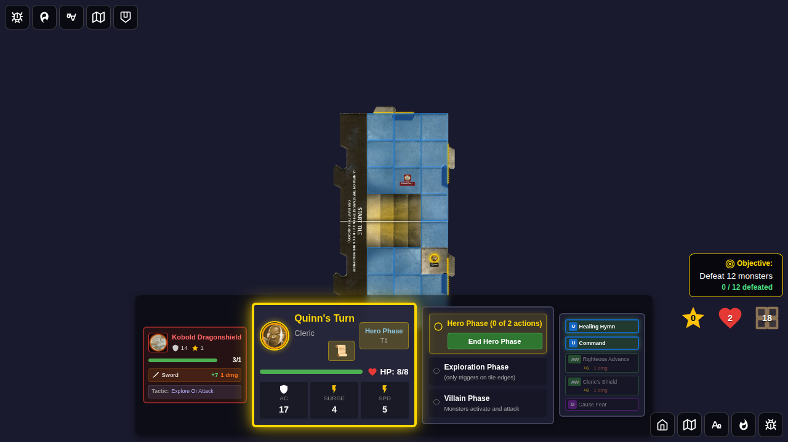
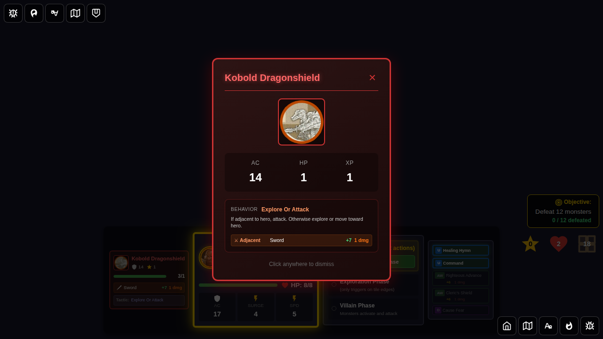

# 122 - Monster Mini-Card Details

## User Story

When a monster is active in the dungeon, the player can see a compact monster mini-card in the player panel. Clicking that mini-card should open the full monster card overlay — the same modal shown when the monster first spawned — giving the player on-demand access to the monster's full stats, tactics, and attacks.

## Test Scenario

1. Start a game with Quinn as the hero
2. Inject a Kobold Dragonshield into the game via Redux (so it appears in Quinn's player panel)
3. Verify the monster mini-card is visible in the panel with no overlay open
4. Click the monster mini-card
5. Verify the full monster card overlay opens, showing stats and tactics
6. Dismiss the overlay by clicking the ✕ button
7. Verify the overlay closes and the mini-card is still visible

## Screenshots

### Step 1: Monster mini-card visible in player panel

### Step 2: Full monster card overlay open after clicking mini-card

### Step 3: Overlay dismissed, mini-card still visible

