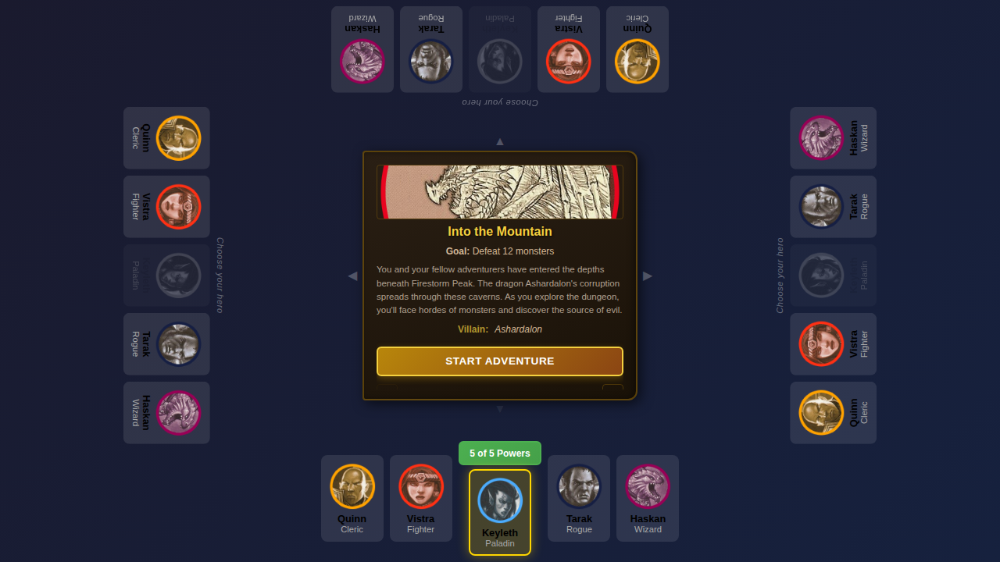
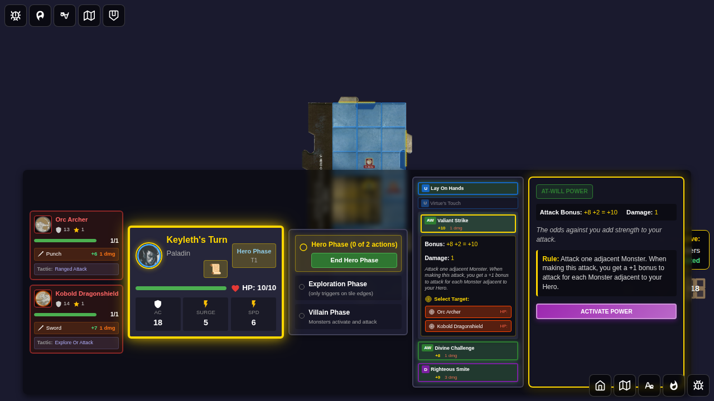
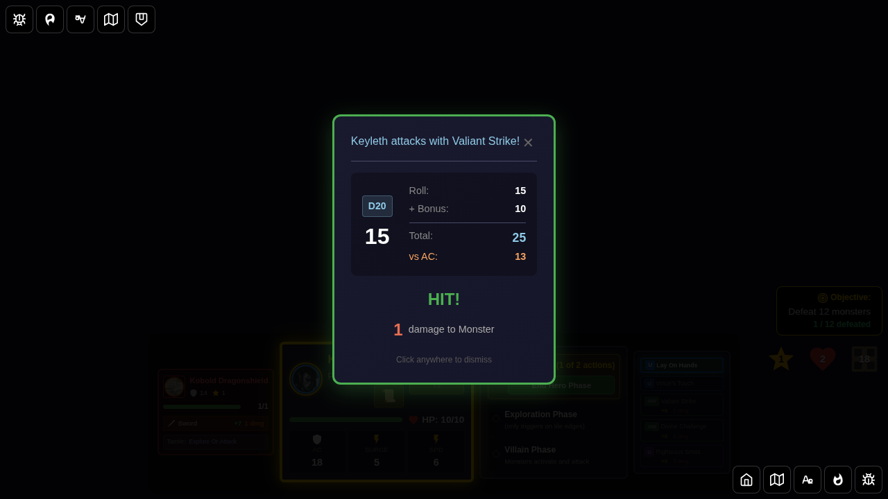

# 122 - Valiant Strike Adjacent Bonus

## User story

A player selects Keyleth, starts a game, becomes adjacent to two monsters, confirms that Valiant Strike shows its live bonus breakdown as `+8 +2 = +10` in the dashboard/details UI, and then attacks to verify the combat result uses the same total bonus.

## Screenshot 000 - Hero selected

Confirms Keyleth is selected from the bottom edge and the game is ready to start.

## Screenshot 001 - Valiant Strike bonus scaled

Confirms two adjacent monsters make Valiant Strike display `+10` in the mini card and the explicit `+8 +2 = +10` breakdown in the expanded attack section and details panel.

## Screenshot 002 - Valiant Strike attack result

Confirms the attack roll breakdown uses the same `+10` bonus during combat resolution.

## Manual verification checklist

- [ ] Keyleth has Valiant Strike available in the active power card list
- [ ] Two adjacent monsters raise Valiant Strike from `+8` to `+8 +2 = +10`
- [ ] The details panel and expanded attack view match the mini-card bonus
- [ ] The combat result popup shows the same `+10` bonus after the attack
