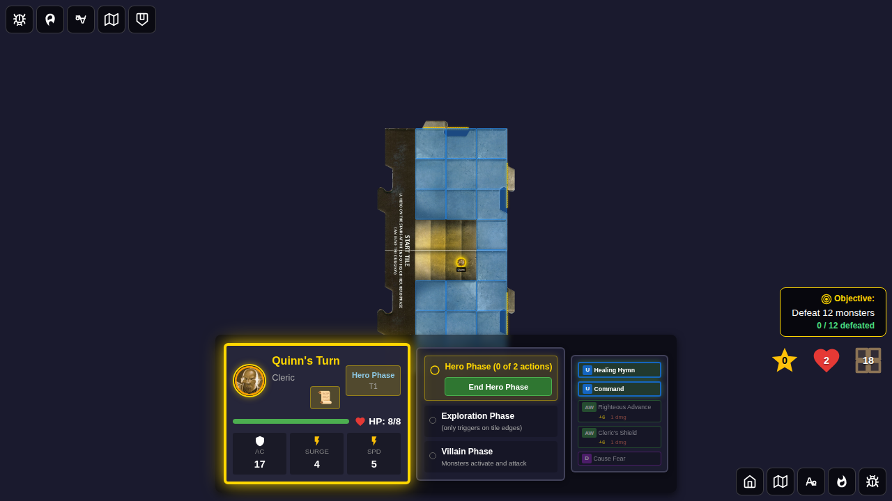
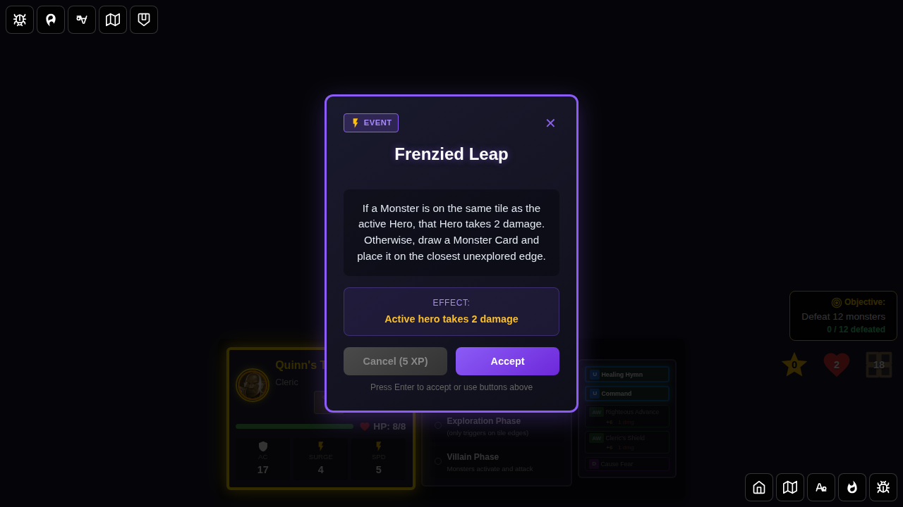
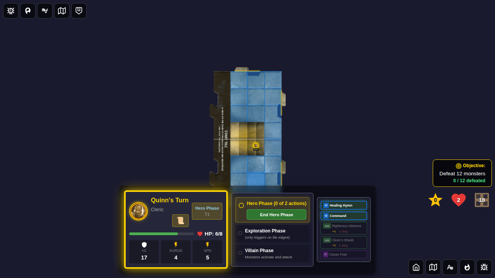
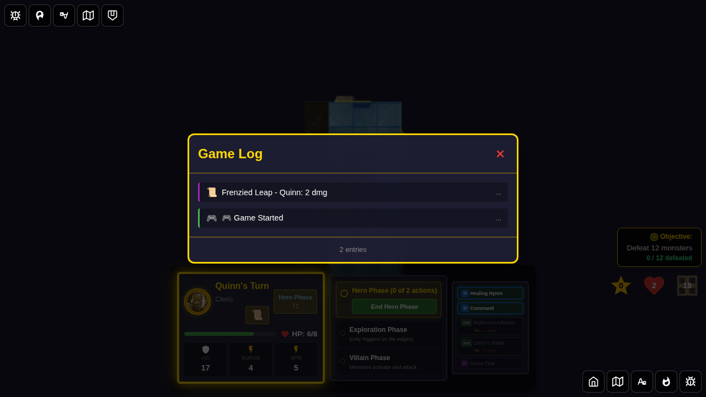
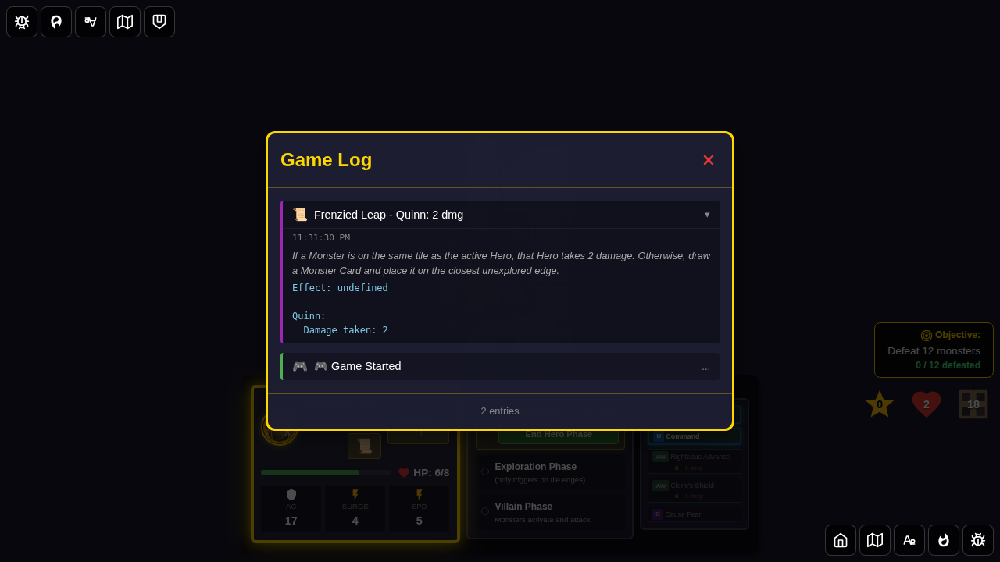
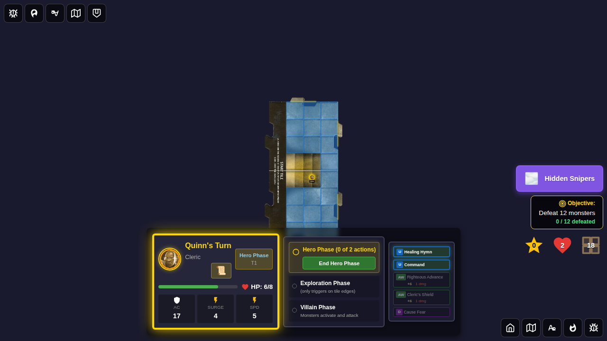
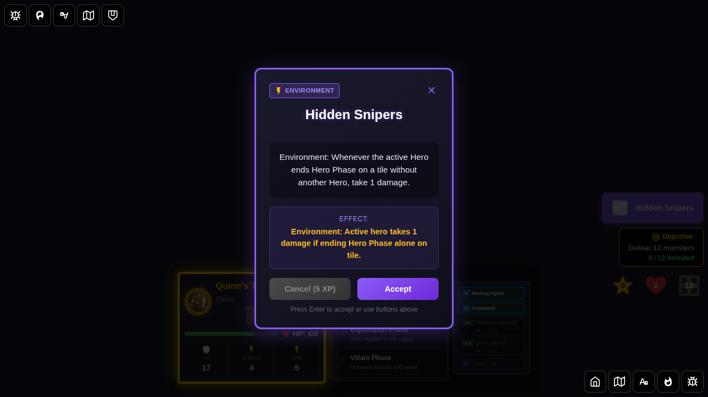
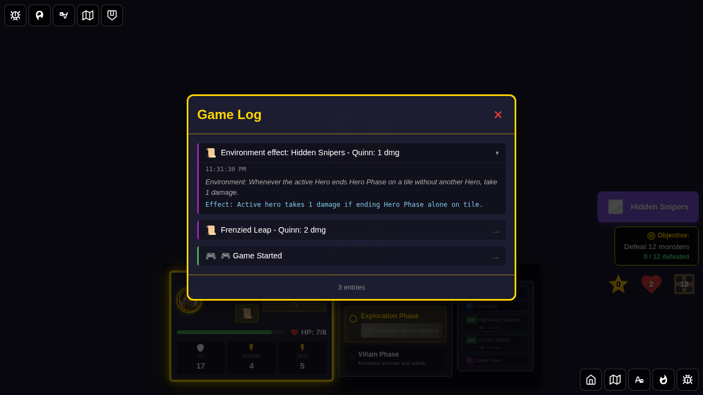
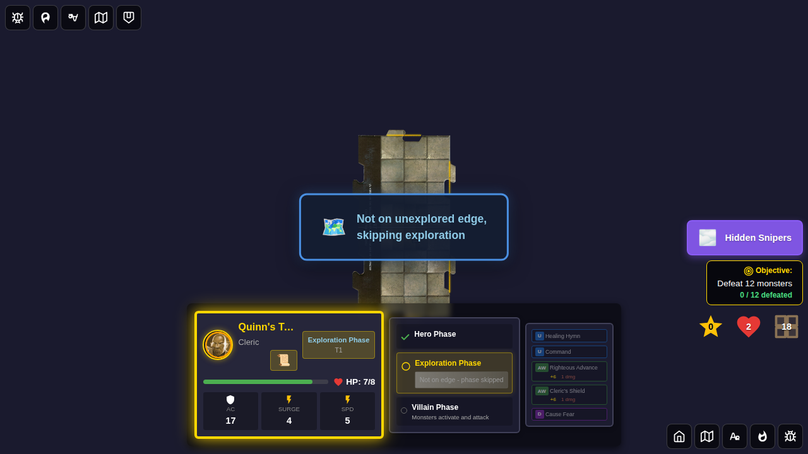

# 123 - Encounter Card Full Logging

## User Story

As a player, I want the game log to contain full encounter card text and detailed effect decisions when encounter cards are drawn and resolved, so that I can review exactly what happened and why. When an environment card is active, I want to be able to click on it to see the full card description.

## Test Scenario

This test verifies the full logging system for encounter cards by:

1. Starting a game with Quinn
2. Drawing a damage-type encounter card (Frenzied Leap) and dismissing it
3. Verifying the game log contains the full card description in `details` and effect information (including attack rolls) in `extendedDetails`
4. Opening the log viewer and expanding the encounter entry to view full details
5. Activating a Hidden Snipers environment card and verifying the environment indicator appears
6. Clicking the environment indicator to view the full card description popup
7. Ending the hero phase to trigger the Hidden Snipers ongoing effect (1 damage when alone on tile)
8. Verifying the environment effect creates a log entry with full card reference
9. Expanding the environment effect log entry to verify full card details

## Screenshots

### 000 - Character Select Screen

**What this verifies:**
- Character selection screen is visible
- Start button is disabled before hero selection

### 001 - Game Started

**What this verifies:**
- Game board is visible
- Quinn is positioned on the start tile
- Game log has initial entries

### 002 - Encounter Card Drawn

**What this verifies:**
- Frenzied Leap encounter card popup is displayed
- Card name and type are visible
- Card is stored in the Redux state as `drawnEncounter`

### 003 - Encounter Dismissed

**What this verifies:**
- Encounter card is dismissed and HP is reduced by 2
- Log entry was created with `details` = full card description text
- Log entry has `extendedDetails` containing "Effect:" prefix and target/damage info

### 004 - Log Viewer Opened

**What this verifies:**
- Log viewer is open showing the Frenzied Leap resolution entry
- Entry is in collapsed state showing the message summary

### 005 - Encounter Log Entry Expanded

**What this verifies:**
- Expanded log entry shows the full card description (italic `.log-details`)
- Extended details (`.log-extended-details`) show "Effect:" info and target details
- Both sections are visible in the expanded state

### 006 - Environment Activated

**What this verifies:**
- Hidden Snipers environment indicator is visible in the board controls
- Environment name is displayed on the indicator

### 007 - Environment Card Detail

**What this verifies:**
- Clicking the environment indicator opens the full card detail popup
- The popup shows the Hidden Snipers card name and effect description
- You can view the full environment card text at any time

### 008 - Environment Effect Triggered

**What this verifies:**
- After ending Hero Phase, Quinn took 1 damage from Hidden Snipers (alone on tile)
- An environment effect log entry was created with full card reference
- The log entry `details` contains the full card description
- The log entry `extendedDetails` contains "Effect:" with the effect description

### 009 - Environment Effect Log Expanded

**What this verifies:**
- The environment effect log entry is expandable
- Expanded view shows the full card description in `.log-details`
- Extended details show the "Effect:" description in `.log-extended-details`

### 010 - Final State

**What this verifies:**
- Game board is in a valid state at the end of the test
- Environment indicator is still visible (Hidden Snipers remains active)

## Manual Verification Checklist

- [ ] Encounter card popup shows card name, type, description, and effect
- [ ] After dismissing an encounter, the log entry has non-empty `details` field (full card text)
- [ ] After dismissing an attack encounter, the log entry `extendedDetails` includes attack roll, total, target AC, hit/miss
- [ ] Clicking the environment indicator opens a popup with the full card details
- [ ] After ending Hero Phase with an active environment, an "Environment effect" log entry is created
- [ ] Environment effect log entries include `details` (full card description) and `extendedDetails` (effect description)
