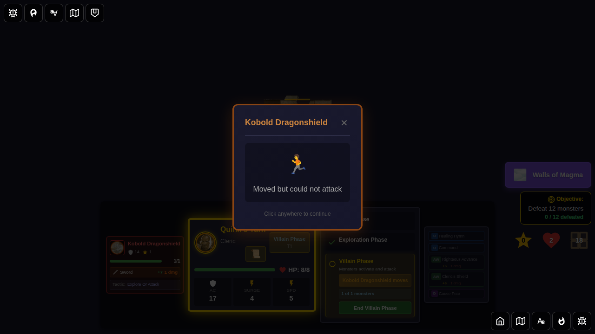
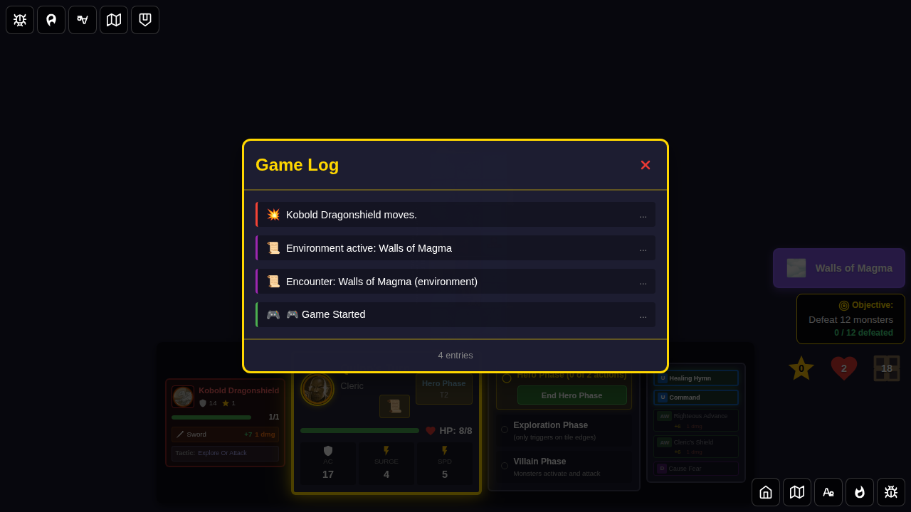
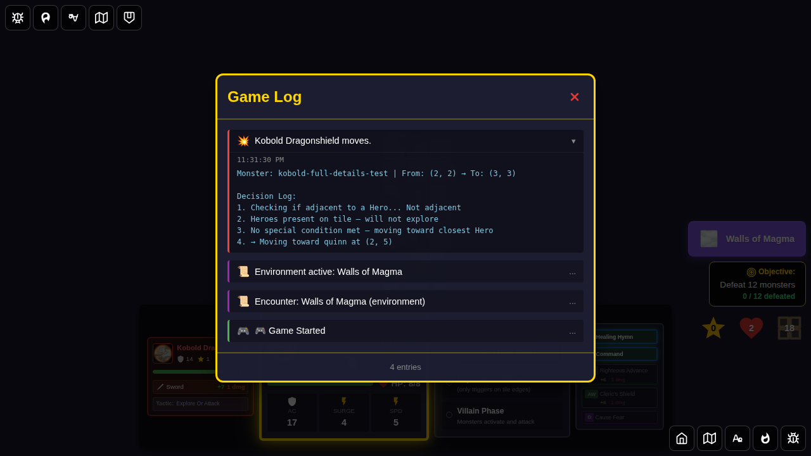

# 124 - Monster Full Details

This test verifies that monster cards display their full activation instructions and that the AI decision log is visible in expanded log entries.

## User Story

As a player, I want to:
1. See the full numbered activation instructions on each monster card (as printed on the official card)
2. Expand a monster activation log entry to see a step-by-step trace of how the AI evaluated the monster's conditions

## Screenshots

### 000 - Monster Card Instructions Shown
The Kobold Dragonshield card shows its 3 official numbered activation instructions.

### 001 - Monster Activated
The monster has been activated during the villain phase. The Redux store confirms a log entry with a decision log was created.

### 002 - Log Viewer Open
The game log is open showing the monster activation entry.

### 003 - Decision Log Visible
The monster activation log entry is expanded, revealing the full step-by-step decision log showing how each activation condition was evaluated.

