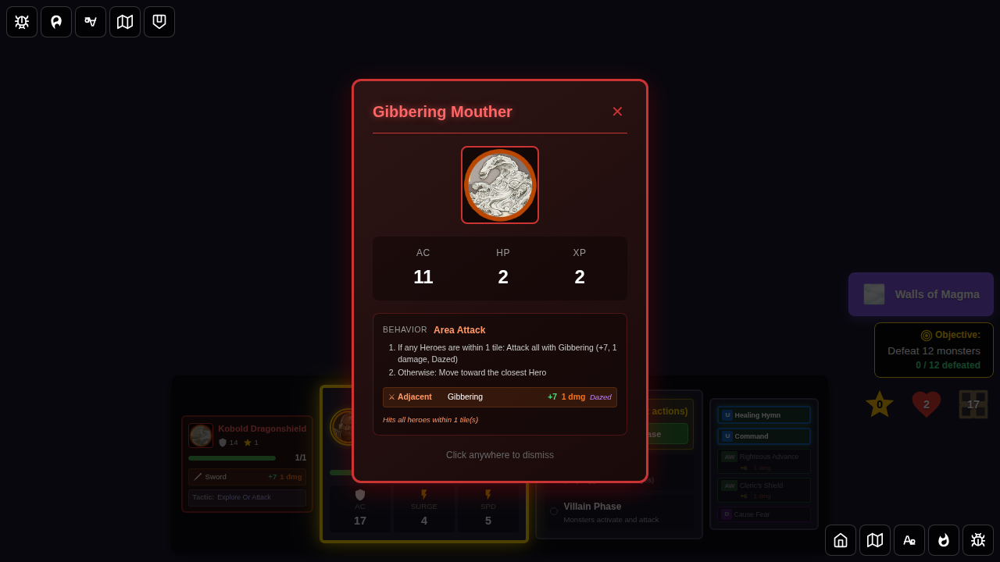

# 125 - Kobold Dragonshield Explore Behavior

## User Story

When a hero explores a new tile and a Kobold Dragonshield spawns on it, the player should see:
1. The monster card displaying all **3 numbered activation instructions** from the official card
2. During the villain phase, the Kobold **explores** the tile's unexplored edge (because no heroes are on its tile), instead of moving toward reachable heroes

This test validates the fix for a bug where the Kobold would incorrectly move toward heroes even when card rule #2 required it to explore.

### What happens when the Kobold explores

When the Kobold explores an unexplored edge:
1. A new tile is placed on the dungeon (highlighted as "newly placed")
2. A monster (e.g. Gibbering Mouther) is spawned on the new tile
3. The **exploration notification** banner is shown ("Kobold Dragonshield explored South edge")
4. After the player dismisses the exploration notification, the **"monster appears" interstitial card** is shown (same as hero-triggered exploration)
5. After the player dismisses the monster card, play continues

## Card Rules (Official)
1. If adjacent to a Hero: Attack with Sword (+7, 1 damage)
2. If on a tile with an unexplored edge (no Heroes on tile): Place a tile
3. Otherwise: Move toward the closest Hero

## Test Scenario

1. Start a game with Quinn as the hero
2. Add a second tile south of the start tile (simulating exploration)
3. Place a Kobold on the south tile — Quinn stays on the start tile
4. Open the monster mini-card and verify it shows 3 numbered activation instructions
5. Enter villain phase and activate the Kobold
6. Verify the Kobold **explores** (not moves) — the `monster-exploration-notification` appears; new tile highlighted
7. Dismiss the exploration notification → monster card interstitial appears for the spawned monster
8. Dismiss the monster card → dungeon shows expanded state with both monsters

## Screenshots

### 000 - Kobold Card Shows 3 Instructions
The Kobold Dragonshield card displays all 3 official numbered activation instructions including the explore rule.

### 001 - Board: Kobold on South Tile
The board shows Kobold on the newly explored south tile; Quinn is on the start tile. The south tile has an unexplored edge.

### 002 - Kobold Explores South Edge (Exploration Notification)
During villain phase, the Kobold explores the south unexplored edge. The monster-exploration notification shows "Kobold Dragonshield explored South edge". The new tile is highlighted. The Gibbering Mouther is already added to state (visible in monster panel), but its interstitial card is shown after the player dismisses this notification.

### 003 - "Monster Appears" Interstitial
After dismissing the exploration notification, the spawned monster's card is displayed as a blocking modal — the same interstitial shown during hero-triggered exploration. The player must acknowledge the new monster before play continues.

### 004 - Expanded Dungeon with Spawned Monster
After dismissing both interstitials, the dungeon shows the new expanded state. Both the Kobold and the newly spawned monster are visible in the monster panel.

## Notes

- Uses `setTestMode(true)` to prevent auto-dismiss of the exploration notification
- The test directly validates `state.game.monsterExplorationEvent !== null` (explore happened) and `state.game.monsterMoveActionId === null` (no move)
- Both `recentlyPlacedTileId` (tile highlight) and `recentlySpawnedMonsterId` (monster card) are verified in sequence
