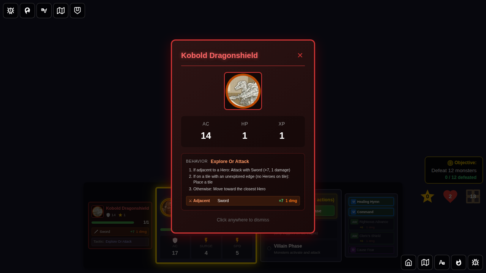
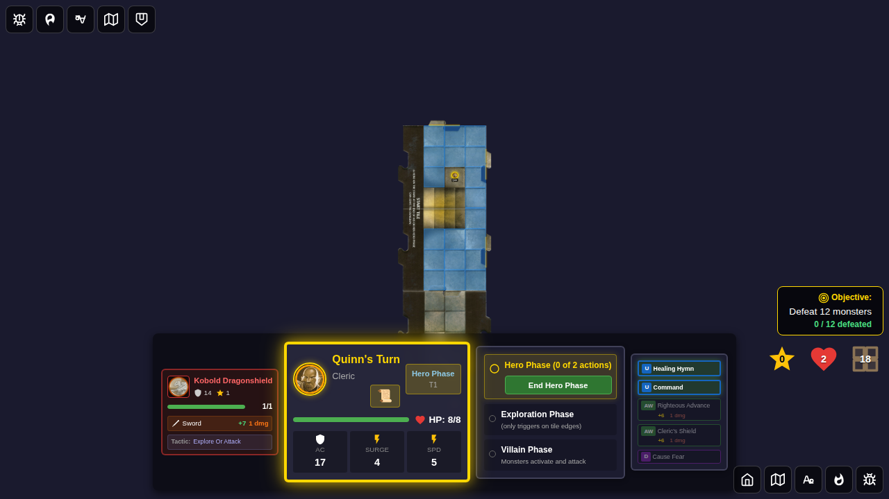
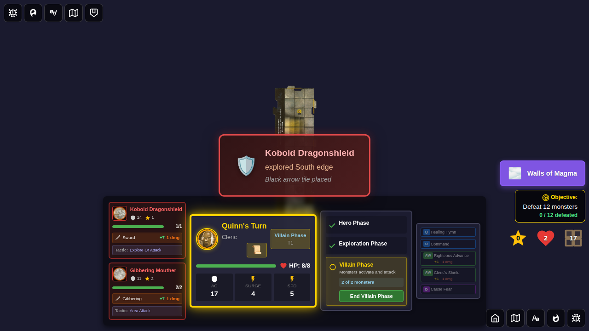
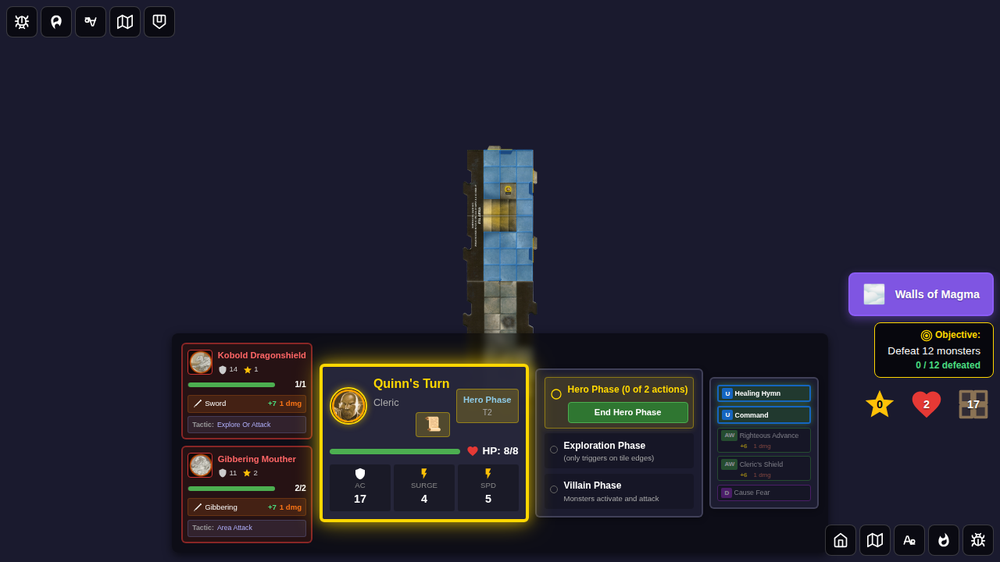

# 125 - Kobold Dragonshield Explore Behavior

## User Story

When a hero explores a new tile and a Kobold Dragonshield spawns on it, the player should see:
1. The monster card displaying all **3 numbered activation instructions** from the official card
2. During the villain phase, the Kobold **explores** the tile's unexplored edge (because no heroes are on its tile), instead of moving toward reachable heroes

This test validates the fix for a bug where the Kobold would incorrectly move toward heroes even when card rule #2 required it to explore.

### What happens when the Kobold explores

When the Kobold explores an unexplored edge:
1. A new tile is placed on the dungeon
2. A monster (e.g. Gibbering Mouther) is **immediately spawned** on the new tile — visible in the monster panel
3. The **exploration notification** banner is shown ("Kobold Dragonshield explored South edge")
4. The **"monster added" interstitial card is NOT shown** for monster-triggered exploration — that card only appears for hero-triggered exploration. The spawned monster appears directly in the monster list panel.

## Card Rules (Official)
1. If adjacent to a Hero: Attack with Sword (+7, 1 damage)
2. If on a tile with an unexplored edge (no Heroes on tile): Place a tile
3. Otherwise: Move toward the closest Hero

## Test Scenario

1. Start a game with Quinn as the hero
2. Add a second tile south of the start tile (simulating exploration)
3. Place a Kobold on the south tile — Quinn stays on the start tile
4. Open the monster mini-card and verify it shows 3 numbered activation instructions
5. Enter villain phase and activate the Kobold
6. Verify the Kobold **explores** (not moves) — the `monster-exploration-notification` appears
7. Verify the dungeon expanded with a new tile after exploration

## Screenshots

### 000 - Kobold Card Shows 3 Instructions
The Kobold Dragonshield card displays all 3 official numbered activation instructions including the explore rule.

### 001 - Board: Kobold on South Tile
The board shows Kobold on the newly explored south tile; Quinn is on the start tile. The south tile has an unexplored edge.

### 002 - Kobold Explores South Edge
During villain phase, the Kobold explores the south unexplored edge. The monster-exploration notification shows "Kobold Dragonshield explored South edge". A Gibbering Mouther (spawned on the new tile) is already visible in the left monster panel. No separate "monster added" interstitial appears — monster-triggered exploration spawns the new monster silently into the monster list.

### 003 - Expanded Dungeon with Spawned Monster
The dungeon has expanded with a new tile placed by the Kobold's exploration. Both the Kobold and the newly spawned monster (e.g. Gibbering Mouther) are visible in the monster panel.

## Notes

- Uses `setTestMode(true)` to prevent auto-dismiss of the exploration notification
- The test directly validates `state.game.monsterExplorationEvent !== null` (explore happened) and `state.game.monsterMoveActionId === null` (no move)
