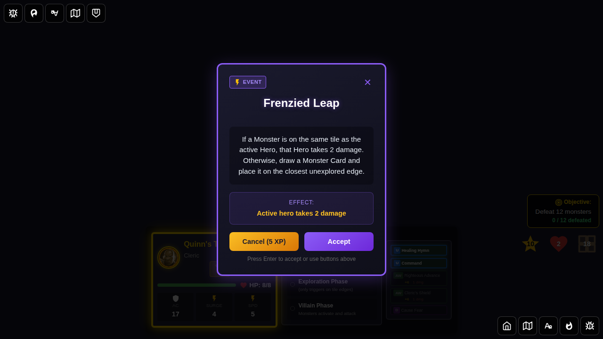
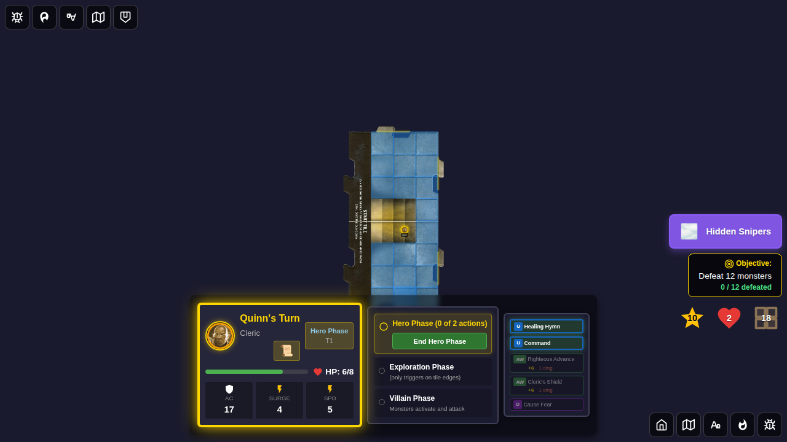
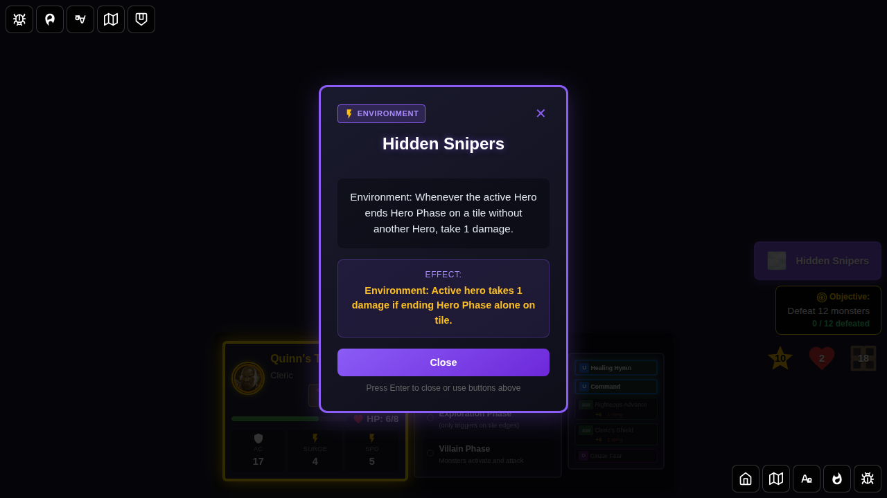
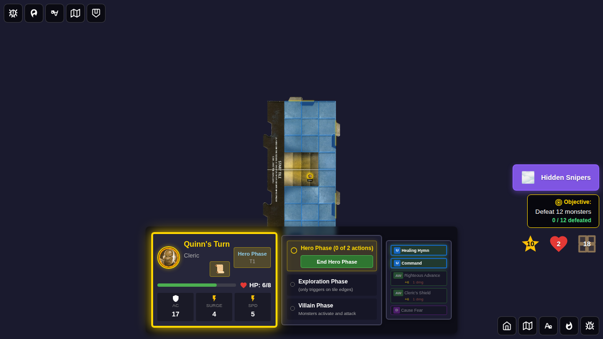

# 126 - Encounter Review Has No Cancel Option

## User Story

As a player, when I click on the environment indicator to review an active environment card, I should only see a "Close" button — not a "Cancel (5 XP)" option. The cancel option is only valid when a card first appears, not during a review.

## Test Scenario

This test verifies that the cancel button is correctly shown/hidden based on context:

1. Starting a game with Quinn
2. Drawing a new encounter card (Frenzied Leap) — verifying the **Cancel (5 XP)** button IS visible
3. Accepting the encounter and activating an environment card (Hidden Snipers)
4. Clicking the environment indicator to **review** the active environment card — verifying the cancel button is **NOT** visible and the button says **"Close"** instead of "Accept"
5. Closing the review and confirming the game board is still in a valid state

## Screenshots

### 000 - Character Select Screen

**What this verifies:**
- Character selection screen is visible
- Start button is disabled before hero selection

### 001 - New Encounter Has Cancel Button

**What this verifies:**
- When a new encounter card is drawn, the "Cancel (5 XP)" button is visible and enabled
- The accept button says "Accept"
- Party has 10 XP (enough to cancel)

### 002 - Environment Indicator Visible

**What this verifies:**
- After accepting an environment encounter, the environment indicator appears on the board
- The indicator shows the environment name "Hidden Snipers"

### 003 - Reviewing Environment Card - No Cancel

**What this verifies:**
- When reviewing an already-active environment card via the indicator, there is **no cancel button**
- The only button shown is "Close" (not "Accept")
- The hint text says "Press Enter to close"

### 004 - Back to Game Board

**What this verifies:**
- After closing the review, the encounter card overlay is gone
- The game board is still in a valid state
- The environment indicator remains visible (environment is still active)

## Manual Verification Checklist

- [ ] When a new encounter is drawn, the "Cancel (5 XP)" button appears
- [ ] When reviewing an active environment card via the indicator, no cancel button is shown
- [ ] The button label changes from "Accept" (new encounter) to "Close" (review mode)
- [ ] The hint text changes from "Press Enter to accept" to "Press Enter to close" in review mode
