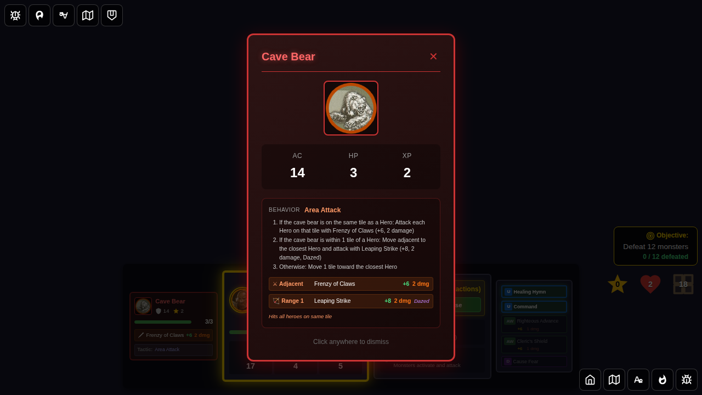
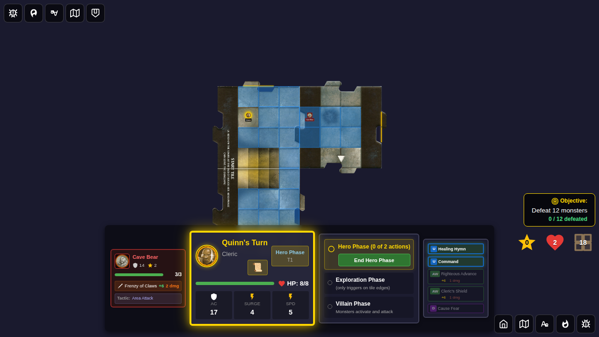
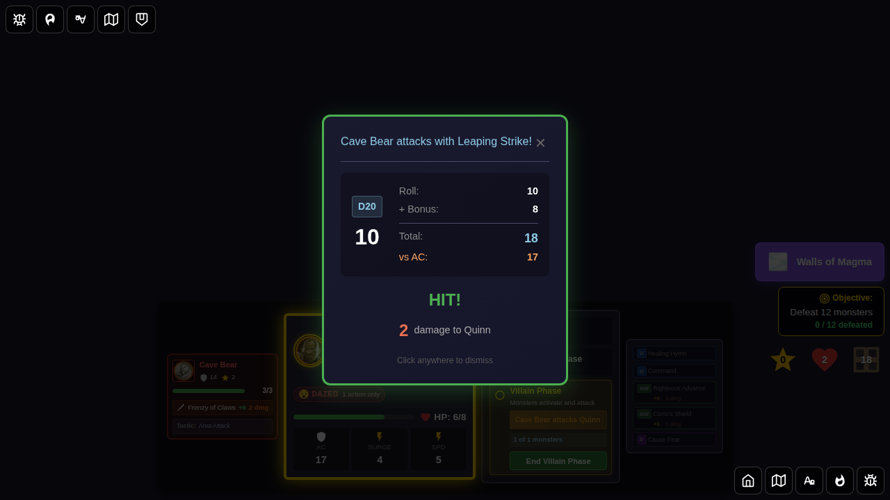
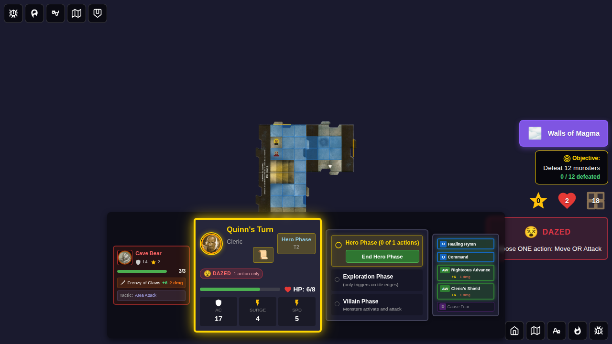

# Test 127: Cave Bear Leaping Strike Behavior

## User Story

As a player, when a Cave Bear activates during the villain phase and there are Heroes within 1 tile (but NOT on the same tile), I expect it to:
1. **Move adjacent** to the closest Hero, AND
2. **Attack with a Leaping Strike** (+8 attack bonus, 2 damage, Dazed on hit)

This is the second condition on the official Cave Bear card (card #104–106 in the Wrath of Ashardalon card set).

## Bug Fixed

The Cave Bear previously had only **2 conditions**:
1. If any Heroes on same tile → Frenzy of Claws (but with wrong stats: +8 and Dazed instead of +6)
2. Otherwise → Move toward closest Hero

After the fix, it correctly has **3 conditions** matching the official card:
1. **Same tile** → Frenzy of Claws (+6, 2 dmg, attacks ALL heroes on tile)
2. **Within 1 tile** → Move adjacent + Leaping Strike (+8, 2 dmg, Dazed)
3. **Otherwise** → Move 1 tile toward closest Hero

## Screenshots

### Step 1: Cave Bear Card — 3 Instructions



**Verification**:
- Monster card shows 3 numbered activation instructions
- Instruction 1: "same tile" + "Frenzy of Claws"
- Instruction 2: "within 1 tile" + "Leaping Strike"  
- Instruction 3: "closest Hero" (move)
- Attack panel shows: Adjacent = Frenzy of Claws (+6, 2 dmg), Range 1 = Leaping Strike (+8, 2 dmg, Dazed)

### Step 2: Board — Cave Bear on East Tile, Quinn on Start Tile



**Verification**:
- Dungeon has 2 tiles (start tile + east tile)
- Cave Bear is on the east tile at local position (0, 1) = global (4, 1)
- Quinn is at (1, 1) on the start tile — 3 squares away (within 1 tile = 4 squares range)
- Cave Bear is NOT on the same tile as Quinn → Frenzy of Claws will NOT trigger

### Step 3: Leaping Strike Combat Result



**Verification**:
- `monsterAttackName` = 'Leaping Strike' (not 'Frenzy of Claws')
- `monsterAttackResult.attackBonus` = 8
- `monsterAttackTargetId` = 'quinn'
- Combat result dialog shows "Cave Bear" as attacker
- Math.random seeded to 0.95 → roll = 20 (critical hit), damage = 2

### Step 4: After Leaping Strike — Quinn Took Damage



**Verification**:
- Quinn HP is below max HP (took 2 damage from Leaping Strike)
- Combat log entry exists mentioning "Cave Bear"

## Changes That Enable This Test

1. **`src/store/types.ts`**: Cave Bear tactics updated:
   - `adjacentAttack` (Frenzy of Claws): fixed `attackBonus: 8` → `6`, removed `statusEffect: 'dazed'`
   - Added `moveAttack: { name: 'Leaping Strike', attackBonus: 8, damage: 2, statusEffect: 'dazed' }`
   - Added `moveAttackRange: 1`
   - `cardInstructions`: now has 3 items matching official card text

2. **`src/store/monsterAI.ts`**: Area-attack handler extended:
   - After checking same-tile heroes, also checks for heroes within `moveAttackRange` tiles
   - If hero found within range: performs `move-and-attack` with `moveAttack` stats (Leaping Strike)

3. **`src/store/gameSlice.ts`**: `addDungeonTiles` now replaces tiles with the same ID (allows updating existing tile edges in tests).

## Running This Test

```bash
# Run this specific test
bun run test:e2e -- e2e/127-cave-bear-leaping-strike/127-cave-bear-leaping-strike.spec.ts

# Update snapshots if UI changes
bun run test:e2e -- e2e/127-cave-bear-leaping-strike/127-cave-bear-leaping-strike.spec.ts --update-snapshots
```

## Related Tests

- **Test 102**: Cave Bear area attack (Frenzy of Claws on same tile — tests condition 1)
- **Test 125**: Kobold explore behavior (similar dungeon setup pattern)
- **Test 026**: Monster card tactics (monster AI decision-making)
