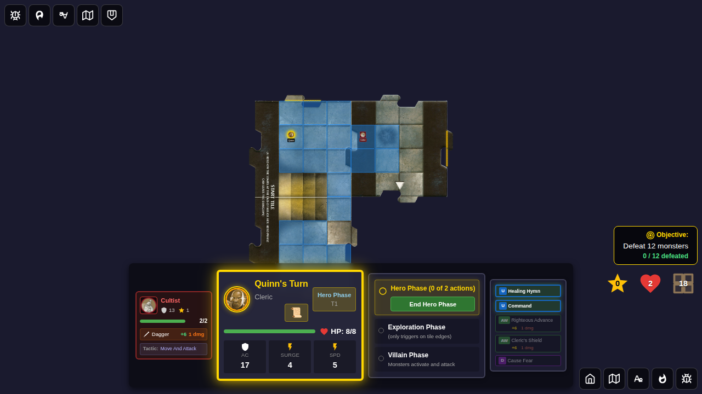
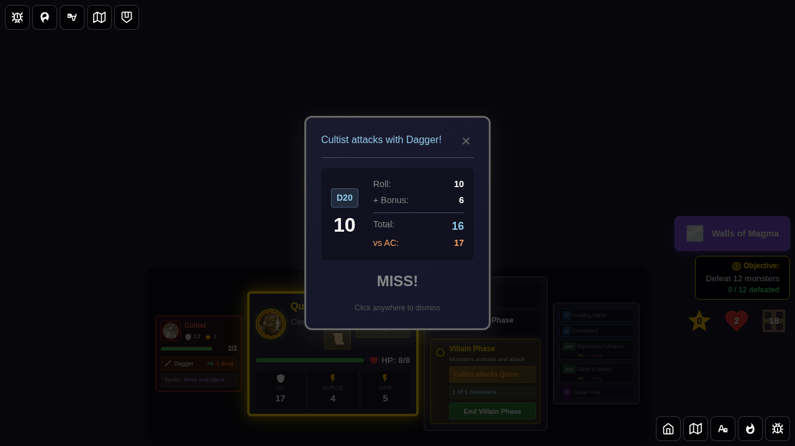
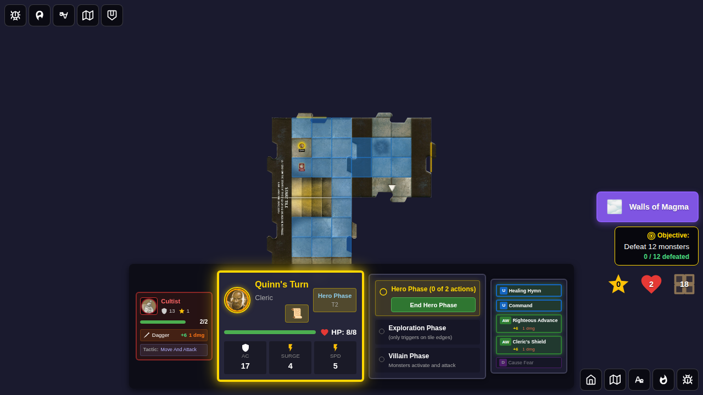
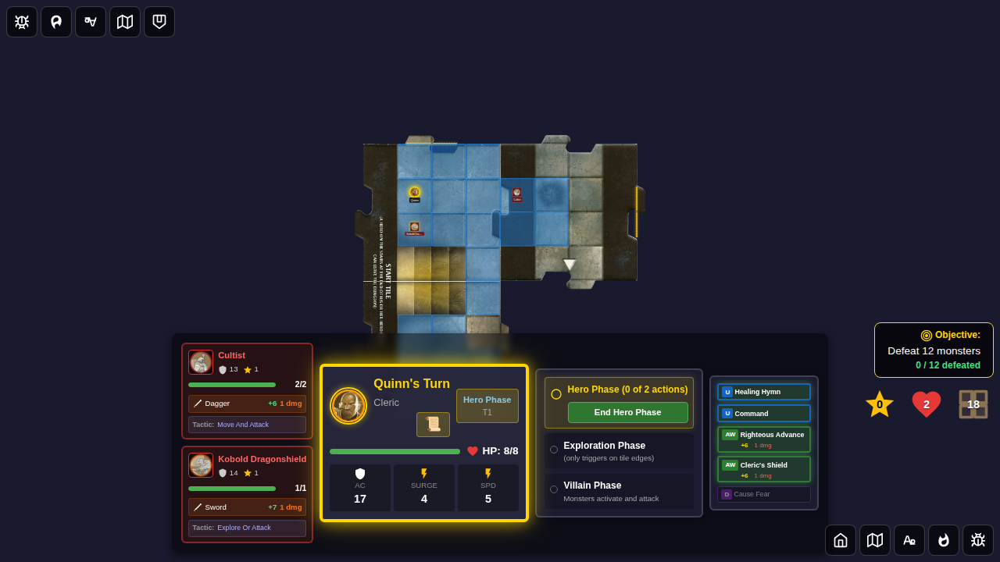
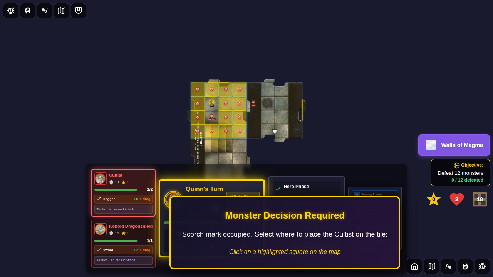
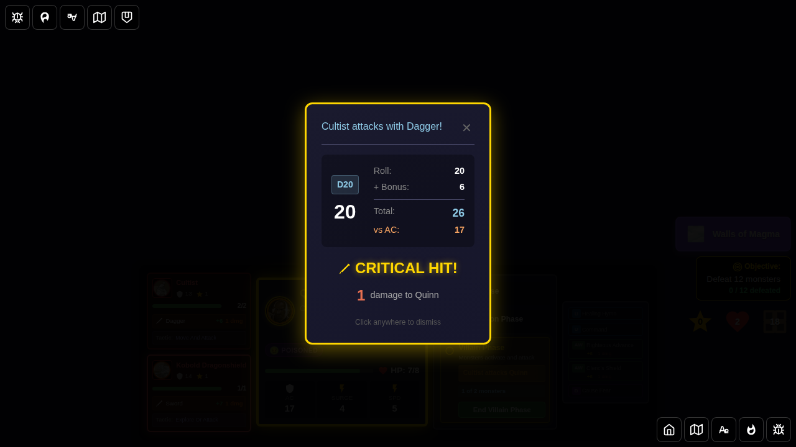
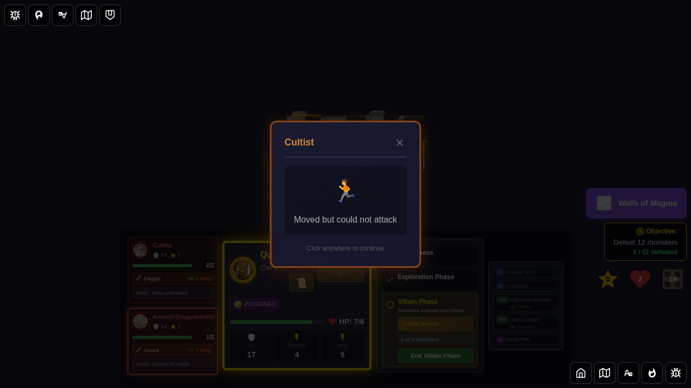

# Test 128: Cultist "Move and Attack" Behavior

## User Story

As a player, when a Cultist activates during the villain phase and is within 1 tile of a Hero (but NOT already adjacent), I expect it to:
1. **Move adjacent** to the closest Hero, AND
2. **Attack with a Dagger** (+6 attack bonus, 1 damage, Poisoned on hit)

This is the second condition on the official Cultist card.

## Bug Fixed

**Issue**: Cultist "move and attack" was not executed

When a Cultist was within 1 tile of a Hero and needed to cross to the Hero's tile, if the **scorch mark** on the Hero's tile was **occupied** (e.g., by another monster), a `choose-tile-entry-position` decision was created. After the player selected a tile entry position, only the **move** was executed — the **attack was silently skipped**.

### Root Cause

In `gameSlice.ts`, the `activateNextMonster` handler correctly identified the move-and-attack scenario but returned early when the scorch mark was occupied to await player input. When `selectMonsterPosition` resolved the tile-entry decision, it moved the monster but did not check whether a pending attack needed to be executed.

### Fix

1. **`types.ts`**: Extended `PendingMonsterDecision.options` with an optional `pendingAttack` field (`{ targetId, attackResult }`) to carry the pre-rolled attack data through the decision round-trip.

2. **`gameSlice.ts`** — `activateNextMonster`: When creating the `choose-tile-entry-position` decision for a `move-and-attack` context, store the pre-rolled attack result in `options.pendingAttack`.

3. **`gameSlice.ts`** — `selectMonsterPosition`: After moving the monster to the chosen position, check if `decision.options.pendingAttack` is set (and context is `'move-and-attack'`). If so, apply the attack: deal damage, apply status effects, log the event.

---

## Test 1: Standard Move-and-Attack (Scorch Mark Free)

### Screenshot 000: Board Before Villain Phase

**Verification**:
- Cultist is on the east tile (adjacent to start tile)
- Quinn is on the start tile (not on scorch mark)

### Screenshot 001: Cultist Attack Result

**Verification**:
- `monsterAttackResult` is not null (attack fired)
- Attack bonus is +6 (Dagger)
- Cultist moved to start tile
- Combat result UI is visible

### Screenshot 002: Move-and-Attack Complete

**Verification**:
- Combat result dismissed
- Cultist is on start tile
- Combat log contains a cultist attack entry

---

## Test 2: Bug-Fix Path — Attack After Tile-Entry Decision (Occupied Scorch Mark)

### Screenshot 000: Board With Occupied Scorch Mark

**Verification**:
- Two monsters present: kobold on scorch mark (1,2), cultist on east tile
- Scorch mark is occupied, forcing the tile-entry decision path

### Screenshot 001: Tile-Entry Decision Pending

**Verification**:
- `pendingMonsterDecision.type = 'choose-tile-entry-position'`
- `pendingMonsterDecision.context = 'move-and-attack'`
- `pendingMonsterDecision.options.pendingAttack` is set (pre-rolled attack stored — **the fix**)
- Villain phase is paused

### Screenshot 002: Attack Fires After Tile-Entry Choice

**Verification**:
- `monsterAttackResult` is not null — **attack fired** (this was the bug, now fixed)
- Attack bonus is +6 (Dagger)
- Cultist is on start tile
- `pendingMonsterDecision` is null (cleared)

### Screenshot 003: After Attack Dismissal

**Verification**:
- Combat result dismissed
- Cultist is on start tile
- Combat log confirms the attack was logged
