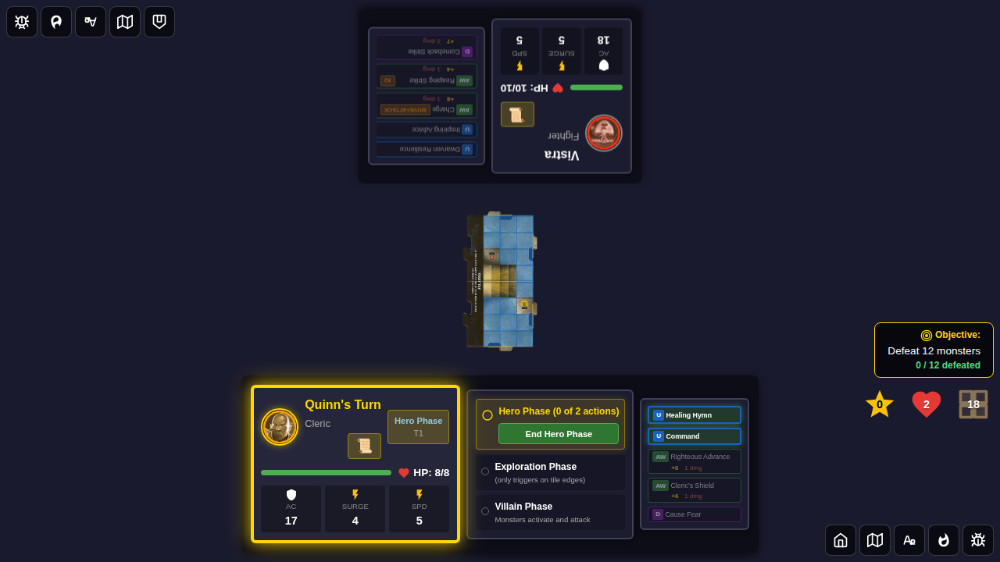
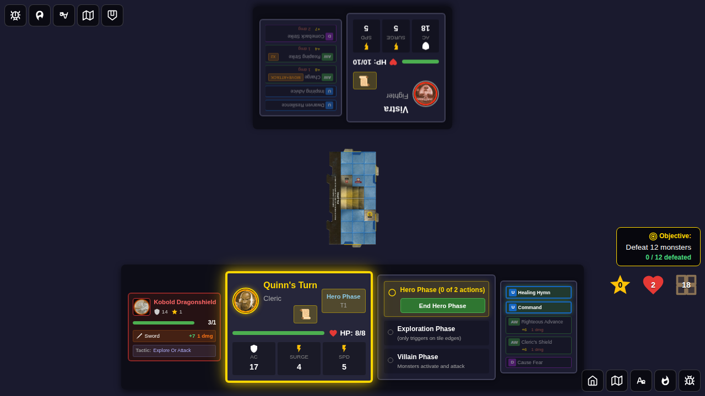
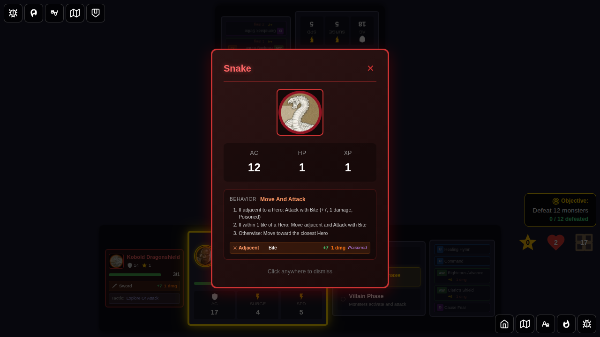
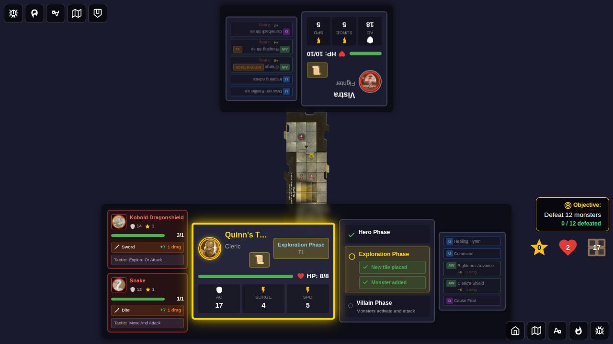
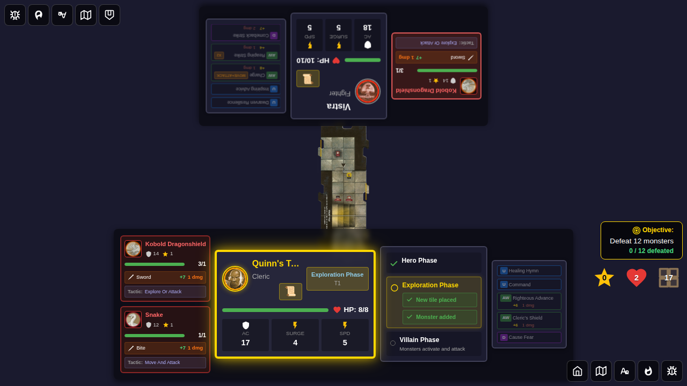
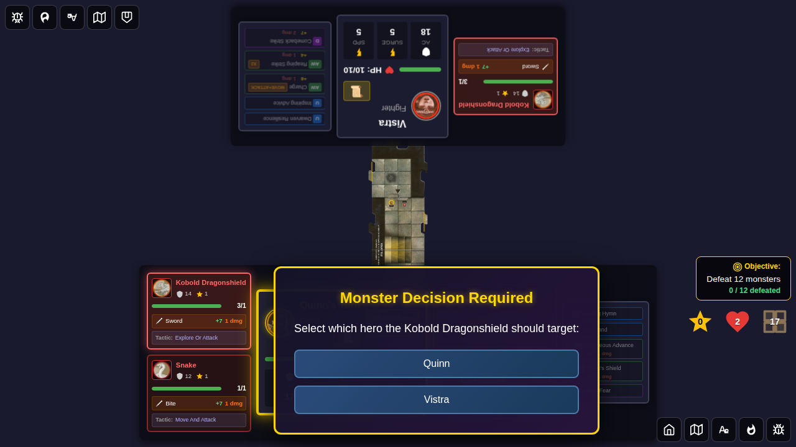
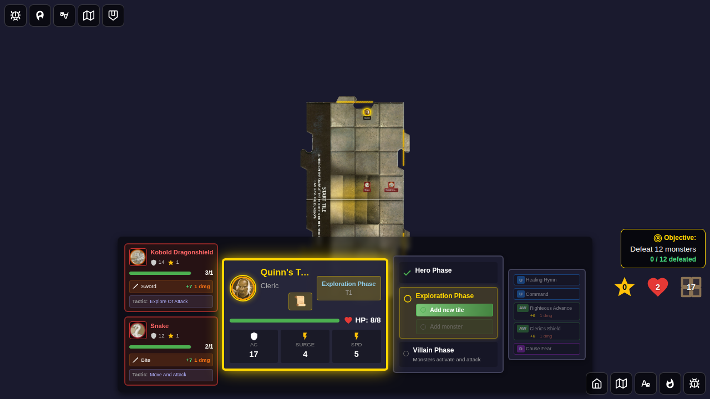

# 129 – Multiple Monsters in Play

## User Story

**As a player**, when my hero draws a new monster card during exploration, I expect the game to prevent me from ending up with two cards of the same monster type. If the top of the monster deck is a type I already control, the game should automatically discard it and keep drawing until it finds a new type.

**As players in a multi-player game**, different heroes are allowed to hold the same monster card type. When two heroes share a monster type, activating that monster during any hero's villain phase activates **all** matching monsters on the board — not just the ones belonging to the active hero.

---

## Test 1: No-Duplicate Re-Draw and Cross-Player Shared Activation

### Steps

1. Start a 2-player game: Quinn (bottom edge) and Vistra (top edge)
2. Inject a Kobold into Quinn's monster list — simulating a monster she already controls
3. Rig the monster deck so the next draw is another Kobold (a duplicate for Quinn), followed by a Snake
4. Move Quinn to an unexplored tile edge and end her hero phase, triggering exploration
5. Verify the game discarded the duplicate Kobold and spawned a Snake instead
6. Confirm Quinn now controls one Kobold + one Snake (no duplicates)
7. Inject a second Kobold controlled by Vistra — verifying that **different players can share a type**
8. Advance to Quinn's villain phase and verify the activation list includes both Quinn's and Vistra's Kobolds (cross-player shared activation)

### Step 1: Two-Player Game Started

Both Quinn and Vistra are on the board with no monsters in play yet.

**Expected**: 2 hero tokens present, 0 monsters in play.

### Step 2: Quinn Controls a Kobold; Deck Rigged

Quinn's monster list contains one Kobold. The deck has `['kobold', 'snake', ...]` — a kobold duplicate is on top.

**Expected**: Quinn has exactly 1 Kobold; deck draw pile starts with `kobold`.

### Step 3: Exploration Triggers — Duplicate Kobold Discarded, Snake Drawn

Quinn explores a new tile. The game detects that the first card drawn (Kobold) is a duplicate type for Quinn and automatically discards it. The next card (Snake) is a new type and gets assigned instead.

**Expected**:
- `explorationPhase.drawnMonster` is `'snake'` (not `'kobold'`)
- Monster deck discard pile contains `'kobold'` (the skipped duplicate)
- Monster card popup is visible showing the newly spawned Snake

### Step 4: Quinn Has Kobold + Snake — No Duplicates

After dismissing the monster card, Quinn's list shows exactly one Kobold and one Snake with no duplicate types.

**Expected**:
- Quinn controls exactly 1 Kobold (no duplicates)
- Quinn controls exactly 1 Snake
- Total Quinn monsters: 2

### Step 5: Both Players Control a Kobold — Sharing a Type Is Allowed

A second Kobold is given to Vistra. Two different players can hold the same monster type.

**Expected**:
- One Kobold on board controlled by Quinn
- One Kobold on board controlled by Vistra
- Total Kobolds: 2 (one per player)

### Step 6: Quinn's Villain Phase — Cross-Player Kobolds Both Activate

During Quinn's villain phase, the activation list includes Quinn's own monsters (Kobold + Snake) **plus** Vistra's Kobold, because both players share the Kobold type. That means 3 monsters total must activate.

**Expected**:
- Current phase: `'villain-phase'`
- Quinn is the active hero
- Quinn's own monsters: 2 (Kobold + Snake)
- Shared same-type monsters from Vistra: 1 (Kobold)
- Total monsters in activation list: **3**

---

## Test 2: Hero Skips Multiple Duplicate Types to Find a New Type

### Steps

1. Start a single-player game with Quinn
2. Give Quinn two existing monster types: Kobold and Snake
3. Rig the deck with three duplicate cards on top (`kobold`, `snake`, `kobold`), then a new type (`orc-archer`)
4. Move Quinn to an unexplored edge and trigger exploration
5. Verify the game skipped all three duplicates and correctly drew `orc-archer`

### Step 1: Three Duplicates Skipped, Orc Archer Drawn

After triggering exploration, the game discards Kobold, Snake, and the second Kobold in sequence before finding the Orc Archer — a monster type Quinn does not yet control.

**Expected**:
- `explorationPhase.drawnMonster` is `'orc-archer'`
- Discard pile contains 2× Kobold and 1× Snake (all three duplicates were discarded)

---

## Verification Checklist

- [x] A hero's monster list never contains two monsters of the same type
- [x] When the top of the deck is a duplicate type, the card is discarded and drawing continues
- [x] Multiple consecutive duplicates are all discarded before finding a valid card
- [x] Two different heroes **can** hold the same monster type
- [x] During a hero's villain phase, the activation list includes that hero's own monsters **plus** any same-type monsters from other heroes

## Redux State Verification

The test verifies Redux store state at each step:

1. **Game start**: `game.heroTokens.length === 2`, `game.monsters.length === 0`
2. **Kobold injected**: `game.monsters[0].monsterId === 'kobold'`, `game.monsterDeck.drawPile[0] === 'kobold'`
3. **After exploration**: `game.explorationPhase.drawnMonster === 'snake'`, `game.monsterDeck.discardPile` contains `'kobold'`
4. **No duplicates**: Quinn's monsters contain exactly one `'kobold'` and one `'snake'`
5. **Two players / same type**: both `'quinn'` and `'vistra'` appear as `controllerId` for Kobold instances
6. **Villain phase list**: `quinnOwnMonsters.length + sharedMonsters.length === 3`
