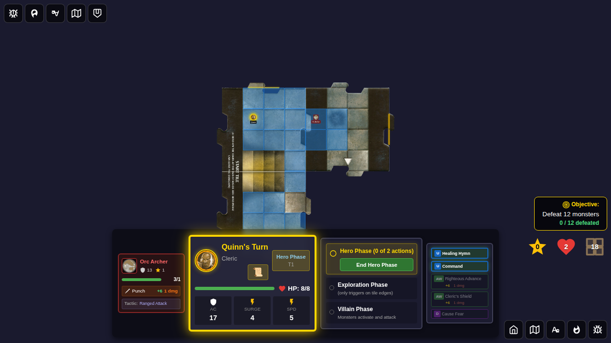
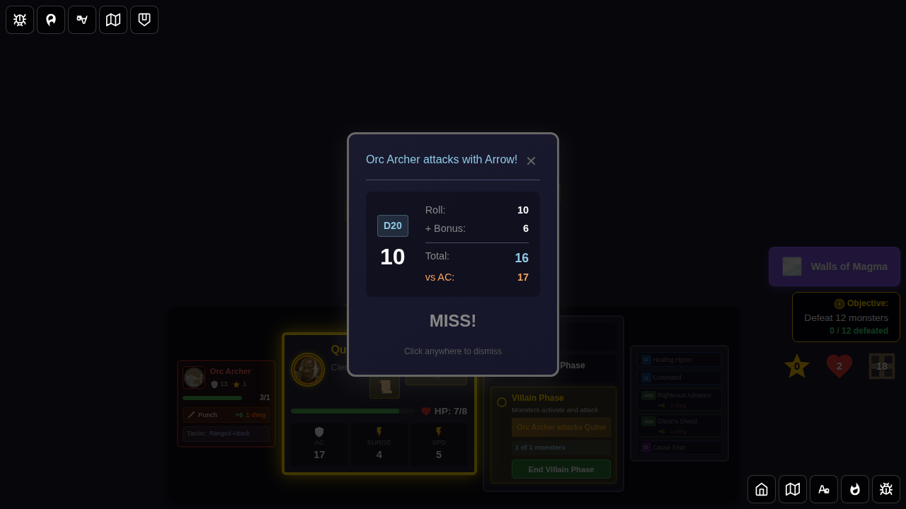
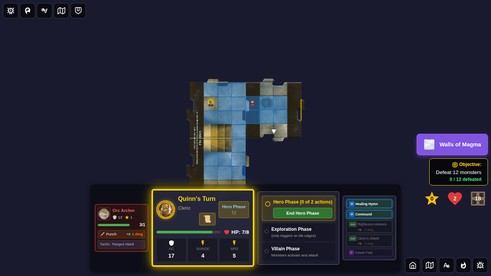
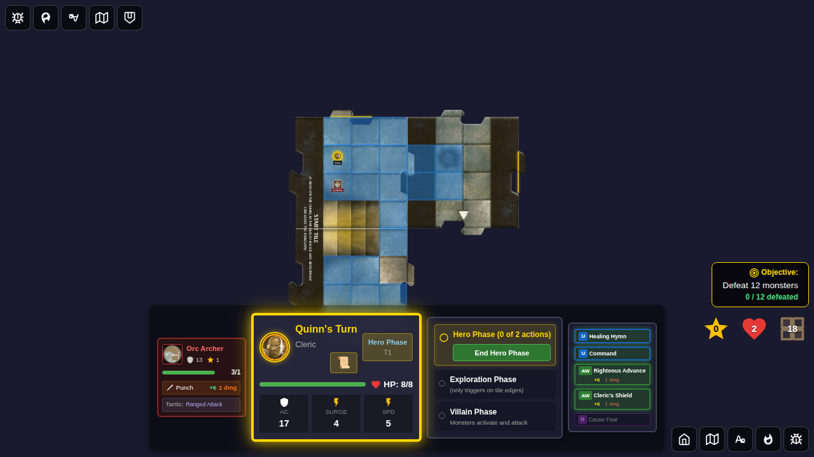
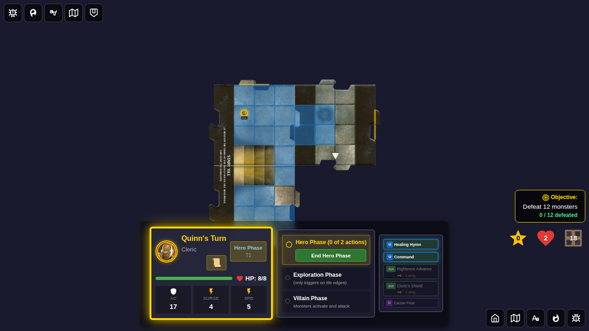
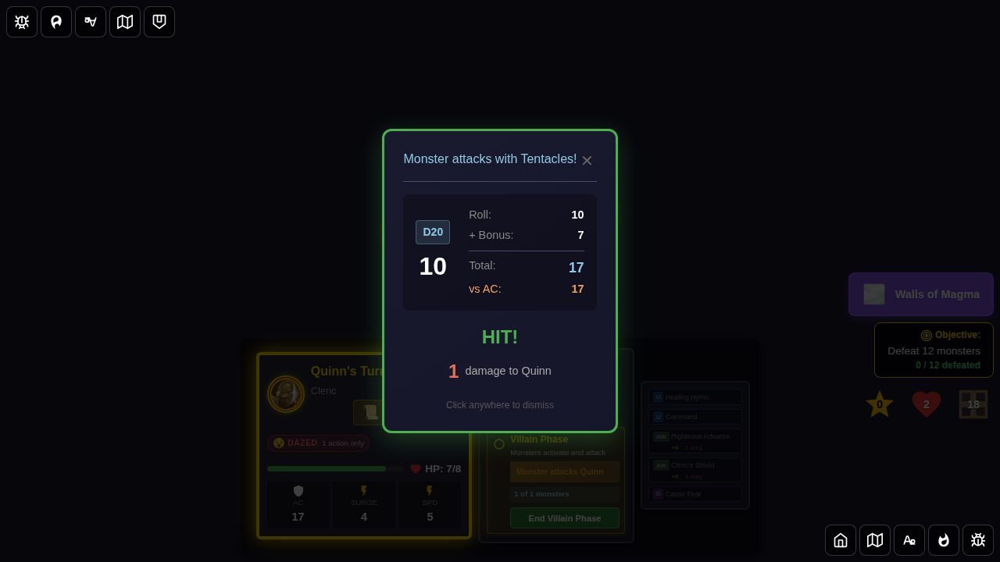
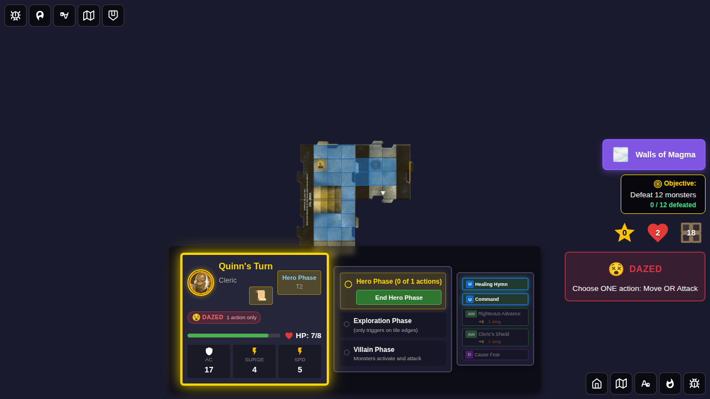

# Test 130: Ranged-Attack Monsters (Orc Archer, Grell)

## User Story

As a player, when a **ranged-attack** monster (Orc Archer or Grell) activates during the villain phase and a Hero is within range but **NOT adjacent**, the monster should:
1. **Attack in place** with its ranged weapon (Arrow / Tentacles) — no movement
2. **NOT** prompt the player to choose a movement destination

This is distinct from `move-and-attack` monsters (e.g., Cultist, Snake) which physically move adjacent before attacking.

## Bug Fixed

**Issue**: `ranged-attack` monsters were handled identically to `move-and-attack` monsters.

An Orc Archer within 2 tiles of a Hero would trigger a  
*"Monster Decision Required — Select where the Orc Archer should move"*  
prompt instead of immediately attacking with its Arrow weapon (+6, 2 damage, miss: 1 damage).

### Root Cause

In `monsterAI.ts`, the `ranged-attack` tactic type was not split out from the `move-and-attack` block. Both tactic types fell through to the same movement logic.

### Fix

1. **`monsterAI.ts`** — Separated `ranged-attack` handling before `move-and-attack`. Within-range but non-adjacent heroes return `type: 'attack'` with `isRanged: true` (no movement).
2. **`gameSlice.ts`** — The `'attack'` handler selects the `moveAttack` weapon option when `result.isRanged` is true. Added a `'ranged-attack'` context branch in `selectHeroForMonster`.
3. **`types.ts`** — Updated `ranged-attack` tactic comment to describe no-movement behavior.

---

## Test 1: Orc Archer — Arrow attack in place (within 2 tiles, NOT adjacent)

### Screenshot 000: Board Before Villain Phase

**Verification**:
- Orc Archer is on the east tile (within 2 tiles of Quinn)
- Quinn is on the start tile, NOT adjacent to the Orc Archer

### Screenshot 001: Orc Archer Arrow Attack Result

**Verification**:
- `pendingMonsterDecision` is `null` (no movement prompt — the bug produced one)
- `monsterAttackResult.attackBonus` is `6` (Arrow weapon)
- Orc Archer is still on the east tile (attacked in place, did NOT move)
- Combat result UI is visible

### Screenshot 002: After Dismissal

**Verification**:
- Orc Archer remains on the east tile
- Combat log contains an Orc Archer attack entry

---

## Test 2: Orc Archer — Punch (adjacent attack)

### Screenshot 000: Board with Adjacent Orc Archer

**Verification**:
- Orc Archer at (1,2), Quinn at (1,1) — adjacent positions

### Screenshot 001: Orc Archer Punch Result

**Verification**:
- `monsterAttackResult.attackBonus` is `6` (Punch weapon, Dazed on hit)
- Orc Archer stays on start tile (no movement for adjacent attack)

---

## Test 3: Grell — Tentacles attack in place (within 1 tile, NOT adjacent)

### Screenshot 000: Board Before Villain Phase

**Verification**:
- Grell is on the east tile (within 1 tile of Quinn)
- Quinn is on the start tile, NOT adjacent to the Grell

### Screenshot 001: Grell Tentacles Attack Result

**Verification**:
- `pendingMonsterDecision` is `null` (no movement prompt)
- `monsterAttackResult.attackBonus` is `7` (Tentacles weapon, Dazed on hit)
- Grell is still on the east tile (attacked in place, did NOT move)
- Combat result UI is visible

### Screenshot 002: After Dismissal

**Verification**:
- Grell remains on the east tile
- At least one combat log entry exists for this attack round
