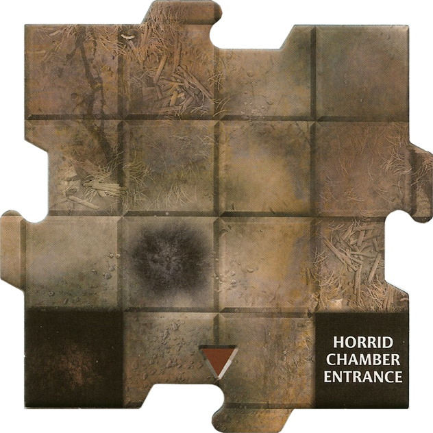
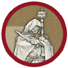

Adventure 14: The Shadow of the Void-Caller
Goal: Find the Obsidian Sanctum and defeat Malphas, the Void-Caller.

Introduction

A thick, unnatural fog has begun to seep out of the Firestorm Peak tunnels, chilling the surrounding villages and draining the life from the land. Whispers from the local rangers speak of a rogue sorcerer named Malphas who has occupied a forgotten ritual chamber deep in the mountain. He is said to be weaving a "Void Gate" that will swallow the light of the world. You must penetrate the depths, find his sanctum, and sever his connection to the void before the eclipse is complete.

Setup
Heroes: Each player chooses a Hero and selects their Power Cards.

Start Tile: Place the Start Tile in the center of the table. Place the Heroes on it.

Dungeon Tile Stack: * Find the Chamber Entrance tile and set it aside.

Take 10 random Dungeon Tiles and shuffle them. Place the Chamber Entrance tile at the bottom of this mini-stack.

Shuffle the remaining Dungeon Tiles and place the 11-tile mini-stack on the bottom of the deck.

Villain: Use the Malphas, the Void-Caller stats (use the Cultist Shaman miniature and double its HP, or use the Otyugh miniature for a more monstrous form).

Tokens: Place 5 Shadow Tokens (use the generic markers) near the board.

Special Rules
The Creeping Void: At the start of each Villain Phase, the active player must check the board. If no Hero is adjacent to another Hero, the active player must draw an additional Encounter Card (even if they revealed a tile with a white arrow).

Malphas’s Shield: While Malphas is in play, he cannot be damaged as long as there are any other Monsters on his tile or adjacent tiles. You must clear his "shadow-stitches" (the other monsters) to strike him.

Chamber Discovery: When the Chamber Entrance is revealed, immediately place the Horrid Chamber tiles around it. Place Malphas and two random Monsters on the Horrid Chamber's center tile.

The Obsidian Sanctum (Chamber Card Effect)
When the Chamber is revealed, all Heroes immediately become Dazed. Additionally, for the remainder of the game, whenever a Hero rolls a natural 1 on an attack roll, they take 1 damage as the void reflects their strike.

Victory & Defeat
Victory: The Heroes win if they defeat Malphas, the Void-Caller.

Defeat: The Heroes lose if any Hero is at 0 Hit Points and there are no Healing Surges remaining.

New Villain: Malphas, the Void-Caller

AC: 16

HP: 12 (Adjust for number of players: +4 HP per additional Hero)

Tactics:

If Malphas is within 1 tile of a Hero: He casts Void Rip. He attacks each Hero on his tile and adjacent tiles (+8 attack; 2 damage and the Hero is Slowed).

If Malphas is within 2 tiles of a Hero: He moves to the closest Hero and casts Shadow Lash (+7 attack; 1 damage and the Hero is Dazed).

Otherwise: He moves 1 tile toward the closest Hero and draws a Monster Card, placing the new monster adjacent to him.
