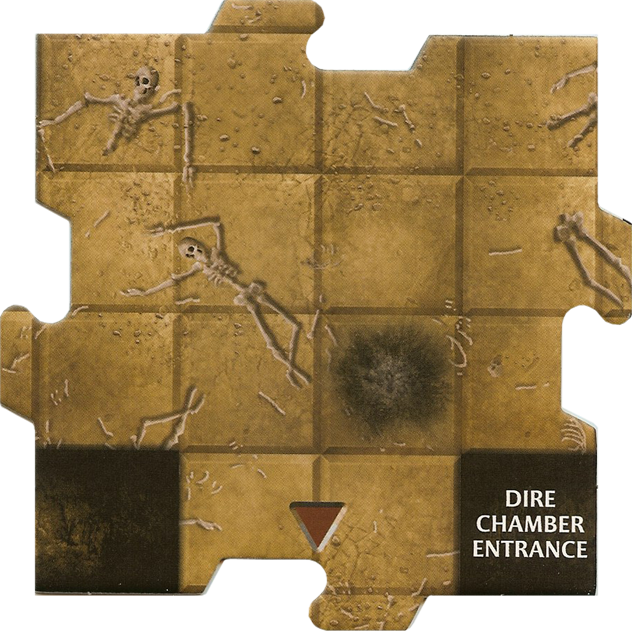
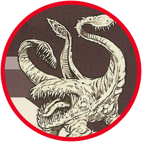

Adventure 15: The Echo of the Cursed Forge
Goal: Reach the Infernal Workshop and destroy Vraxos, the Cursed Sentinel.

Introduction

Deep within the soot-stained corridors of Firestorm Peak lies an ancient forge once used to craft weapons of legend. However, a mechanical monstrosity known as Vraxos has claimed the forge, using its heat to build an army of animated armors and jagged blades. The forge's rhythmic pounding can be felt throughout the mountain, destabilizing the tunnels. You must find the workshop and dismantle the Sentinel before the mountain collapses.

Setup
Heroes: Each player chooses a Hero and selects their Power Cards.

Start Tile: Place the Start Tile in the center of the table.

Dungeon Tile Stack: * Find the Chamber Entrance tile and set it aside.

Take 12 random Dungeon Tiles and shuffle them. Place the Chamber Entrance tile at the bottom of this 12-tile mini-stack.

Shuffle the remaining Dungeon Tiles and place them underneath the first 13 tiles to form the deck.

Villain: Use the Vraxos, the Cursed Sentinel stats (use the Iron Golem miniature or the Otyugh as a proxy).

Tokens: Keep the Blade Trap and Pit Trap tokens nearby.

Special Rules
Heat Exhaustion: The closer you get to the forge, the harder it is to breathe. Whenever a Hero ends their turn on a tile with a Volcanic Vent, they must roll a die. On a 1–5, that Hero is Slowed.

Automated Defense: Every time an Encounter Card with the "Trap" keyword is drawn, place a Blade Trap token on the active Hero’s tile in addition to the card's effect. If there is already a trap on that tile, the Hero takes 1 damage instead.

The Forge Awakens: When the Chamber Entrance is revealed, immediately discard the current Encounter card and draw a new one. All "Monster" results on that card are doubled for this turn only.

The Infernal Workshop (Chamber Card Effect)
When the Chamber is revealed, place the Vraxos Villain on the center square. While in the Workshop, all Heroes' Daily Powers deal +1 damage, but all Monsters gain a +2 bonus to their Armor Class due to the enchanted mist filling the room.

Victory & Defeat
Victory: The Heroes win if they defeat Vraxos, the Cursed Sentinel.

Defeat: The Heroes lose if any Hero is at 0 Hit Points and there are no Healing Surges remaining, or if the Dungeon Tile deck runs out before the Chamber is reached.

New Villain: Vraxos, the Cursed Sentinel

AC: 18

HP: 10 (Adjust for number of players: +5 HP per additional Hero)

Tactics:

If Vraxos is adjacent to a Hero: He uses Crushing Grip. He attacks the adjacent Hero (+9 attack; 2 damage and the Hero cannot move during their next Hero Phase).

If Vraxos is within 2 tiles of a Hero: He fires Steam Vent. He attacks every Hero within 2 tiles (+7 attack; 1 damage and the Hero is pushed 1 square away from Vraxos).

Otherwise: Vraxos moves 2 tiles toward the closest Hero. If he ends his move adjacent to a Hero, he immediately deals 1 damage (no attack roll required) as his gears grind against them.
