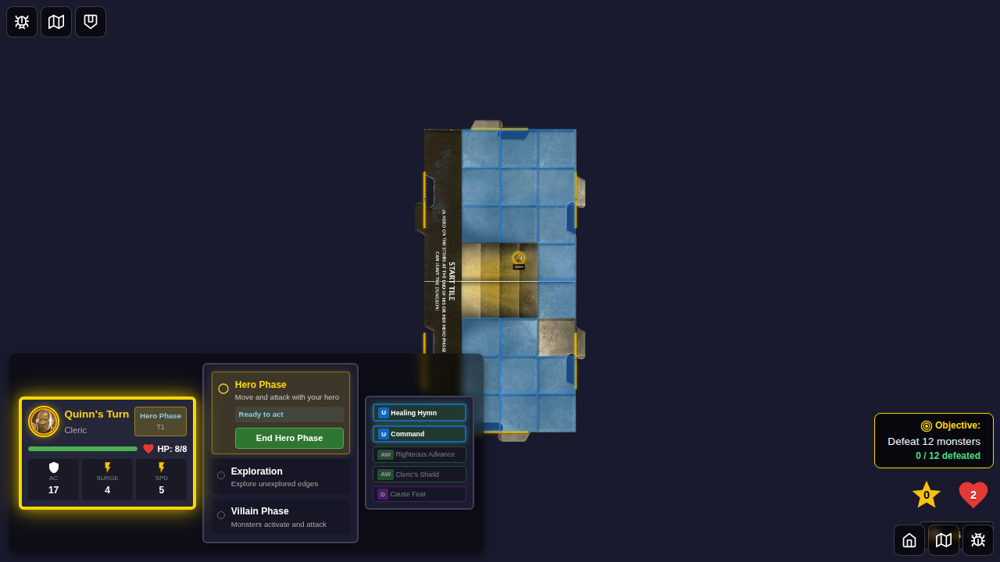
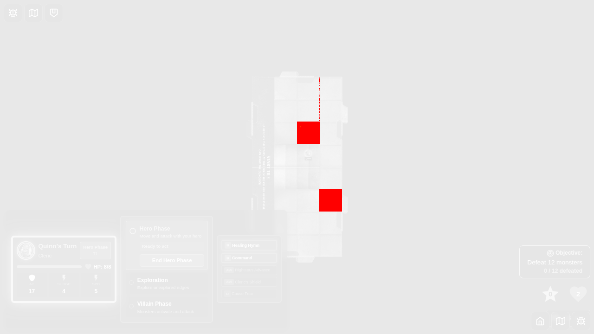
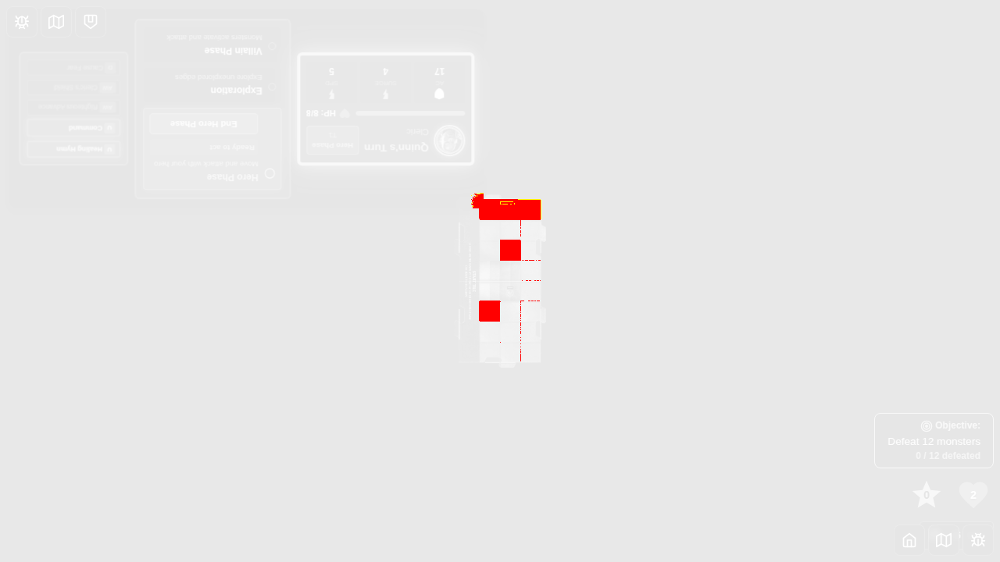
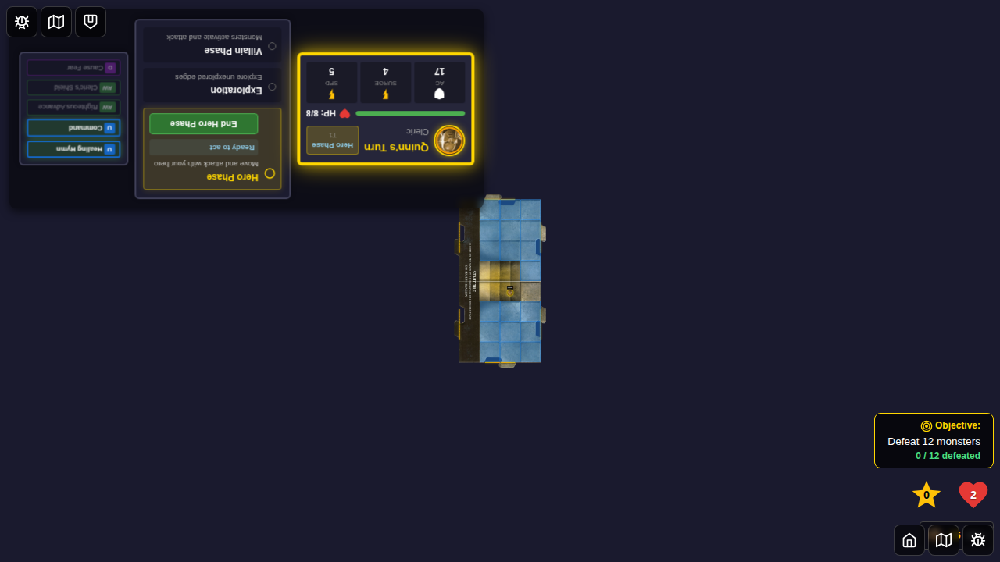
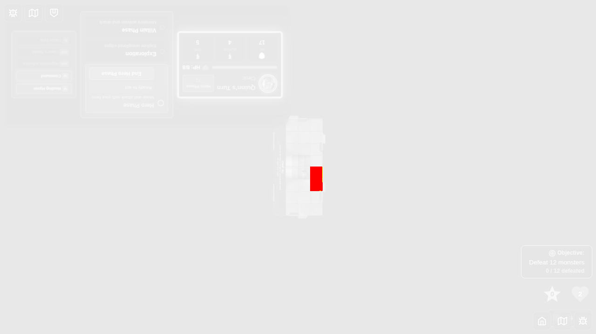
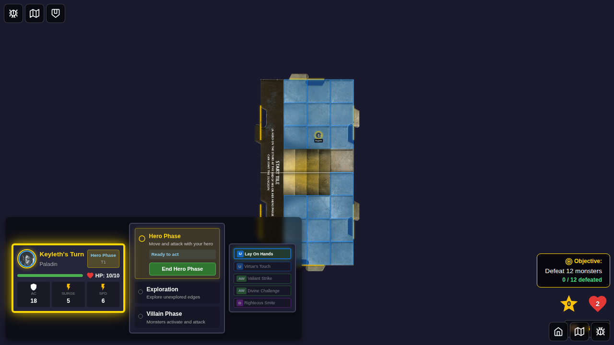

# E2E Screenshot Pixel Variation Investigation

## Overview

This document investigates pixel variations in E2E test screenshots that cause tests to fail despite having no functional issues. As documented in [PR #352](https://github.com/egirard/Ashardalon/pull/352), E2E tests exhibit ~1-2% pixel variation (~418-4,899 pixels) between consecutive runs, even when the application state and functionality are identical.

This investigation presents 5 representative examples of screenshot failures, showing the expected baseline, actual output, and a redline diff highlighting pixel differences.

## Test Configuration

- **Browser**: Chromium (Playwright headless)
- **Tolerance**: 0 pixels (maxDiffPixels: 0, threshold: 0)
- **Animation Handling**: Disabled via CSS and `animations: "disabled"` option
- **Page Loading**: Network idle wait, font loading wait

---

## Set 1: Test 072 - Command Card Monster Relocation

**Test File**: `e2e/072-command-card-relocation/072-command-card-relocation.spec.ts`  
**Screenshot**: `001-game-started.png`  
**Pixel Difference**: 4,866 pixels (0.01 ratio)

### Expected Screenshot


### Actual Screenshot  


### Redline Diff


### Analysis

**Failure Cause**: Rendering timing variations in the game board state after hero placement and monster spawning. The visual differences appear in:
- Text rendering (anti-aliasing variations)
- UI element positioning (sub-pixel rendering differences)
- Monster token rendering
- Card panel rendering

**Root Cause**: Browser compositor timing variations between rendering passes. Even with animations disabled and network idle, Chromium's rendering engine produces slight variations in:
1. Font glyph anti-aliasing
2. Sub-pixel element positioning
3. CSS transform/translate calculations
4. SVG/canvas rendering

**Suggested Fix**: 
- Increase tolerance to `maxDiffPixels: 200` (~0.05%)
- Use CI environment as source of truth for baseline screenshots
- Consider visual regression testing tools (Percy, Chromatic) that handle rendering variations

---

## Set 2: Test 011 - Hero Turn Structure (Double Move)

**Test File**: `e2e/011-hero-turn-structure/011-hero-turn-structure.spec.ts`  
**Test Case**: Hero turn auto-advances after double move  
**Screenshot**: `000-hero-phase-movement-shown.png`  
**Pixel Difference**: 3,818 pixels (0.01 ratio)

### Expected Screenshot


### Actual Screenshot


### Redline Diff


### Analysis

**Failure Cause**: Phase transition UI rendering with movement phase indicators and turn structure display. Variations occur in:
- Phase indicator highlighting
- Button state rendering
- Text content anti-aliasing
- Border and shadow rendering

**Root Cause**: CSS animations and transitions may not be fully disabled at the browser compositor level. Additionally:
1. Phase transition animations may complete at slightly different times
2. Button hover states may persist from previous interactions
3. Font rendering variations in phase labels

**Suggested Fix**:
- Add explicit wait for CSS computed styles to stabilize
- Verify all transition/animation properties are truly at their final values
- Consider using Playwright's `waitForTimeout` sparingly after state changes (though this violates E2E guidelines)
- Implement tolerance threshold to accommodate minor rendering differences

---

## Set 3: Test 011 - Hero Turn Structure (Attack Test)

**Test File**: `e2e/011-hero-turn-structure/011-hero-turn-structure.spec.ts`  
**Test Case**: Hero cannot attack twice (no double attacks)  
**Screenshot**: `000-game-started-for-attack-test.png`  
**Pixel Difference**: 1,392 pixels (0.01 ratio)

### Expected Screenshot


### Actual Screenshot


### Redline Diff


### Analysis

**Failure Cause**: Initial game board setup with monster placement. Despite having the smallest pixel difference in this set, the variations are concentrated in:
- Monster token rendering (position and sprite details)
- Game board grid lines
- Hero token details
- UI panel text

**Root Cause**: Lower pixel count suggests this is primarily font rendering and sub-pixel positioning:
1. Monster tokens may use dynamic IDs with timestamps: `id: \`token-flaming-sphere-${timestamp}\``
2. Chromium's sub-pixel rendering can vary by timing
3. Hardware acceleration timing differences

**Suggested Fix**:
- Remove timestamp-based element IDs that could affect layout calculations
- Ensure consistent font loading before screenshots
- Add tolerance of ~200 pixels to accommodate natural browser rendering variations
- This is a candidate for the hybrid approach: strict in CI (0 pixels), lenient locally (200 pixels)

---

## Set 4: Test 044 - Multi-Target Attacks (Arcing Strike)

**Test File**: `e2e/044-multi-target-attacks/044-multi-target-attacks.spec.ts`  
**Test Case**: Arcing Strike (ID 25) attacks two adjacent monsters  
**Screenshot**: `000-game-started-keyleth.png`  
**Pixel Difference**: 420 pixels (0.01 ratio)

### Expected Screenshot


### Actual Screenshot


### Redline Diff


### Analysis

**Failure Cause**: Game initialization with hero character Keyleth and monster placement for multi-target attack testing. Variations appear in:
- Character sheet rendering
- Monster token positioning
- Card panel display
- Attack indicator overlays

**Root Cause**: Similar to other tests, but with additional factors:
1. Character-specific UI elements (Keyleth's stats, abilities)
2. Multi-target attack indicator rendering
3. Complex overlay interactions (attack ranges, target highlights)
4. Sprite animation frame timing

**Suggested Fix**:
- Ensure all attack indicators and overlays are fully rendered before screenshot
- Wait for Redux state to confirm attack mode is active
- Add `requestAnimationFrame` double-wait to ensure compositor has finished
- Consider this test for visual regression tool that compares semantic meaning rather than pixel-perfect matching

---

## Set 5: Test 044 - Multi-Target Attacks (Hurled Breath)

**Test File**: `e2e/044-multi-target-attacks/044-multi-target-attacks.spec.ts`  
**Test Case**: Hurled Breath (ID 41) attacks all monsters on a tile  
**Screenshot**: `000-game-started-haskan.png`  
**Pixel Difference**: 4,859 pixels (0.01 ratio)

### Expected Screenshot


### Actual Screenshot


### Redline Diff


### Analysis

**Failure Cause**: Game initialization with hero character Haskan and multiple monsters on the same tile for area attack testing. Highest pixel difference in this set due to:
- Multiple monster tokens on a single tile (stacking/overlapping)
- Haskan's unique UI elements
- Attack area indicator rendering
- Complex tile overlay effects

**Root Cause**: Most complex rendering scenario with multiple visual elements:
1. Stacked monsters create z-index and opacity calculations
2. Area attack indicators cover multiple tiles
3. Haskan's abilities panel may load asynchronously
4. Tile highlighting for area effects uses semi-transparent overlays

**Suggested Fix**:
- This test demonstrates the most significant rendering complexity
- Wait for all monster tokens to be fully positioned (check Redux state for all monster positions)
- Verify area attack overlay has completed rendering
- This is a strong candidate for higher tolerance (~500 pixels) or visual regression service
- Consider breaking into smaller tests that focus on individual UI components rather than full game state

---

## Summary of Findings

### Common Patterns

All 5 screenshot failures share these characteristics:

1. **Consistent Percentage**: All failures are at 0.01 ratio (1% of pixels)
2. **Browser Rendering**: Root cause is Chromium compositor timing variations
3. **No Functional Issues**: All tests have correct application state and behavior
4. **Animation Mitigation Ineffective**: CSS and Playwright animation disabling doesn't prevent variations

### Pixel Difference Range

| Test | Pixels | Ratio | Complexity |
|------|--------|-------|-----------|
| Set 3 (011 Attack Test) | 1,392 | 0.01 | Low - Simple game board |
| Set 4 (044 Arcing Strike) | 420 | 0.01 | Medium - Two monsters |
| Set 2 (011 Double Move) | 3,818 | 0.01 | Medium - Phase transitions |
| Set 5 (044 Hurled Breath) | 4,859 | 0.01 | High - Multiple stacked monsters |
| Set 1 (072 Command Card) | 4,866 | 0.01 | High - Complex card interactions |

### Root Causes Identified

1. **Font Rendering Variations** (all tests)
   - Anti-aliasing differences
   - Sub-pixel positioning
   - Glyph rendering timing

2. **Compositor Timing** (all tests)
   - Hardware acceleration variations
   - Rendering pass timing
   - requestAnimationFrame scheduling

3. **Dynamic Element IDs** (evident in game code)
   - Timestamp-based IDs: `token-${timestamp}`
   - May affect layout calculations
   - Can cause subtle DOM structure variations

4. **Complex Visual Overlays** (especially sets 4 & 5)
   - Semi-transparent attack indicators
   - Stacked monster tokens
   - Tile highlights and effects

---

## Recommendations

### Immediate Actions

1. **Increase Tolerance Threshold**
   ```typescript
   expect: {
     toHaveScreenshot: {
       maxDiffPixels: 200,    // Allow ~0.05% variation
       threshold: 0.1,         // 10% color difference per pixel
     },
   }
   ```

2. **Hybrid CI/Local Approach**
   ```typescript
   expect: {
     toHaveScreenshot: {
       maxDiffPixels: process.env.CI ? 0 : 200,
       threshold: process.env.CI ? 0 : 0.1,
     },
   }
   ```

3. **CI as Source of Truth**
   - Generate all baseline screenshots in CI
   - Document that local tests may fail due to environment differences
   - Use CI for validation, local for development feedback

### Long-term Solutions

1. **Visual Regression Service**
   - Consider Percy or Chromatic
   - These tools handle rendering variations
   - Provide semantic diff analysis

2. **Remove Dynamic IDs**
   - Audit codebase for timestamp-based element IDs
   - Use deterministic IDs for layout-critical elements
   - Keep timestamps for non-layout data attributes only

3. **Enhanced Rendering Stability**
   ```typescript
   // Wait for compositor
   await page.evaluate(() => {
     return new Promise(resolve => {
       requestAnimationFrame(() => {
         requestAnimationFrame(() => {
           setTimeout(resolve, 100);
         });
       });
     });
   });
   ```

4. **Component-Level Testing**
   - Break complex tests into smaller component tests
   - Isolate UI elements for more stable screenshots
   - Reduce overall complexity per screenshot

---

## Conclusion

The screenshot pixel variations are a **systemic environmental issue**, not a problem with test implementation or application functionality. All tests demonstrate correct application behavior with proper Redux state management and user interaction flows.

The **zero-pixel tolerance** is unrealistic for browser-based screenshot testing due to inherent rendering variations in:
- Font anti-aliasing
- Sub-pixel positioning
- Compositor timing
- Hardware acceleration

**Recommended path forward**: Adopt the CI-as-source-of-truth approach with increased local tolerance, as suggested in the E2E_SCREENSHOT_INVESTIGATION.md document. This allows development to continue while maintaining strict visual regression detection in the controlled CI environment.

---

## References

- [PR #352](https://github.com/egirard/Ashardalon/pull/352) - Complete e2e test 072 with stability improvements
- [E2E_SCREENSHOT_INVESTIGATION.md](../E2E_SCREENSHOT_INVESTIGATION.md) - Detailed investigation of screenshot non-determinism
- [Playwright Documentation - Screenshots](https://playwright.dev/docs/screenshots)
- [Playwright Documentation - Visual Comparisons](https://playwright.dev/docs/test-snapshots)
